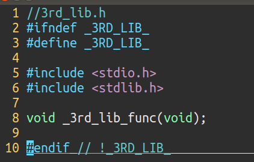
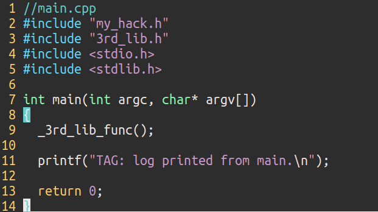
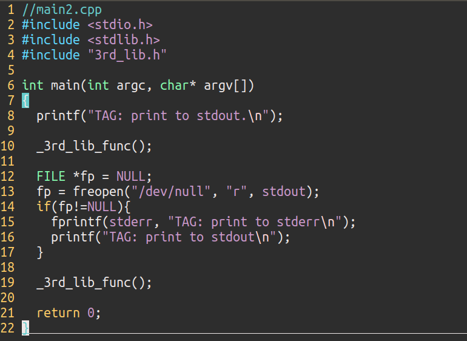
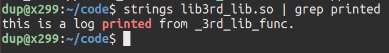
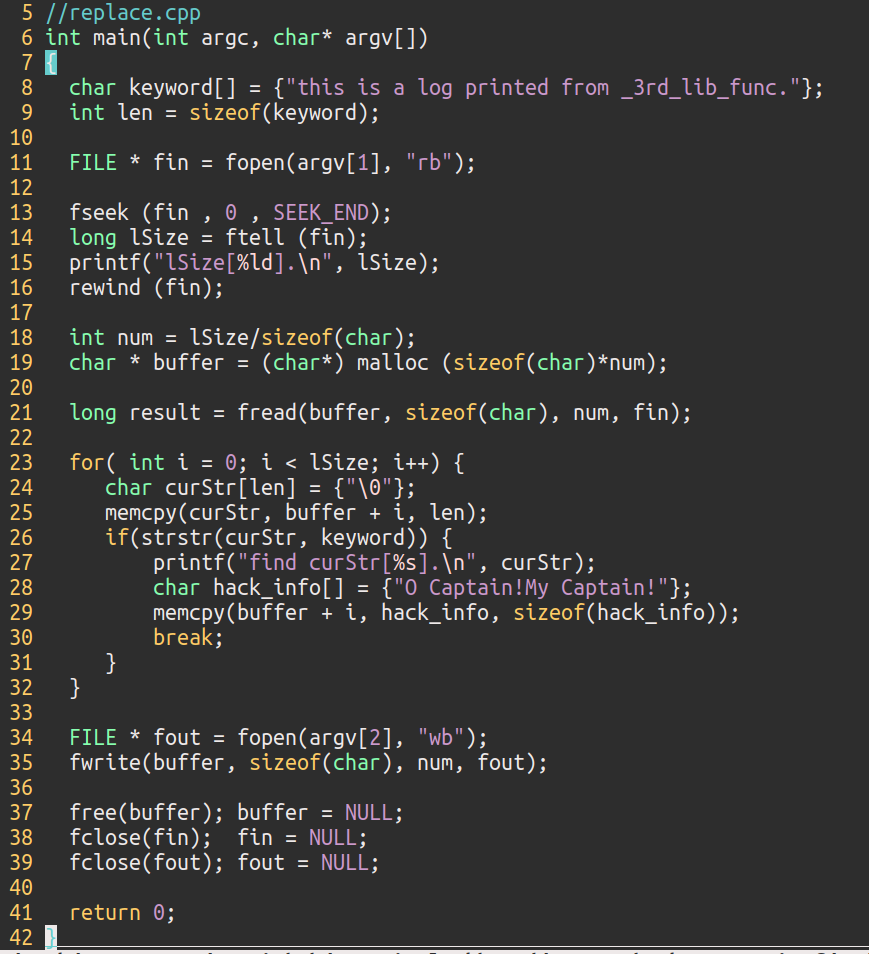

# 　　　　　　hack your printf
## 引言
在某些情况下，我们用到了第三方的库，比如一个lib3rd_lib.so文件，但是又不想在我们调用它的时候让库里面的打印信息显示出来，只想打印我们自己代码里面的信息，让我们的日志文件或者Terminal更加整洁；或者我们开发了自己的库发布出去，但是里面有打印信息（比如版权信息，作者联系方式等），一定要打印出来，不想让使用者抑制打印信息。该怎么办呢？这是矛和盾的问题，这里船长以前者（抑制第三方库的打印）为例，即抑制printf函数打印信息为例(其他的方式，比如std::cout，打印文件，可以举一反三)，列出几种方法和大家讨论一下。矛的缺点，就是盾的优势，搞懂了怎么抑制，那怎么反抑制就不难了。

+ 目标：抑制第三方库的printf函数打印信息，不让它显示在Terminal

+ 限制条件：1. 不可以影响第三方库除打印外的功能； 2. 不可以要求系统root权限；3. 不可以影响系统正常运行；４. 不可以影响我们自己代码里面的打印功能。

**欢迎探讨，本文持续维护。**

## 实验平台：

+ 操作系统：Ubuntu 18.04 LTS

+ 编译器：g++ (Ubuntu 5.5.0-12ubuntu1) 5.5.0 20171010

### Case 1, 狸猫换太子——劫持printf

我们的计算机系统里面的软硬件是分**层次**的，最底下是计算机的硬件（显示器，键盘，内存条，显卡等），硬件上面是硬件驱动和操作系统内核（比如大名鼎鼎的Linux kernal），操作系统内核的上层是运行时库，运行时库上面就是我们的日常用到的Firefox浏览器，git，Vim文本编辑器这样的应用程序和gcc编译器，ld链接器这样的开发工具。底下的层通过API来为上层提供功能，比如显卡通过显卡驱动的API来为操作系统内核提供显示和并行计算的功能，操作系统内核通过系统调用API以软件中断方式（Linux 为0x80号中断）来为运行时库提供支持，而运行时库又以库API的方式(比如我们这里要抑制的printf)为应用程序提供支持。所以，从我们在应用程序的代码里面写下一行printf("Hello world!\n")之后，它要经过一系列的**调用链**（运行时库->操作系统->显卡驱动）才能在显示器Terminal里面显示出来一行Hello world字符串。

说到这里，就清楚了，只要我们能在这个调用链的任何一环劫持到用到的API，我们就能干扰到最上面的printf()函数，在里面做我们爱做的事情，比如，抑制第三方库的printf函数往Terminal打印。这里以劫持printf调用到的puts()函数来演示一下。

实验代码：

首先是第三方库的代码：

第三方库很简单，就是在_3rd_lib_func()这个函数里面调了printf()打印了一句话。

接着是main.cpp代码，在main函数里面调用了第三方库里面的_3rd_lib_func()，自己也调用了printf打印了一句话。

最后是我们最重要的，劫持了库里面的int puts ( const char * str )的函数：

这个my_hack.cpp就是改写了系统默认的puts函数，而**puts函数是printf到系统内核调用链条中的一环**，所以，我们在自己写的puts函数里面，就可以为所欲为了。实验过程如下：

可以看到，在开始按照正常的过程编出来的a.out打印出来了3rd_lib.cpp里面的log，在第二个加入了my_hack.cpp编出来的a.out，打印的过程被hack了，打印出来了原本不应该出来的HA, hacked printf。这里，我们可以选择把my_hack.cpp文件的6,7,8三行注释掉，那么就让第三方库的printf哑巴了。然后，如果我们自己的main.cpp函数里面调用到的printf函数，该怎么办才能正常输出呢？方法很简单，在想正常输出的字符串里面加一个TAG，在my_hack.cpp的puts函数里面，检查一下有没有这个TAG关键字，如果没有，就让它哑巴掉，如果有，就用fputs打印出来。

这种方法有没有缺点呢？缺点其实很明显，它只能劫持特定范围（比它高级且依赖于它）的函数，如果lib3rd_lib.so里面不是用printf，而是用std::cout，或者直接用接近调用链底层的puts, fputs这样的函数，此法就失败了，除非你能找到调用链条最底层（精确点说，应该是比第三方库用的打印函数更底层）的那个函数，还好[Linux是开源的](https://book.douban.com/subject/1231584/)，代码都有，感兴趣的可以试试看。

那有没有更好更根本一点的解决办法呢？

### Case 2, 丢进垃圾桶——输出重定向

Unix系统的设计哲学里面有一点很重要，**一切皆为文件**（不仅仅txt文档是文件，jpg图像是文件，目录、套节字也是文件，显示器也是文件）。在操作系统的眼里，printf往显示器打印信息，就是操作系统往stdout(默认绑定了显示器，是显示器在操作系统里面的抽象)这个文件里面写信息。多说一句，标准错误stderr这个文件也是默认绑定了显示器的，标准输入stdin这个文件绑定的是键盘。除了上面说的标准输入，标准输出，标准错误三个特别的文件之外，还有一个很特殊的文件[/dev/null](https://en.wikipedia.org/wiki/Devnull)，这个文件在Unix生态里面的行话也叫位桶(bit bucket)或者黑洞(black hole)，向这个黑洞文件输出的所有流，都会被它吞掉丢弃，就好像进了黑洞一样。

如果我们能在程序里把printf文件的输出对象（stdout）文件，重新定向到黑洞文件，就可以把printf的所有输出都吞掉。

实验代码：

上面的代码第13行，用freopen函数把/dev/null这个垃圾桶和标准输出stdout绑定了，所以，在绑定之后的语句里面，再往标准输出stdout输出，就什么也看不到了。不过，这时标准错误stderr还是和屏幕绑定的，往标准错误输出的字符串还是能正确现实。运行过程和结果如下：

上面代码还有个两个缺点，第一，如果在调用freopen函数之前的打印，那还是打印得出来;第二点，就是把我们自己的printf的输出也给吞了，这时，我们是可以用fprintf这个函数，来指定把我们的信息输出到stderr（前文讲了，stderr这个文件也是默认绑定显示器的），这样就绕开了标准输出重定向/dev/null的尴尬。或者我们可以在调用第三方库的之前，进行重定向，之后，再重定向回来。但是这样做还是不太优雅，显得很没有品味。

### Case 3, 大力出奇迹——重写字符串

源文件里面的字符串常量，在编译后的二进制文件里面，是有专门存储字段来存储的，而且是**连续存储**的，而且是**明文**连续存储的。验证如下

既然知道了上面这些，而且我们知道了存储的字符串内容（跑一下程序看看就知道了），那么我们就可以暴力扫描这个lib3rd_lib.so文件，找到他要打印的字符串，改写成我们想要的（注意不要溢出）。暴力扫描和替换的代码如下（为了能截屏到一张图，代码风格不佳，很多返回值也没有检查，仅作示意）

实验结果如下：

可见，把lib3rd_lib.so这个文件里面的打印字符串我们成功修改了，而且没有影响原来库的功能。

这个方法缺点，毫无技术含量。

## 总结

本文以抑制第三方库的打印信息为目的，提出了三种方案，给出了实验过程和技术分析，并且分析了他们各自的优缺点。

## 参考资料
+ https://en.wikipedia.org/wiki/Devnull
+ [《Linux内核源代码情景分析》](https://book.douban.com/subject/1231584/)
