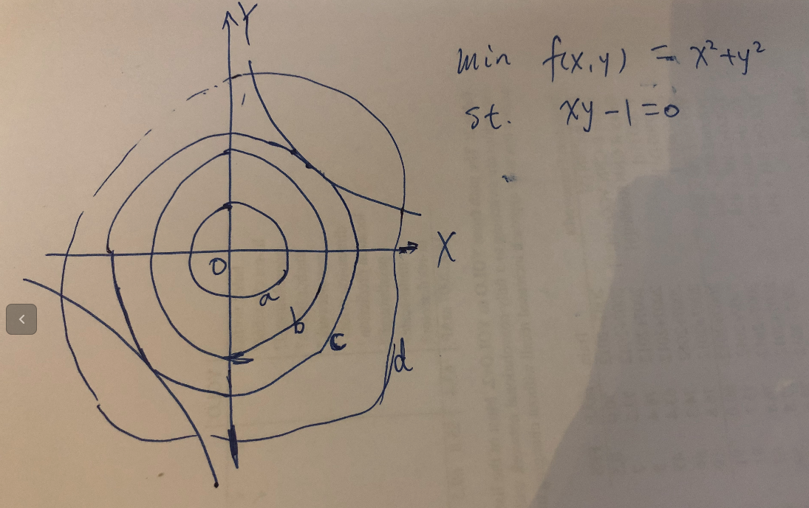
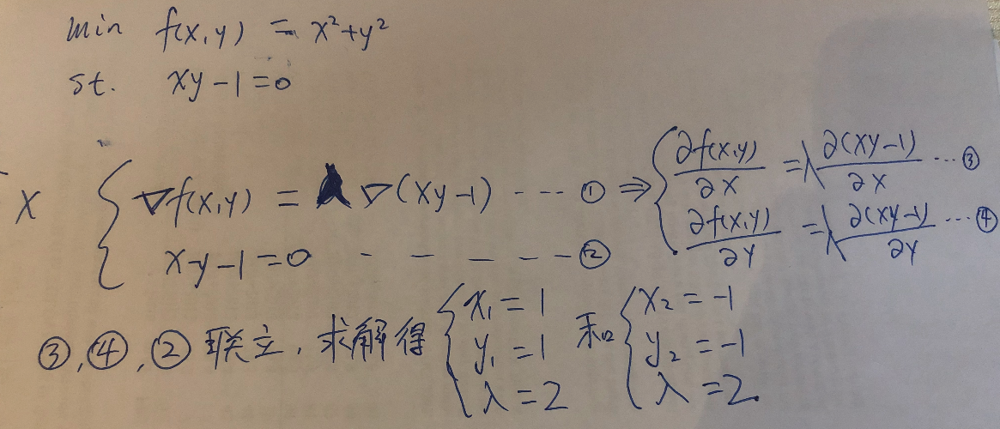
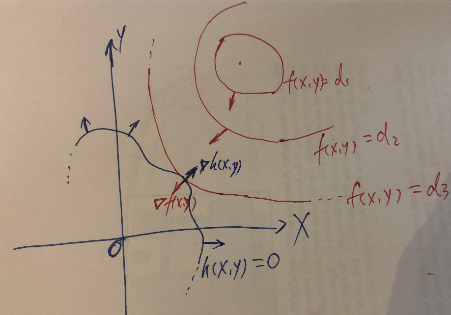
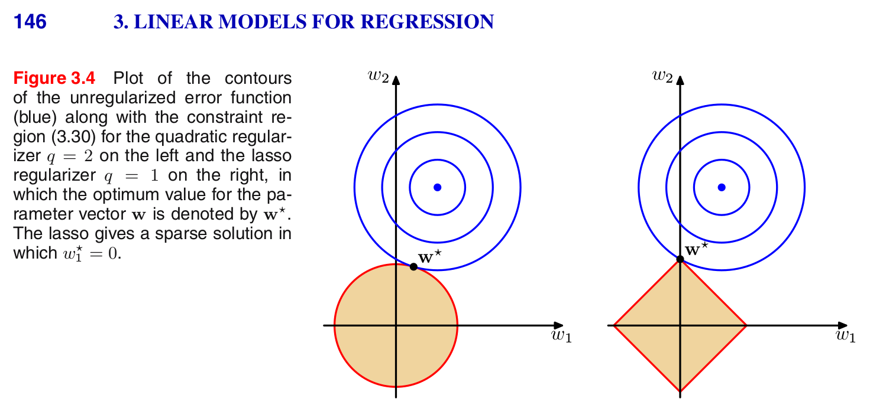

# 　　　　　　拉格朗日乘子法
## 引言
在最优化理论中，[拉格朗日乘子法](https://en.wikipedia.org/wiki/Lagrange_multiplier)是求解等式约束下极值问题的常用手段(KKT条件可以推广到求解不等式约束问题)，在机器学习中是一个很重要很基础的理论，[最大熵模型](https://en.wikipedia.org/wiki/Maximum-entropy_Markov_model)，L1[正则](https://en.wikipedia.org/wiki/Regularization_%28mathematics%29)项为什么可以获得比L2正则获得更稀疏的解，[SVM](https://en.wikipedia.org/wiki/Support-vector_machine)的理论推导的理解都和拉格朗日乘子法有关系。

**欢迎探讨，本文持续维护。**

## 实验平台：

N/A，纯数学公式推导，无代码

## 拉格朗日乘子法介绍

拉格朗日乘子法的基本思想，就是将一个含有n个变量个k个（等式）约束条件的**有约束**最优化问题（也叫原问题）通过引入拉格朗日乘子转化为求(n+k)个变量的**无约束**最优化问题（也叫对偶问题），然后求解无约束最优化问题的极值解就是原来有约束最优化问题的解。其背后的数学原理是原问题极值处的梯度为各个约束条件梯度所张成的空间中的一个向量。

上面的说法有点不好理解，下面以两个(n=2)变量，一个约束(k=1)条件下的最优化问题来具体讲。

设目标函数是f(x,y)，约束条件是h(x,y)=0，需要求目标函数最小值。即
min f(x,y), st. h(x,y) = 0，求解这个问题可以用高斯消元法（但是有时候隐函数不容易消元），也可以引入拉格朗日系数lambda，通过求解拉格朗日函数L(x, y, lambda) = f(x,y) + lambda\*h(x,y)的极值就可以得到原问题的极值（是极大值还是极小值，需要进一步判定）。通常说的拉格朗日对偶函数（简称对偶函数），是拉格朗日函数对x取下确界，即：

不论目标函数f(x,y)是否为凸函数，对偶函数F(x, y, lambda) = f(x,y) + lambda\*h(x,y)一定为凹函数。求对偶问题的极值，就是F(x, y, lambda)函数对x,y和lambda三个变量分别求偏导数，令偏导数等于0，再联立得到的3个方程，3个方程3个未知数，求解x，y和lambda三个值就得到了原问题的解。

### 几何实例

为什么可以这么做，李航老师的《统计学习基础》附录有比较简单的公式推导，这里可以通过下面的具体例子来直观解释一下：

假设约束方程为h(x,y) = xy - 1 = 0（双曲线）;优化目标min f(x,y) = x^2+y^2。换句话说就是求解双曲线上距离坐标原点最近的点(距离要开根号，不过这里开不开根号，最优解都一样，根号可以忽略)。

如上图所示，我们要求的目标就是在**双曲线上**的所有点中，找到**距离原点最近**的点。f(x,y)函数簇就是一些以原点为圆心，半径不一样的圆，图中画出了圆a,b,c,d只是几个具体实例。
那么，什么样的点，是即在双曲线上（即满足约束条件xy-1=0），又让圆半径最小（半径最小是优化目标）呢？直观看来，应该是圆c和双曲线**相切**的点（因为如果不相切，则圆和双曲线必有交点，那么必有双曲线上的某些点在圆內，而这些点距离原点的距离，都比交点短，更优于交点）。那么，两个曲线相切，有什么必要条件需要满足呢？那就是法向量必须平行。所以有下图中的式１。

由式1可以推出3和4，然后联立方程2,3,4可以解出对偶问题最优解是x = y = 1和x = y = -1。
而式3,4和2，其实就是上节提到的对偶问题F(x,y,lambda)分别对x,y和lambda分别求导。

所以这里就以一个具体的例子，体会了一下拉格朗日乘子法的思想，为什么拉格朗日乘子法可以将原有约束优化问题转换为对偶无约束优化问题，然后通过求解对偶问题求解原问题。

### 拉格朗日乘数法基本形态

上面是以具体的例子体验了一下，这里做进一步的推广。
首先复述一下拉格朗日乘子法：原问题，求函数z = f(x,y)在约束条件 h(x,y) = 0下的条件极值，可以引入拉格朗日乘子lambda转换为对偶问题F(x, y, lambda) = f(x, y) + lambda\*h(x, y)的无条件极值问题。

可以画图来辅助我们理解：

红线是优化目标的函数簇（同一个线上，z值相等，可以理解为等高线），蓝线为约束条件h(x, y)，小箭头代表法线方向。

可以直观地看出，在最优解处，f和h的法线平行。剩下怎么求解就跟上节几何实例中一样了，首先加入拉格朗日乘子lambda体现法向量平行，然后分别对x,y求导得到两个方程，结合约束方程h(x,y)，三个方程三个未知数求解，不赘述。

## 在机器学习中的应用

拉格朗日乘子法作为一种凸优化的基础方法，在机器学习中有基础而广泛的应用。

### 离散分布的最大熵

下面是一个拉格朗日乘子法在概率论和机器学习里面的应用，证明均匀分布是最大熵分布

### L1，L2正则分析

在机器学习问题中，随着模型参数的增多复杂度越大，模型的表达能力越强，越倾向于学到太多的**噪音**。表现为当模型的复杂度增加时，训练误差越来越小，而测试误差会先逐渐减小，达到最小值后又逐渐增大。这就是发生了**过拟合**问题，如下图所示：

而学习到噪音往往和极大的参数值有关，或者说噪音是通过一些极大绝对值的参数值学习到的。所以，通常就在优化目标上加上一个正则化项来表示对这些大的参数值的惩罚。正则化一般具有如下形式：

当后面的正则化项为L1函数的时候，称为L1正则，为L2函数的时候，称为L2正则。L1正则比L2正则比，更容易得到稀疏（很多分量接近0）的解。

这里可以用拉格朗日乘子法在二维情况下做个理解性分析：

上图中蓝色的圈，就是经验风险L(w)，红色的是J(w)正则化项（圆形是L2正则，方形是L1正则）。正则化的一般形式可以理解为拉格朗日乘子法的无约束条件下的对偶问题，上图，可以理解为对偶问题拆回到了原问题，L(w)是要优化目标函数，一圈一圈的圆形是它的等高线，红色的J(w)是约束条件（圈内的点符合约束）。由上图可以看到，在L1正则的情况下，等高线更容易碰到（其实是相切）方形的尖尖上，而尖尖那里，就是代表有某些系数为0！（这里是w1=0）这样就是稀疏化了。而在L2的时候，等高线不容易碰到圆形w1=0的地方，也不容易碰到w2=0的地方，所以L2就没有L1的稀疏化能力。另外，这里是二维参数的情况，在高维情况下，L1约束区域有更多的尖尖，每个尖尖有更多的分量为0，而且，等高线也更容易碰到尖尖。

## 总结

本文介绍了拉格朗日乘子法的基本形式，对其简单的几何证明，并介绍了该理论在机器学习中的应用。

## 参考资料
+ [《统计学习方法》](https://book.douban.com/subject/10590856/)
+ [《PRML》](https://www.douban.com/group/471521/)
+ [《The Elements of Statistical Learning》](https://book.douban.com/subject/3294335/)
