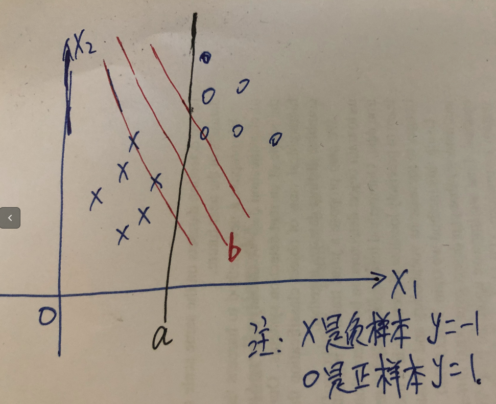
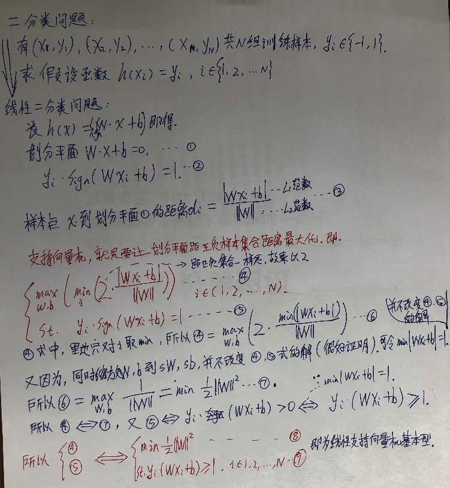
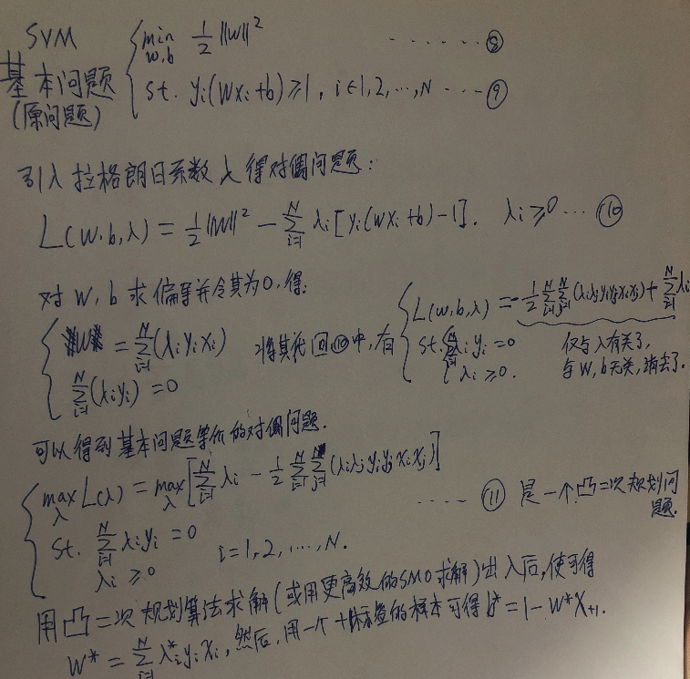

# 　　　　　　支持向量机
## 引言
在机器学习中，[支持向量机](https://en.wikipedia.org/wiki/Support-vector_machine)是一种有效并且常用的二分类模型，它的基本模型是定义在特征空间中的间隔最大化的线性分类器（加上核技巧后也可变成非线性分类器）。它的数学理论基础扎实，且适用于小样本的学习，在现在深度学习流行的今天，也是一种值得学习的基础模型。

**欢迎探讨，本文持续维护。**

## 实验平台

N/A，纯数学公式推导，无代码

## 线性支持向量机

### 从二分类模型到线性支持向量机基本型

如上图给定一组训练数据{(x1,y1), (x2,y2), ..., (xN,yN)}，其中x是特征向量，y是标签（取值-1，+1）。二分类问题就是要找到一个假设函数h(x)，使得对所有的训练数据有h(xi) = yi，数学描述等价于h(xi) \* yi = 1。如果我们假设要找的这个假设函数为线性函数，即假设h(x) = sign(Wx + b)这种形式，那么就是线性二分类问题，Wx + b = 0为**划分超平面**，h(x) = Wx + b为**分类决策函数**，超平面将整个特征空间一分为二，符合h(x) > 0的决策为+1类，否则决策为-1类。数学描述就是要找到合适的W和b参数，使对所有h(xi) \* yi = sign(Wxi + b) \* yi = 1，这等价于对所有的xi都有(Wx + b) * yi > 0。

这样的超平面可能有无数个，如上图所示的a和b就是两个，那用什么标准来选择最好的呢？支持向量机的核心思想就是，选择和距离正样本集合和负样本集合**间隔最大**的超平面为划分超平面(而空间点和平面的距离公式为下图中式3所示)，所以支持向量机的原始形式可以见下图式4和式5，翻译成人话就是，在分类所有训练样本正确的前提下，寻找W和b，使其构成的超平面Wx + b = 0可以最大距离划分正样本集和负样本集，所谓的最大距离，就是超平面和任意一个样本点的距离都尽可能地大。也就是，支持向量机是想找到图中b所代表的划分平面比a要好。

但是这里原始形式很难处理，为了能在能在现实中好优化，需要继续把它做简化，简化成一个经典的凸二次规划(QP)问题。

在**式4中，里面的求最小，是相对于所有的样本点求最小，和W,b的取值无关**，所以可以将式4简化为式6，然后可以注意到，同时用相同的系数缩放W和b，不改变式6和式5的解，我们就可以进一步令min|Wxi+b| = 1（反正可以任意缩放咯），这里的集合意义是让样本点中离超平面最近的距离归一化一下，然后式6就可以转化到式7(等价可以到式8)，同样式5可以转化为式9。最后联立式8和式9就是**线性支持向量机的基本型**了。

### 对偶问题
可以证明，式8和式9描述的线性支持向量机的基本行中所描述的优化属于d+1个优化变量（W和b），N个约束的**凸二次规划问题**。我们可以用[D#0008](https://github.com/Captain1986/CaptainBlackboard/blob/master/D%230008-%E6%8B%89%E6%A0%BC%E6%9C%97%E6%97%A5%E4%B9%98%E5%AD%90%E6%B3%95/D%230008.md)中提到的拉格朗日乘子法引入拉格朗日乘子将带约束的原问题转换为不带约束的对偶问题来方便地求解。

由上面的W\*和b\*的表达式可以知道，当lambda_i\* = 0时，对应的x_i和y_i对Ｗ\*的取值无影响，进而b\*这些x_i和y_i也影响不到b\*。所以可知，**只有那些对应于lambda_i\* != 0的样本才对最终的决策平面(Wx + b = 0)有影响**。而这些样本就是支持向量机的**支持向量**，第一张图中两个x和一个o这三个点就是支持向量。

由上面的讨论现在可以有以下结论，1.支持向量机的划分平面由最重要的少数样本点(支持向量)决定；2.在预测时，样本点到划分平面的距离，可以**在一定程度上**表示为置信度。

## 非线性支持向量机

上面介绍的线性支持向量机处理的样本都有个假设，假设样本线性可分，但是我们更可能遇到的是一些线性不可分的数据，例如下图所示：

对于这种情况，**T. M. Cover模式可分性定理**证明了，对于低维度特征，可以通过非线性映射z = T(x)嵌入到高维度(甚至无穷维度)空间内，在那个空间内特特征线性可分！这样我们又可以在这个高维度空间内愉快地使用线性SVM来分类了。我们把T(x)当作ｘ代入上上图式11中，解出高维空间中新的W* = sum_1toN(lambda_i \* y_i \* T(x_i))，b* = 1 - W*x_+1。不失一般性，让b\* = 0（相当于整个样本和划分平面一起平移，使划分平面经过原点），那么我们有划分平面W\*T(x) = 0，也就是**sum_1toN(lambda_i \* y_i \* T(x_i)) \* T(x) = 0**。

### 核技巧基本原理

但是，这里有两个问题，**第一，这个从低维度特征空间到高维度特征空间的映射函数T(x)很难找；第二，高维度特特征空间维度可能很高，甚至于无穷维，那么要直接计算T(x)也是很困难的。**

继续观察到，我们找到划分平面，**其实不需要去计算T(x)的具体值是多少，甚至连T(x)的函数形式都不需要，我们只需要知道T(x_i) \* T(x)是多少就可以了。**即，找到一个新的函数K(x1, x2)使其等于T(x_i) \* T(x)。这个函数K可以找的比较简单的形式(起码比T函数要简单的多)，找到的K就叫做**核函数**。

### 核函数的讨论和常用核函数

核函数是否一定存在？什么样的函数可以做核函数呢？这涉及到更深的希尔伯特空间中核矩阵的判别问题，这里就不多做讨论了。

通过上面的讨论可知，我们希望通过T将低维度空间内线性不可分问题转换为高维度空间内线性可分问题，那么高维度特征空间的好坏，也就是T的好坏，就决定了支持向量机的性能好坏。让人悲伤的是，我们并不知道高维度特征空间的样子，也不知道T的形式，我们只是为了简单计算，**间接地通过核函数K来定义T**。所以，核函数的选择好坏，直接决定了高维度特征空间的好坏，如果和函数选择不好，可能直接就决定了支持向量机性能也不好。**“核函数”的选择成为支持向量机方法成败的关键变量**。

一般来说，当特征维数D大于样本数量N时（例如文本分类），使用线性核；当特征维数D比较小，而样本数量N适中时，选择高斯核（也称RBF核），或者情况不明时，也选择高斯核；当特征维数D比较小，样本数N特别大时，选择深度神经网络一般会比SVM好。

下面列出了一些常见的核函数：

## 软间隔和Hinge Loss
在上面的探讨中，都是要求支持向量机得到的划分平面能**100%正确划分**正样本和负样本，即**假设样本都是线性可分的**，虽然在理论上，我们总能找到一个高维映射使数据线性可分，但是在实际任务中，寻找这样合适的核函数很难而且计算也困难。另外，因为样本中噪音的存在，一味要求100%的正确分类，也很容易陷入过拟合的困境。

## 支持向量机与深度学习讨论

## 总结

## 参考资料

+ [《统计学习方法》](https://book.douban.com/subject/10590856/)
+ [《PRML》](https://www.douban.com/group/471521/)
+ [《The Elements of Statistical Learning》](https://book.douban.com/subject/3294335/)
+ [南京大学-张皓-从零推导支持向量机](https://github.com/HaoMood/File/blob/master/%E4%BB%8E%E9%9B%B6%E6%8E%A8%E5%AF%BC%E6%94%AF%E6%8C%81%E5%90%91%E9%87%8F%E6%9C%BA(SVM).pdf)
+ [《数据挖掘概念与技术》](https://book.douban.com/subject/2038599/)
+ [《数据挖掘十大算法》](https://book.douban.com/subject/24735417/)
+ [支持向量机SVM - 从入门到放弃](https://zhuanlan.zhihu.com/p/30596284)
+ [现在还有必要对 SVM 深入学习吗？](https://www.zhihu.com/question/41066458)
