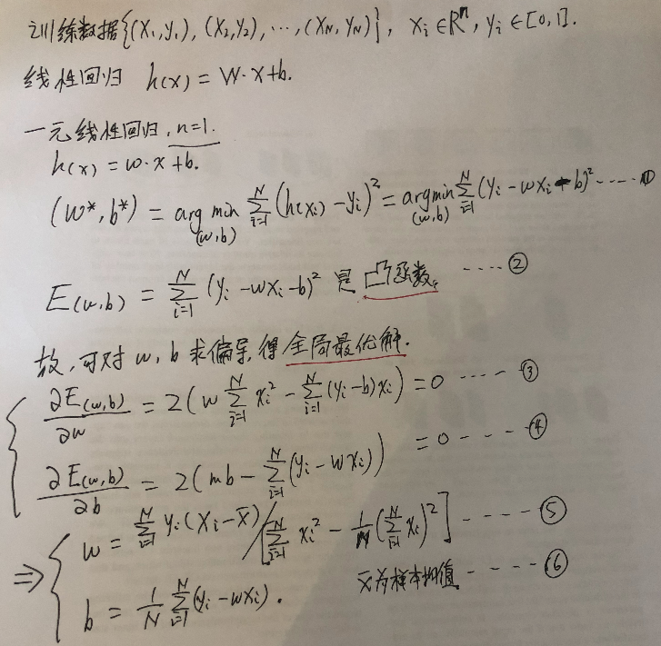
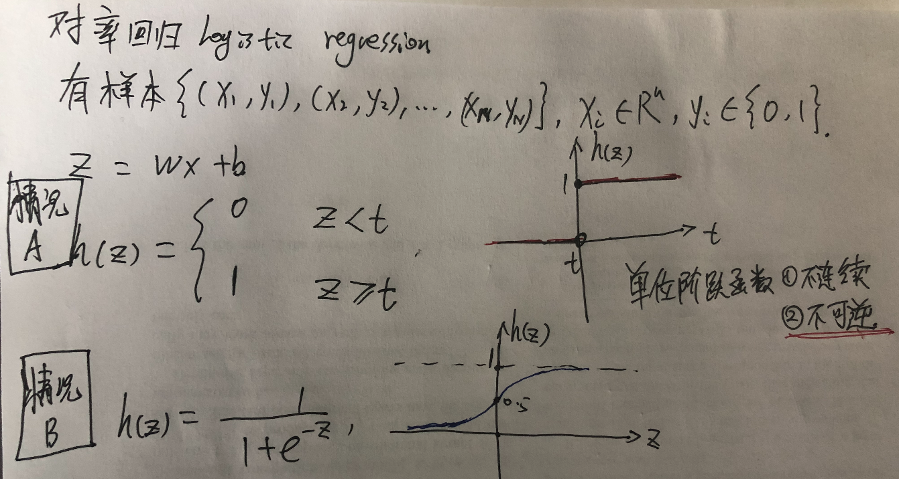
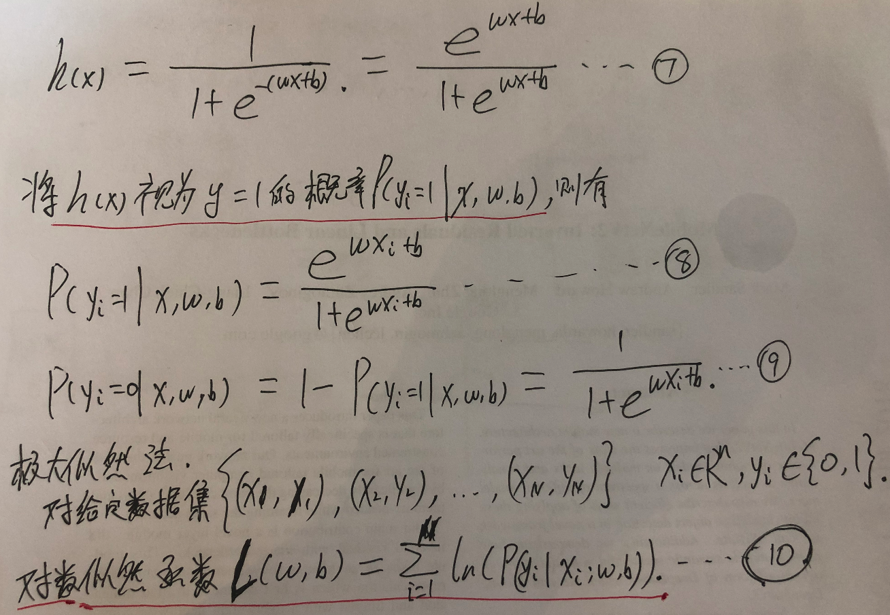
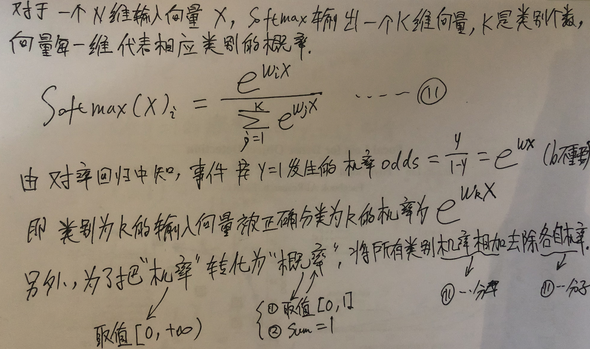

# 　　　　　　从线性回归到对率回归到Softmax激活函数
## 引言

**欢迎探讨，本文持续维护。**

## 实验平台

N/A，纯数学公式推导，无代码

## 线性回归

给定一组训练数据{(x1,y1), (x2,y2), ..., (xN,yN)}，其中x是特征向量，y是标签，取值区间在[0,1]。一元线性回归就是将特征空间的每个分量，赋予一定的权重将他们加起来，然后加上一个偏置，将其和作为标签y的估计值。或者说，寻找一个W，使h(x) = Wx + b接近训练集y。

### 一元线性回归

当特征空间只有一维的时候，就是一维线性回归。此时，W是标量，b也是标量，h(x) = wx + b。

那么如何通过训练数据估计参数w和b呢？关键在于找到一个函数，度量估计值和真实值的总的差距大小，然后找到使这个总的差距最小的的w和b就可以了。均方差就是这么一个度量工具。因此，我们可以通过均方差最小化来找w和b的解。

如上图E(w,b)是总的平方误差（和均方差只差一个系数1/N，不影响讨论），**E是关于w,b的凸函数**，所以直接可以对w,b分别求偏导数然后令偏导数等于0就可以求得w和b的在最小二乘意义下的**全局最优解**。上面说的**基于均方误差最小化来进行模型求解的方法成为“最小二乘法”**。在**线性回归中，最小二乘法的几何意义是试图找到一条直线h(x)，使这条直线到所有样本点的欧式距离平方的和最小**。

### 多元线性回归

当一元线性回归的样本特征维数大于1的时候，一元线性回归就泛化成了多元线性回归。求解的方法同样是最小二乘法。先对w，b求导，然后分别令其为0即可。为了简便，可以把w和b组合成一个新的变量W' = (w;b)，然后h(x) = W'x。最后可以求得W'的解为inv(X_t\*X) \* X_t \* y，X_t是X的转置。需要特别注意的是，当数据集中**样本个数小于特征维数的时候，X_t\*X是不满秩的**，此时有无数多个W'，此时就要根据具体问题的实际情况的偏好，对W'的取值范围进行约束，常见的做法是引入正则项。

一元线性回归是多元线性回归的特殊情况，它只有一个特征维度，但是有大于一个的学习样本，样本数大于特征的个数，所以，肯定不会出现X_t\*X不满秩的情况的。

### 联系函数和广义线性回归

线性回归模型虽然简单，但是却可以产生出丰富的变化。如果我们前面的模型W\*x + b不是直接预测标签y，而是预测y的变换g(y)，那么这就是**广义线性模型**，W\*x + b的值对于y本身来说，不是线性的，但是对于y的变换域g(y)来说是线性的。这里的函数g()成为**联系函数**。特别地，如果g取自然对数ln的话，那就是“对数线性回归”，它使用W\*x + b线性拟合ln(y)，换一种说法，它使用e^(W\*x+b)来线性拟合y。g(y) = W\*x + b可以推出y = g_inv(W\*x + b)，所以**联系函数g()必须是可逆函数**，要不然就不能把W\*x + b直接映射到y了。

## 对率回归

上面讲的都是回归的内容，回归简单地将就是将一组输入特征变换一下，输出一个**实数值**。但是如果要用特征的线性组合W\*x + b做**分类**问题怎么办？很简单，找一个联系函数，把特征的线性组合W\*x + b映射到不同类别就行。最简单的映射当然是指定一个值t，当W\*x + b　> t时，映射到1类，反之映射到0类，h(z)对应于一个阶跃函数，如下图中情况A所示。

但是，阶跃函数不连续，求解过程中不好求导；更重要的是阶跃函数**不可逆**，那就不能作为联系函数来用（原因请见联系函数一节）。

### 对率函数

有人就想到了用对数几率函数（上图情况B所用的h(z)函数）来替代阶跃函数，对数几率函数是一个S形函数，单调可微，任意阶可导，取值范围(0,1)，**正好也可以对应到标签的两端，而且也是概率的取值范围**。另外，它还有其它一些很好的数学性质，比如关于(0,0.5)这个点点对称，比如求导简单等。

使用对数几率函数作为联系函数的（其实是逆函数）广义线性回归，就叫对率回归。**对率回归的输出值可以看做是预测为1的概率**。那么当使用对率回归做分类时，很自然地加一个阈值就可以了，比如对率函数输出大于0.5就判断为1类，否则判断为0类。

题外话，对率函数其实是Logistic函数簇的一种特殊情况，为什么把它叫对率函数呢？其实对率函数的全称应该是**“对数几率线性回归函数”**。几率定义为样本x作为1类的概率除以作为0类的概率，即odds = y / (1-y)。如果对odds去自然对数，那么在对率函数的情况下，这个对数的结果ln(y/(1-y))是由W\*x + b线性表示的，所以叫对数、几率、线性、回归！所以就将这个特殊的S型的函数成为对率函数，因为它将W\*x + b和对数几率直接联系了起来。

### 对率回归参数估计

见上图，式7是对率回归的表达式h(x)，将其视为y=1的概率，然后写出可以用极大似然估计函数式10。式10是对w和b的高阶连续可导凸函数，理论上可以直接求导找到最大值，但是直接像线性回归那样找到解析解十分困难。所以一般是用凸优化理论的方法，比如牛顿法、梯度下降法来迭代，找到数值解，因为怎么求解和模型本身的思想关系不大，这里不做详述。

## 从对率回归到Softmax激活函数
先说明一下，这里讲的Softmax不是Softmax Function = ln(sum_1toN(e^x_i))，而是Softmax Activation Function。
Softmax激活函数，是如下图式11所示

通过对率回归的一个结论：事件发生的几率odds等于e^(wx)，可以知道，Softmax的输出的K个分量就对应了这个输入x属于该分量对应类别的几率大小。式11分母部分，是为了赋予一个概率的意义，把各个输出分量用他们的和归一化而已（不太准确的说，就是将几率转化为概率）。

## 一点学习心得

从最简单直观的线性回归，到不那么好理解的Softmax激活函数，各种巧妙的方法，思路都是从基础简单的问题和思路一步步推演过来的，要么是为了发展旧方法来解决一个具体的小问题（例如对率函数的引入，就是为了解决阶跃函数不可导不可逆的问题），要么是对原来旧方法的拓展（例如从多元线性回归到广义线性回归）。另外，有些方法由于历史原因，名字不是很合适，例如，"Logistic Regression"这个名字就很不恰当，应该叫对数几率回归比较好。另外，Softmax称为Softargmax也会更恰当。

## 总结

## 参考资料

+ [《统计学习方法》](https://book.douban.com/subject/10590856/)
+ [《PRML》](https://www.douban.com/group/471521/)
+ [《The Elements of Statistical Learning》](https://book.douban.com/subject/3294335/)
+ [Logistic function](https://en.wikipedia.org/wiki/Logistic_function#cite_note-4)
+ [《深度学习》](https://book.douban.com/subject/27087503/)
