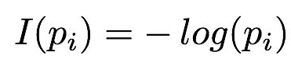
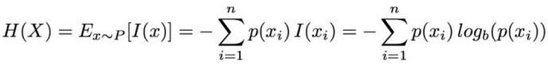
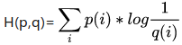
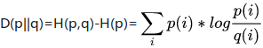
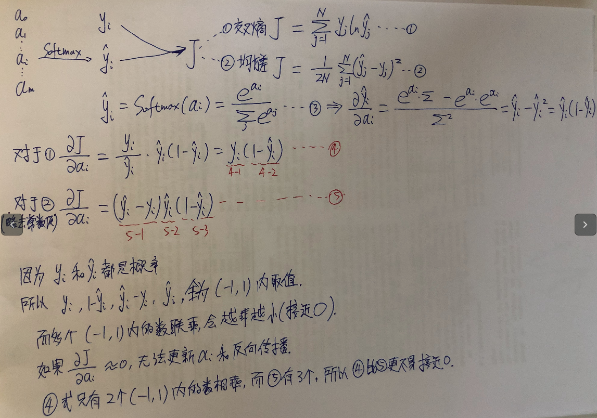
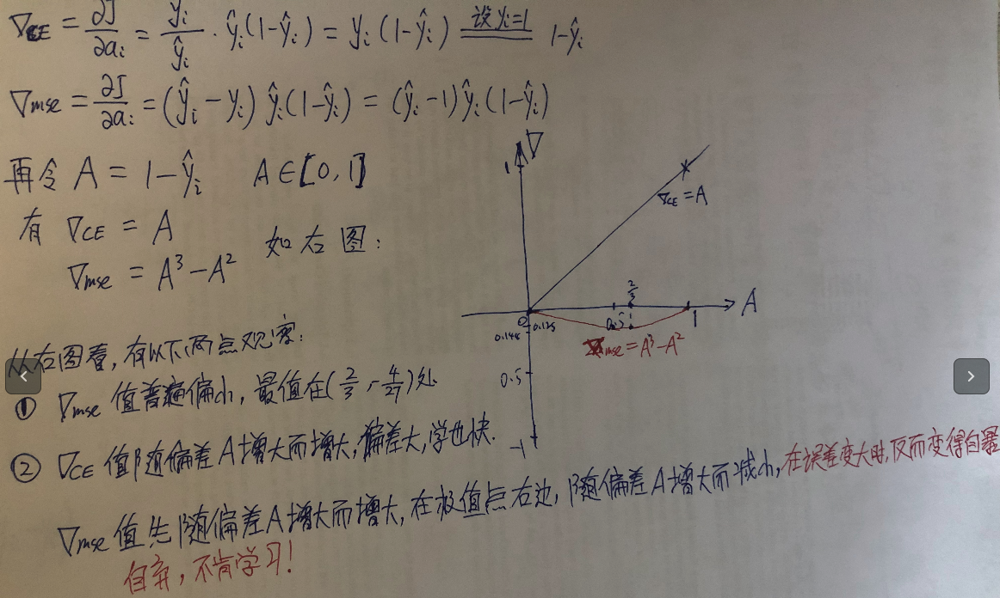

# 　　　　　　为什么选交叉熵作为分类问题的损失函数
## 引言

在深度学习中，经常（如果不是100%的话）选交叉熵作为分类问题的损失函数，为什么选交叉熵，而不是传统机器学习更熟悉的均方差或者别的损失函数？这在深度学习中是一个很重要的和基础的问题。

**欢迎探讨，本文持续维护。**

## 实验平台

N/A，纯数学公式推导，无代码

为了回答本文题目提出的问题，下面从两个方面来做讨论：

1. 交叉熵**能不能**做分类问题的损失函数？
2. 交叉熵与均方差相比，做深度学习分类问题损失函数，**优势在哪里**？

我想回答了上面两个子问题，本文题目的问题，也就迎刃而解了。

## 交叉熵能不能做分类问题损失函数

### 信息论中的熵

熵是一个物理学中的概念，代表事物的**混乱程度**，越混乱，越没有规律的事物，熵越大，反之越小。在信息论和计算机科学中，熵代表**信息量**的多少，信息量越多，熵越大。**信息量的多少，用编码这个信息所需要的最少要多少个bit表示**，比如吃没吃饭这个信息，只有两个不同状态，就可以只用一个bit（0代表没吃，1代表吃了）编码；今天周几这个信息，有7个不同的状态，就至少要用3个bit来编码。编码位数用公式表达就是，p_i代表某个状态i出现的概率（本文的对数，没有特别声明都是以2为底）。再取所有可能的状态去加权平均，就是这个信息（分布）的熵，**代表编码这个事件所需要的总的字节数**。

另外，还有一点很重要的结论，那就是一个事件**按照真实分布编码的时候，需要的字节数，也就是熵H(X)最小**。证明很简单，类似于贪心算法，出现概率最大的可能性，分配最少的字节去编码，最小可能性，分配最多的字节去编码，更严谨的证明，参见[Gibbs' inequality](https://en.wikipedia.org/wiki/Gibbs%27_inequality)。

### 衡量两个分布的相似度－KL散度

如果同一个事件A，分布p是它的真实分布（如果找得到的话），另外有一个分布q是我们**猜测的**事件A的分布，我们希望我们猜测的分布q尽量地和实际分布p一致。我们按照q分布去给事件A编码，那么每个事件A的可能性需要的字节数乘以该可能性发生的概率，就得到了**p分布和q分布的交叉熵**。根据上节中的讨论，**交叉熵可以理解为，用猜测的q分布去编码实际为p分布的事件所需要的字节数**。而这样编码，和最佳编码（按照实际分布p来编码），所**额外用的字节数**，叫做**相对熵**，也叫做[**KL散度**](https://en.wikipedia.org/wiki/Kullback%E2%80%93Leibler_divergence)，额外用的字节数越少，那么分布q就和分布p越接近，所以，KL散度是衡量两个分布相似度的指标。额外提一句，**KL散度不满足距离要求的对称性，不能当作距离用**。

### KL散度和交叉熵的关系

由上面的讨论可知，交叉熵代表了用q分布编码p分布需要的字节数，KL散度表示这个字节数和最佳编码字节数之间的差值，也就是多用的字节数。**当分布p一定的时候，H(p)也就定了，那么交叉熵和KL散度同增同减，是等价的**。因为

1. KL散度可以衡量两个分布q和p的相似程度
2. **在分布p一定时**，交叉熵和KL散度同增同减

所以，在优化时，如果要衡量两个分布相似度，交叉熵是一个合适的选择。

### Softmax输出的是什么

在[《从线性回归到对率回归到Softmax激活函数》](https://github.com/Captain1986/CaptainBlackboard/blob/master/D%230010-%E4%BB%8E%E7%BA%BF%E6%80%A7%E5%9B%9E%E5%BD%92%E5%88%B0%E5%AF%B9%E7%8E%87%E5%9B%9E%E5%BD%92%E5%88%B0Softmax%E6%BF%80%E6%B4%BB%E5%87%BD%E6%95%B0/D%230010.md)文中已经论述了，我们可以把Softmax的输出看作是每类的概率分布。真实的Ground Truth就代表了**真实分布**。这两个分布一个是上文提到的q，一个是p，那么对这两个分布的距离，用交叉熵来表示（将底改为e，不影响最值），也就是自然而然的事情了。

到此为止，我们也就解答了“交叉熵能不能做分类问题损失函数”这个问题。

## 交叉熵比均方差好在哪里

除了交叉熵比均方差完美地配合了Softmax输出概率这一个前提之外，交叉熵比均方差做损失函数好还有一些比较现实的原因。

上图中，左上角y帽代表网络输出的真值的估计，y是真值。而y帽是从Softmax激活函数得来的，a_i是Softmax激活函数每一路的输入值。J代表损失函数，在优化的时候，损失函数会通过梯度下降法反向传播来优化网络，减小J的值。这里以J反向传播到a_i为例，直观感受一下为什么Softmax作为输出层的时候，J用交叉熵比用均方差好。

首先对于交叉熵的损失式１，对它关于a_i求导，得到式4，式4里面有两项（4-1和4-2）相乘。对于均方差的损失式2，也对它关于a_i求导，得到式5，式5里面有三项（5-1,5-2和5-3）相乘。因为y帽和y都是概率，所以4-1,4-2个5-1,5-2,5-3都是绝对值小于1的，一些小于1的数相乘，越乘越接近0，而且项数越多，越接近0。接近0是我们不愿意发生的，因为误差反向传播需要根据这些导数来更新网络的参数，接近0就代表更新量接近0了，不利于网络优化。

然后我们假设，y_i = 1的时候，看看学习时会发生什么。

可以看到，在y_i　 = 1（假设学习one-hot目标）时，**交叉熵相对于Softmax的输入a_i的导数delta_ce和误差A成正比，误差越大，导数越大，学习越快**；而用**最小二乘的delta_mse，随着误差增大，反而学习变慢了，学习效率不高**。而且，delta_mse的绝对值一直比delta_ce小，也印证了我们在上一段的讨论。

除了和Softmax配合之外，如果前面一层的激活函数是Sigmoid激活的话，也有类似的问题，这里不再证明。

至此，我们也回答了文首提出的第二个问题“交叉熵与均方差相比，做深度学习分类问题损失函数，优势在哪里？”

总结一句就是，交叉熵做Softmax分类的损失函数，它可以做，也做得比其它损失函数好，所以深度学习的分类问题，一般就是它啦。

## 总结

本文从信息论和统计学KL散度的角度论证了用交叉熵作为深度学习中分类问题损失函数的合理性，并结合Softmax作为网络最后输出层这个例子，在误差反向传播和参数迭代优化的角度，比较了交叉熵比均方差在分类问题上的优势。这些讨论可以加深我们对经典方法的理解和学习，在工程实践中，也有一定作用。

## 参考资料

+ [《深度学习》](https://book.douban.com/subject/27087503/)
+ [Gibbs' inequality](https://en.wikipedia.org/wiki/Gibbs%27_inequality)
+ [KL散度](https://en.wikipedia.org/wiki/Kullback%E2%80%93Leibler_divergence)
+ [《从线性回归到对率回归到Softmax激活函数》](https://github.com/Captain1986/CaptainBlackboard/blob/master/D%230010-%E4%BB%8E%E7%BA%BF%E6%80%A7%E5%9B%9E%E5%BD%92%E5%88%B0%E5%AF%B9%E7%8E%87%E5%9B%9E%E5%BD%92%E5%88%B0Softmax%E6%BF%80%E6%B4%BB%E5%87%BD%E6%95%B0/D%230010.md)
+ [如何通俗的解释交叉熵与相对熵?-Noriko Oshima](https://www.zhihu.com/question/41252833/answer/108777563)
+ [为什么使用交叉熵作为损失函数](https://zhuanlan.zhihu.com/p/63731947)
