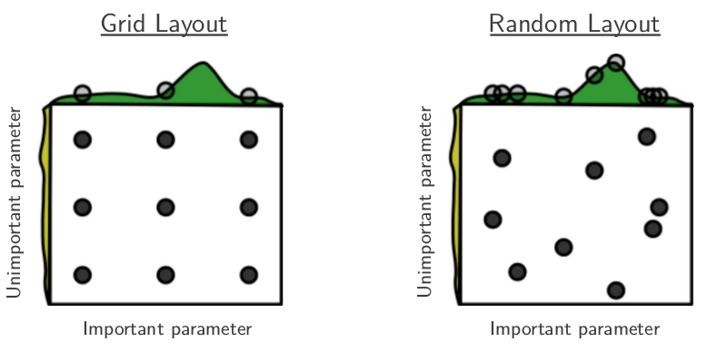

# 　　　　　　深度学习调参常用方法总结
## 引言

在深度学习工程师的日常工作中，很大一部分时间都是在训练模型，或者说调参。深度学习中的超参数很多，学习率，正则系数，dropout，weight decay，kernel size这些都是需要在训练之前设置的超参。而且每次模型训练，都要花很多时间，很多资源成本。是故，本文总结了常用的几种调参策略。

**欢迎探讨，本文持续维护。**

## 实验平台

N/A

## 试错法（Baby Sitting）

试错法也叫照看法，是最简单的调参策略。就是设计一组超参数，然后跑训练，看训练的结果满意不？不满意，就看哪里出问题了，**不断根据前面的结果迭代**修改超参数，继续下一次训练，如此往复，直到满意，或者项目deadline逼近。试错法简单易懂，技术门槛低，容易实现，是很多机器学习从业者的首选，不过缺点在于试错法最终得到的结果是**高度依赖调参者水平和经验**的一种方法。

## 网格搜索（Grid Search）

网格搜索，稍微比试错法效率好一点。因为方法简单，**适用于超参数种类比较少，取值也不多的情况下**，也会被很多工程师用到。

基本思路是这样的，比如现在要寻找一组Dropout rate和Learning rate的最佳组合，让验证集误差最小。网格搜索就是指定一些离散的Dropout rate，比如(0.4,0.5,0.6,0.7)这四个取值；然后再给Learning rate也同样指定一些可能的取值，比如(1e-4,1e-3,1e-2)这三个取值，如果以Dropout rate为横轴，以Learning rate为纵轴建立一个平面直角坐标系，那么这些取值点就是盘面上的4x3=12个点，这些点连成一个网格。下一步就是以这12个点为参数训练12个模型，取效果最好的参数。

这个方法的优点在于容易理解，概念简单，易于多机并行化，缺点在于穷举方法太暴力，**成本太高**，特别是需要调节的参数数量比较多的时候，训练次数是成**指数性增长**的。

## 二分搜索（Binary Search）

网格搜索太暴力，成本太高。其实我们对所要调节的参数要干什么，会对最终结果（验证集误差）会产生什么影响应该是略有知晓的。网格搜索没有利用这个信息。

那如何改进呢？

如果某个参数的取值，对验证集误差来说是平滑而且有一个极值的，那么我们可以用二分搜索来减少训练次数，加快调参。

举个例子，在MTCNN人脸检测中，用的人脸分类损失是二分类交叉熵，人脸框回归和特征点定位用的是L2损失。在训练每个子网络(P-Net,R-Net和O-Net)的时候会对交叉熵和L2损失用不同的加权求和作为各自网络训练时的损失函数。以P-Net来说，L_pnet = L_cls + alpha x (L_boxreg + L_landmark)，alpha这个权重系数，就是一个可以手动调节的超参数。alpha调节的是训练时分类损失和其他两个损失的权重对比，如果alpha取值比较大，那么人脸检测任务可能表现的不好，反之alpha取值太小，框回归和特征点定位任务可能表现不好。在设定了一个最低的人脸召回率后，我们可以用二分法在(0.0,1.0)这个区间去用二分法寻找最合适的alpha值，比网格搜索要高效地多。

二分法比网格搜索效率成**指数性**的提高，但是需要超参数的取值对验证集误差是一个**凸函数**，这在仅一类超参数调节的时候还好，在多类超参数需调节的时候，一般很难保证找到全局最优。

## 随机搜索（Random Search）

二分搜索前提条件太苛刻，网格搜索效率太低，而且不适合于同时优化太多超参数。而随机搜索前提条件比较松，而且适合于同事优化多个超参数，编程也不复杂，在同样的训练次数约束下效果一般也不比网格搜索差，是一种比较重要的调参思路。

随机搜索的思路是这样的：一般我们需要调整的超参数很多，但是**并不是所有的超参数都有同样的重要性**（这一前提很重要，也很容易满足），在训练次数一定（资源约束）的情况下，**训练更多的参数的组合**（而不是像网格搜索一样，很多参数的组合都是一个参数**不动**，动其余的参数），更有可能找到那些重要的参数的最佳值（采样点更多选最优嘛）。随机搜索和网格搜索比较示意图如下：

图中需要优化（最大化）的函数是f(x,y) = g(x) + h(y)，这里x,y可以看成是超参数，f(x,y)是验证集上的损失。图上黄色的是h(y)的函数曲线，绿色是g(x)是的函数曲线。这里h(y)函数值比较均匀，在最优值处贡献比g(x)小，所以自然在x轴上采样更多的点去训练比较比较好。而左边网格搜索，9个点（9次实验）只有3种不同的x取值；右边随机搜索，里面的点都是随机找（比如在x和y上按照均匀分布找）的，同样9个点，可以找到9个不同的x值的配置来训练，**没有浪费的实验**，明显比网格搜索的3个点更容易找到g(x)的最大值，也就是找到了f(x,y)的最大值。当有几个超参数都性能没有显著影响时，随机搜索比网格搜索**指数级的高效**。另外，随机搜索不用离散化超参数的值，**有更大的搜索空间**，而不产生额外的代价而更容易搜索到超参的最佳值，这也是随机搜索比网格搜索优秀的地方。

## 贝叶斯优化（Bayesian Optimization）

## 总结

本文总结了常用的几种深度学习调参的方法，这些方法都有各自的优缺点，有的方法之间还有相互借鉴的交集，需要在实际工作中多揣摩，多实验，多分析。

## 参考资料

+ [深度学习超参数搜索实用指南](https://zhuanlan.zhihu.com/p/46278815)
+ [超参数搜索不够高效？这几大策略了解一下](https://zhuanlan.zhihu.com/p/46718023)
+ [Practical guide to hyperparameters search for deep learning models](https://blog.floydhub.com/guide-to-hyperparameters-search-for-deep-learning-models/)
+ [How To Make Deep Learning Models That Don’t Suck](https://blog.nanonets.com/hyperparameter-optimization/)
+ [Random Search for Hyper-Parameter Optimization](http://www.jmlr.org/papers/volume13/bergstra12a/bergstra12a.pdf)
+ [《深度学习》](https://book.douban.com/subject/27087503/)
