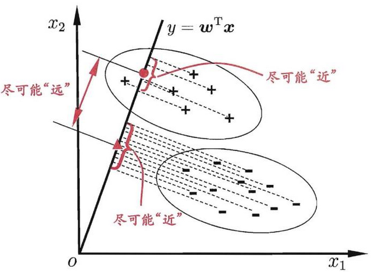
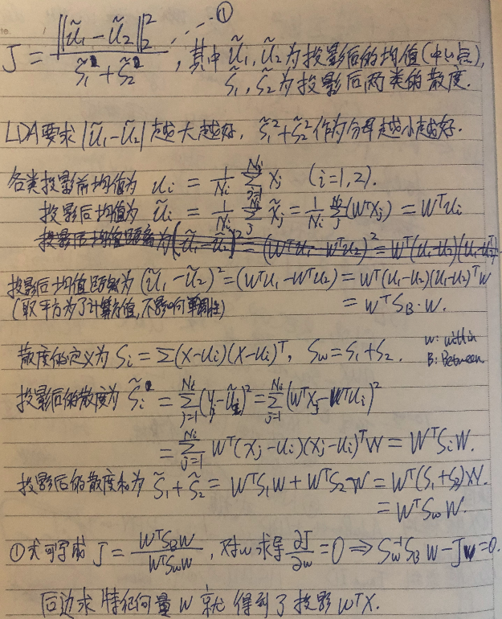
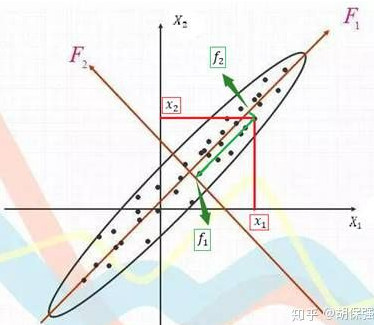

# 　　　　　　数据降维常用方法总结(LDA,PCA)
## 引言

做机器学习的时候，一般来说特征越多，我们对训练样本的信息越多，越有利于学习。但是特征太多，也会带来两个问题，1.**维数灾难**，为了学习到每个维数的规律，那个维数的样本就不能太少，而样本的数量是跟着特征维数的增大而指数性增大的；2.**资源开销大**，我们提取的特征太多，这些特征中就有可能有相关和**冗余**，给数据存储，学习和优化都带来负担。有鉴于此，在特征维数过大的时候，我们有必要对这些特征进行辨别和合并，有选择性地压缩特征的维度。本文介绍了几种常用的特征选择方法。

**欢迎探讨，本文持续维护。**

## 实验平台

N/A

## 线性判别分析(Linear Discriminant Analysis)

什么是好的特征？好的特征有两点才叫好，

**1. 同类样本在特征空间中应该尽可能靠近；**

**2. 不同类样本在特征空间中应该尽可能远离。**

**同时满足**这两个的要求的特征，在做分类时才好分，线性判别分析正是根据上面两点来做特征降维的。

**线性判别分析的思想非常朴素：给定训练样例集，设法将样例投影到一条直线上，使得同类样例的投影点尽可能接近、不同类样例的投影点尽可能远离。在对新样本进行分类时，将其投影到同样的这条直线上，再根据新样本投影点的位置来确定它的类别。**

LDA由二维降维到一维的最简单情况如上图所示，我们有在由x1,x2张成的二维特征空间内有一些正样本+和一些负样本-，LDA就是找一个由二维到一维的投影Y = W_t \* X（这里只做降维，为了分析简单，所以投影直线的截距设置为0，过二维原点），Ｗ是直线的法向量，**在这个投影上，这两类新的中心点要尽量的远离，但每类内部的点要尽量地靠拢。**

在下面公式推导之前，有一个重要的结论就是这里每个点投影后的值W_t \* x代表的是投影后的点到二维原点o的距离，可以利用向量的内积在几何上去理解，W_t \* x = <w, x> = |W|\*|x|\*cos(theta) = |x|\*cos(theta)，W是直线的法向量，长度为1。

这里推导很直观，不再赘述。

## 主成分分析(Principal Components Analysis)

线性判别分析压缩需要用到不同类的标签，如果同一类要做特征压缩，那么我们可以用主成分分析。

主成分分析的目标是通过**旋转坐标轴**（也就是线性变换！）将各个原始特征组合成新的特征，而这些新的特征有的特征所携带的信息量大，有的特征所携带的信息量小，PCA**删除一些携带信息量小的特征**，留下信息量大的特征，最大程度的保留原始特征所能表达的信息。

如上图所示，在原始特征X1和X2张成的特征空间，有一群样本点，这些样本点在X1轴方向分布的范围比较大，在X2轴方向分布的范围也比较大。直观地想，分布范围比较大，相当于数据分布比较乱，分布没啥规律，从信息论的角度理解就是数据在X1和X2方向上的熵比较大，携带信息比较多，不能简单地丢掉某一维度来降维。而PCA是先旋转原始X1,X2轴到新的方向F1,F2，在这个F1,F2张成的坐标系中，F1方向携带的信息多，F2方向携带的信息少（因为F2方向数据投影的取值范围很集中），这样就可以省略F2这个特征，取用F1特征达到降维的目的。

**主成分分析的这种坐标轴变化是通过将原来的坐标轴进行线性组合完成的。**

为了形式化找到X1,X2到F1,F2的旋转矩阵，需要先计算原始数据**协方差矩阵**X_t\*X的特征值和单位特征向量，特征值大的特征向量方向所含的信息多（上图中F1），特征值越大，所含信息越多。PCA选取特征值大的特征向量组成旋转矩阵对原始数据降维。

**如果特征根小于1，说明该主成分的解释力度还不如直接引入一个原变量的平均解释力度大，因此一般可以用特征根大于1作为纳入标准。**

更详细的推导过程可见[理解主成分分析 (PCA)](https://zhuanlan.zhihu.com/p/37810506)

## 总结

本文总结了两种常用的数据降维方法，第一个是用于**多类**的线性判别分析LDA降维，第二个是用于**单类**的主成分分析PCA方法降维。两者都有比价扎实的数学基础和压缩指导。

## 参考资料

+ [《深度学习》](https://book.douban.com/subject/27087503/)
+ [主成分分析原理介绍-笔记](https://zhuanlan.zhihu.com/p/55981609)
+ [理解主成分分析 (PCA)](https://zhuanlan.zhihu.com/p/37810506)
+ [奇异值分解(SVD)](https://zhuanlan.zhihu.com/p/29846048)
