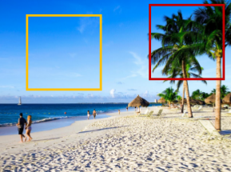
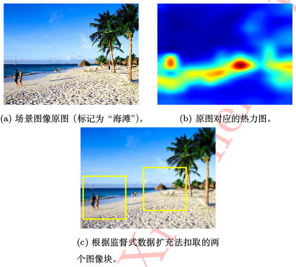

# 　　　　　　深度学习中不平衡样本的处理
## 引言

在目标检测问题中，负样本更容易采集，所以我们能得到的负样本数量一般会比正样本数量多很多。但是负样本多了，就会引起训练数据类别不平衡问题，这会带来：

1. 大量容易负样本（不提供有用的学习信息）会导致训练过程无效。

2. 大量容易负样本产生的loss会压倒少量正样本的loss（即容易负样本的梯度占主导），导致模型性能衰退。

样本不平衡问题不是目标检测问题独有的困难，在反欺诈，灾害预测，垃圾邮件预测等等问题中也会有正样本过少导致训练集样本不平衡的问题。要解决这个问题，可以采用本文介绍的从数据层面和算法两个层面要思考解决方案。

**欢迎探讨，本文持续维护。**

## 实验平台

N/A

## 数据层面
通过对训练集合数据的处理，让正样本的数量和负样本的数量比例趋于平衡（例如1:3）。常见的方式有数据重采样和数据增强。
### 数据重采样
数据重采样，是指在训练之前或者训练时候，对样本多的类别采样频率减少，对样本少的类别采样频率增大，从而使在训练的时候各类类别样本数目比较平衡。
#### 多数样本下采样
拿二分类人脸检测来说，背景是数量样本较多的类别，而人脸是样本较少的类别。对于负样本来说，可以选择**随机抛弃**一部分样本来减少训练时背景样本的数量来达到平衡，但是这样做会降低训练数据的多样性而影响模型泛化能力一般不采用。正确的下采样方式是这样的，比如假设训练时负样本和正样本的比例为3:1（这个比例需要根据实际问题来做出合理的假设），那么**在批训练时候，每批样本随机采集3个负样本（而不是更多）的时候就随机采集1个正样本，使每个批次的训练数据保持负样本比正样本比例大致为3:1。**
另外，根据训练模型在验证集上测试结果，**观察假阳性的规律**（比如手掌部位的假阳性较多），可以特地选取一些手掌的图片作为负样本进行训练（对负样本进行了约束，自然也就降低了负样本的数量）。

#### 少数样本上采样
少数样本的上采样是指：在训练时，对少数样本那一类进行**有放回的抽样**，以用来增加负样本在训练批次里面的数量比例。或者在训练之前，对少数样本那一类进行简单复制，也属于少数样本上采样的一种方式。
需要注意的是，仅仅采用少数样本上采样，因为本质上没有真正增加少数样本的多样性，没有带来更多的信息，可能会引起模型**过拟合**问题。更保险和有效的方式是采取多数样本下采样和少数样本上采样**相结合使用**。

### 数据增强

正样本不够，可以采取一些处理方式，增加正样本，这是一种简单易行的方式。

#### 图像处理增加少类样本
对少数样本的图片添加噪音（例如高斯噪音），进行直方图均衡化操作，进行裁剪，小角度旋转，翻转等等，这些都可以在不改变样本种类的前提下增加少类样本的数量。
#### SMOTE
SMOTE[Chawla et a., 2002]是通过对少数样本进行**插值**合成新的样本。比如对于每个少数类样本a，从a最邻近的样本中选取样本b，然后在[a,b]区间中随机选择一点作为新样本。

#### Fancy PCA
在AlexNet提出的同时，Krizhevsky等人还提出了使用"Fancy PCA"的方法进行数据扩充，这个方法讲Top-1错误率降低了一个百分点（很显著的提升）。
具体操作如下：首先，对所有数据的R,G,B通道进行主成分分析，得到对应特征向量p_i和特征值lamda_i。再根据特征向量和特征值计算一组新的特征值[p1,p2,p3]\*[alpha_1\*lamda_1,alpha_2\*lamda_2,alpha_3\*lamda_3]，其中alpha为均值为0，方差为0.1的高斯分布随机值。最后将其作为扰动加入原来图像的像素值即可。在每一个epoch之后，再次采样新的alpha值进行扰动。

Krizhevsky等人提到“**Fancy PCA可以近似地捕获自然图像的一个重要特性,即物体特质与光照强度和颜色变化无关**”。

#### 监督式数据扩充

在某些情况下，图像分类所用的是整个场景的高级语义特征，此时如果采用随机裁剪作为数据增强方式，可能会裁剪到部分样本而破坏了原来的高级语义，那样的数据，连标签都错了，完全不能用来做训练。

如上图所示的一个场景分类的样本，样本的标签是“海滩”，随机裁剪可能裁剪到了“天空”或者“树”上面去了，就完全不能代表“海滩”这一类场景了。

在2016年ImageNet竞赛场景分类任务中，国内的**海康威视**团队提出了一种利用原始数据标签的监督式数据增强方法：如下图所示，首先，利用已有的数据训练出一个初始模型；然后，利用该模型跑原始训练样本集，对每个样本生成对应的热力图（可直接将分类模型最后一层卷积层特征**按照深度方向加和**得到），这**张热力图可以指示图像区域与场景标记之间的概率关系**，然后对热力图概率高的地方为中心对应原图取裁剪图像块就可以了。

## 算法层面
在算法层面减轻类别不平衡的方法基本上是**改造优化时的目标函数**，使目标函数倾向于减轻多数样本的惩罚力度，加大少数样本的惩罚力度；或者加大难分样本的惩罚力度，减轻容易分样本的惩罚力度。这其中最具有典型性的是**Focal Loss**。关于Focal Loss的介绍，可以参见[《深度学习常用损失函数》](https://github.com/Captain1986/CaptainBlackboard/blob/master/D%230015-%E6%B7%B1%E5%BA%A6%E5%AD%A6%E4%B9%A0%E5%B8%B8%E7%94%A8%E6%8D%9F%E5%A4%B1%E5%87%BD%E6%95%B0/D%230015.md)一文。
## 总结

本文对于深度学习实践中常遇到的数据集不平衡问题的处理方式，从数据层面和算法层面两个角度总结了一些实际可行的缓解方法。

## 参考资料

+ [《深度学习》](https://book.douban.com/subject/27087503/)
+ [CNN_book](http://210.28.132.67/weixs/book/CNN_book.pdf)
