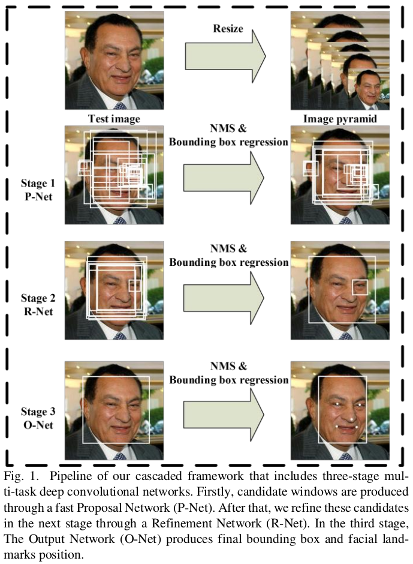
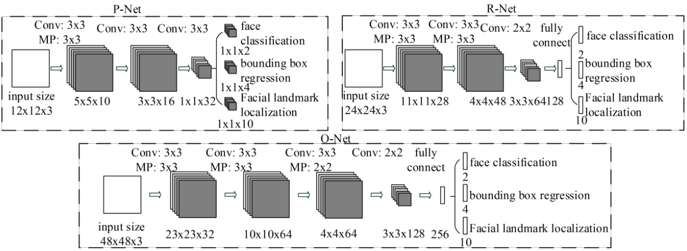
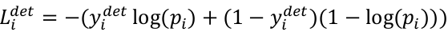
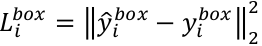
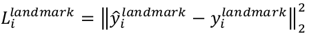
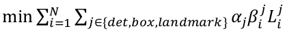
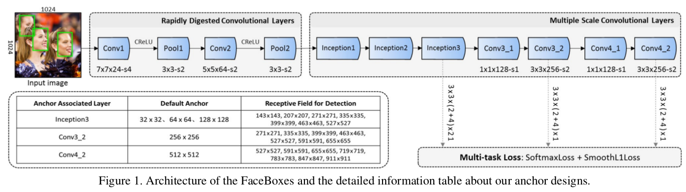
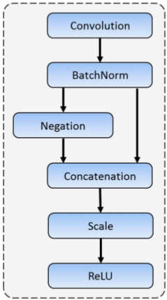
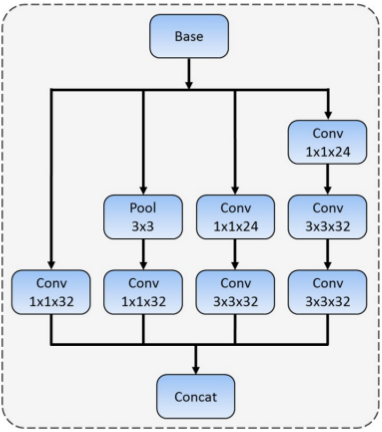

# 　　　　　　MTCNN和FaceBoxes
## 引言

人脸检测是人工智能落地运用的最充分的一个领域，它是属于通用目标检测的一个子领域（只判断是不是人脸）。本文介绍两种实际项目中运用的比较多的深度学习人脸检测算法，MTCNN和FaceBoxes。

**欢迎探讨，本文持续维护。**

## 实验平台

N/A

## 人脸检测简要历史回顾（2018之前）

１．[VJ算法]((http://www.face-rec.org/algorithms/Boosting-Ensemble/16981346.pdf))

在2001年，Viola和Jones在IJCV上发表了论文[Robust Real-Time Face Detection](http://www.face-rec.org/algorithms/Boosting-Ensemble/16981346.pdf)，文中设计了一种快速人脸检测算法，其利用简单地Haar特征训练**级联的**AdaBoost分类器作为分类器，再利用**滑动窗口方法**穷举人脸可能区域送入分类器进行人脸/非人脸的分类（检测）。这个算法的速度较之前的算法有2个数量级的提高，并且有很高的精度，人们称之为**VJ框架**。

2. [Cascade CNN](http://users.eecs.northwestern.edu/~xsh835/assets/cvpr2015_cascnn.pdf)

论文发表于2015年CVPR上，其集成了VJ框架的分类器级联结构，并利用三个**级联**的**检测网络**去由简单到复杂地过滤人脸，并穿插三个**校准网络**对每个检测子网络的输出进行校正。

3. [Faceness Net](https://arxiv.org/pdf/1701.08393.pdf)

Faceness Net论文发表于2017年PAMI上，其主要创新点是用多个卷积网络分别对人脸各个部件，例如头发，眼睛，鼻子，嘴巴，胡须等进行检测，再加一个卷积网络对这个检测到的部件进行优化，输出检测到的结果。由于使用了**部件检测器**，其对人脸的遮挡具有非常好的鲁棒性。

## MTCNN

### 简单介绍

MTCNN是**M**ulti **T**ask **C**ascaded **C**onvolutional **N**et的缩写，出自中科院深圳先进技术研究院和香港中文大学，它是一个利用多个小CNN网络级联来做人脸检测的模型。[论文](https://arxiv.org/abs/1604.02878)发表于2016年的ECCV，性能属于当时的STOA。

它借鉴了VJ算法的级联分类器框架，借鉴了Cascade CNN算法的多个卷积网络由粗到细的分类，不同点在于将bounding regression，landmark regression和face classification这**三个互补的任务放在一起训练**，另外还加入了**在线难例挖掘**(Online Hard Sample Mining)，最终在减少了子网络的数量和计算量的同时保持了良好的性能。

### 算法流程

上图是MTCNN算法工作流程示意图，整个流程分为三个Stage：

+ Stage1，用**P**roposal Net输出人脸候选框和五个关键点坐标，值得注意的是，P-Net是一个**全卷积网络**，可以接受**任意尺寸**的图片，输出的特征图可以上采样到输入图片的坐标，那样就**只需要做一次前向操作**，所以处理速度比滑动窗口要快很多。本阶段的**主要任务是提供人脸Proposals，要求比较高的Recall**（可以有适当的误报，假阳性可以在后面的阶段处理掉）；
+ Stage2，用**R**efinement Net对Stage1输出的Proposals进行细化，抛弃掉非人脸Proposals，并进一步**细化微调**框和特征点的位置；
+ Stage3，**O**utput Net以Stage2输出的人脸框为输入，进一步进行人脸的分类，框和特征点的回归和细化，输出最终的检测结果。

### 网络结构

上图是P-Net，R-Net和O-Net的网络结构示意图。**这里为了加速考虑，让P-Net的输入最小，为了精度考虑，后面两个网络的输入分辨率成倍递增。**每个子网络都同时输出三个信息：人脸分类，人脸框回归和人脸特征点回归。和前面介绍的Cascade CNN模型相比，主要改动在

1. 将5x5卷积核改成了更小的3x3的卷积核，以减小模型计算量；

2. **增加了卷积核的通道数，以学习到更多的更丰富更有辨别力（discriminative description）的特征**

### 网络训练

#### 样本准备

因为是联合三种任务进行训练，所以训练样本需要如下四种不同标注的不同图片：

**1. 负样本图片**：和所有真值人脸的IoU(Intersection over Union)小于0.3的图片作为人脸负样本；

**2. 正样本图片**：和任意真值人脸的IoU大于0.65的图片作为人脸正样本图片；

**3. 部分人脸图片**：和任意真值人脸的IoU在(0.4,0.65)这个区间的图片作为部分人脸图片；

**4. 特征点训练图片**：标记好了五个点坐标信息的人脸图片。

每个任务所用到的图片为：

|     任务     | 负样本 | 正样本 | 部分样本 | 特征点训练样本 |
| :----------: | :---: | :---: | :-----: | :---------: |
|    人脸分类   |   Y    |   Y   |   N    |      N       |
|   人脸框回归  |   N    |   Y   |   Y     |     N       |
| 面部特征点回归 |   N    |   N   |   N     |     Y       |

#### 目标函数

 每个网络的训练，都用了人脸分类，人脸框回归和人脸特征点回归三种任务同时进行。对人脸分类，取**二分类交叉熵**作为目标函数；对人脸框回归取**L2损失**作为目标函数；对人脸面部五个特征点回归也是取**L2损失**作为目标函数。

最终每个网络训练的时候，对以上三个任务的目标函数取加权和为子网络的目标函数。对于P-Net和R-Net，aplha_det = 1.0, alpha_box = 0.5, alpha_landmark = 0.5，检测任务的损失权重高，因为P-Net和R-Net的主要任务就是提取人脸Proposals，而不是进行人脸框的精确回归和人脸特征点的精确定位，后两个任务只是辅助性的（其实最后部署的时候，这两个网络的输出也只用了分类结果和框回归，**特征点回归信息没用上**）。对于R-Net，aplha_det = 1.0, alpha_box = 0.5, alpha_landmark = 1.0，和前面两个网络相比，**O-Net的训练提升了人脸特征点回归任务的权重**。**Beta代表样本类型指示器**，因为当样本是背景的时候，没有必要去做人脸框回归和特征点回归的任务。各个网络训练的时候采用随机梯度下降法(Stochastic Gradient Descent)作为求解器。

#### 在线难例挖掘

有别于先训练好网络再做难例挖掘的传统做法，MTCNN方法**对人脸分类任务**采用了**在线难例挖掘技术**。首先，在每一个mini-batch前向做完得到loss的输出后，将每个训练样本的loss进行从大到小的排序，**取loss排序靠前的70%做难例样本**；然后，在误差反向传播阶段，**只计算这70%的难例的梯度**，忽略其余30%的简单样本（这些样本提供的信息没有难例好）。

### 实践中可能的优化点

1. 拼接大图

在论文默认实现中，为了检测不同大小的人脸，需要把输入的图片做一系列的金字塔，分别输入进P-Net网络中，这样P-Net就会做多次前向计算。如果把这些不同层的金字塔图片拼接成一个大的图片，并记住他们的位置信息（对应金字塔的哪一层），将这一大张图片送进P-Net，这样P-Net就只需要做一次前向运算，可能会对速度有所优化。当然，因为拼接成一张大图需要计算量，还有输入P-Net的分辨率也大了，优化效果需要在落地平台上实际测量为准。

2. 网络裁剪

可以假设网络中每个通道的特征图的重要性不是一样的，可能有些特征图重要些，有些不那么重要，可以通过某些优化方法裁剪掉那些不重要的特征图。另外，Mobile Net中的可分离卷积核也可能对网络速度优化有好处。

3. 进一步回归

已经有人给MTCNN后面又加了一层网络，专门细化回归人脸特征点，如果需要精细化的特征点信息（比如人脸对齐，美颜等），可以考虑在O-Net后面再加一层专门做特征点回归的网络。

4. 超参数调整

在论文中，很多参数都是启发式设置的，比如三个网络训练时，不同任务损失的权重参数，正负样本和部分样本的定义阈值，还有非极大值抑制的IoU阈值等，这些参数是不是可以考虑用[《深度学习调参常用方法总结》](https://github.com/Captain1986/CaptainBlackboard/blob/master/D%230013-%E6%B7%B1%E5%BA%A6%E5%AD%A6%E4%B9%A0%E8%B0%83%E5%8F%82%E5%B8%B8%E7%94%A8%E6%96%B9%E6%B3%95%E6%80%BB%E7%BB%93/D%230013.md)做进一步研究和优化？

## FaceBoxes

### 简单介绍

FaceBoxes是2017年首次发表在IJCB上，出自**中科院自动化所李子青**教授团队，属于2017年的STOA。与MTCNN相比，它只用了一个网络实现了**CPU上实时**高精度检测人脸，而且检测速度和图片中**人脸个数无关**。

其主要创新点在于：

1. 提出**R**apdily **D**igested **C**onvolutional **L**ayers，RDCL快速摘要卷积层**加速特征提取过程**
2. 提出**M**ultiple **S**cale **C**onvolutional **L**ayers，MSCL多尺度卷积层**丰富感受野**和离散化**不同anchor到不同分辨率特征图**上（类似于SSD）

3. 采用**anchor密集采样**策略，对**浅层特征图上的锚点做更密集的采样**，使不同类型的锚点在原图上都有一样的采样密度，提升对小尺度人脸的召回率。

### 网络结构和算法流程

如上图所示，网络的主体部分，按照功能划分有RDCL层和MSCL层两个部分。**RDCL任务是加速。快速降低特征图分辨率，在提取特征的同时，减少计算量。而MSCL是综合不同层的特征图进行人脸的二分类和人脸框的回归，可以类比SSD。**

+ **理解RDCL层**可以从以下三个方面看：

1. RDCL层串联两个卷积层和两个池化层，每层的stride分别为4,2,2,2，**快速收缩特征图**到输入图片的**1/32**的分辨率；

2. RDCL层卷积层分别用7x7和5x5的**大尺度卷积核**，增大感受野；这一点需要和1.1配合起来理解，1.1中快速收缩的特征图分辨率丢失了很多信息，用大尺度的卷积核可以增加感受野对这些信息的损失进行**一定层度的中和**；

3. 使用[**C-ReLU**](https://arxiv.org/abs/1603.05201)代替普通的ReLU层，通过**减少卷积核的数目**来加速，但经过C-ReLU，特征图的通道数又可以翻倍，不使后面MSCL层有太多信息损失；

   

   这里需要说一下ICML 2016的C-ReLU激活函数的原理，论文中作者在AlexNet的模型上做了一个有趣的实验，发现：**低层卷积层中的一些滤波器核存在着负相关程度很高的滤波器核，而层次越高的卷积层，这一现象越不明显**，作者把这一现象称为**Pairing Phenomenon**。这样在CNN中较低的层（FaceBoxes中就是RDCL层），如上图所示，**C-ReLU减少一半输出通道(output channels)的数量，通过简单的concate相同的输出和其negation使其变成双倍数量**，即达到原来输出的数量，这使得**2倍的速度提升**而没有损失信息；个人理解，**减少一半channel数目是根据conv filters数目降低一半得到的**，**先减少一半channels的feature map，再通过C-ReLU可以扩充一倍的channels数目**，这样就达到了对比原先channel扩充2倍的conv filters的目的；**conv filters减少了一倍，自然速度就提升了两倍**；C-ReLU can double the number of output channels by simply concatenating negated outputs before applying ReLU；

+ **下面来看MSCL层**：

MSCL目的为**丰富感受野**和**离散化anchor至不同的feature map**上，可以让FaceBoxes处理大尺度变化的人脸目标。

从Figure 1上可以看出，MSCL层使用了三个Inception模块，多任务分类和回归使用了采自Inception3，Conv3_2和Conv4_2三层的特征图信息。

1. 使用类似GoogLeNet **Inception结构**（见上图），不同分辨率的卷积核进行卷积，**丰富感受野**，以在同层的特征图上处理不同尺度的人脸；使用Inception模块的出发点为：作者认为与anchor关联的检测层的特征，应该包含尽可能多的不同尺度的感受野信息(output  features of the anchor-associated layers should correspond to various  sizes of receptive fields)，这样这样就可以更方便的检出不同尺度的人脸。而Inception结构在不同卷积分支上使用不同大小的卷积核，这种在feature map宽度上增加多尺度卷积核的方式可以丰富每层feature map的感受野信息；
2. 离散化不同的anchor到不同层的特征图，**综合不同抽象程度的特征，处理人脸的尺度变化**；原理类似于SSD，常规操作。

+ 锚点密集采样策略

  **对浅层feature map**(如FaceBoxes中的Inception3)检测的小尺度目标，其对应anchor(小目标对应的anchor一般预定义比较小，如32x32、64x64等)，**做更加密集的anchor采样**，使得小目标anchor的采样密集与大目标采样密度一致，这样可以提升对小目标的召回率。

### 网络训练
#### 样本准备

使用Wider Face训练集内的12800张图片作为训练集。并用颜色扭曲，随机抠图，尺度变换（patch缩放到1024x1024），水平翻转等进行数据增强；删除长宽小于20像素的人脸。

#### 匹配策略

训练阶段的anchor与gt bbox匹配策略，与ssd几乎一致：**与gt bbox iou最大的anchor作为正样本，与gt bbox iou大于阈值T的也为正样本。**

#### 目标函数

和前面介绍的MTCNN是一样的，2类Softmax loss + 回归的bbox Smooth-L1 loss。

#### 在线难例挖掘

也比较常规，anchor中负样本比较多，跑一遍forward，根据loss(对应分类score)降序排序，控制正负样本比例为1:3。

## 总结

本文先介绍了在2018年之前的一些主流人脸检测算法，VJ架构，Cascade CNN和Faceness Net。然后详细介绍了在CPU上速度比较快比较实用的2016年的MTCNN和2017年的FaceBoxes。

## 参考资料

+ [Robust Real-Time Face Detection](http://www.face-rec.org/algorithms/Boosting-Ensemble/16981346.pdf)
+ [A Convolutional Neural Network Cascade for Face Detection](http://users.eecs.northwestern.edu/~xsh835/assets/cvpr2015_cascnn.pdf)
+ [Faceness-Net: Face Detection through Deep Facial Part Responses](https://arxiv.org/pdf/1701.08393.pdf)
+ [Joint Face Detection and Alignment using Multi-task Cascaded Convolutional Networks](https://arxiv.org/abs/1604.02878)
+ [FaceBoxes: A CPU Real-time Face Detector with High Accuracy](https://arxiv.org/abs/1708.05234)
+ [Understanding and Improving Convolutional Neural Networks via Concatenated Rectified Linear Units](https://arxiv.org/abs/1603.05201)
+ [IJCB2017_FaceBoxes](https://zhuanlan.zhihu.com/p/39183856)
+ [《机器学习与应用》](https://book.douban.com/subject/30445238/)
