# 　　　　　　DeepID1,DeepID2,DeepID2+和DeepID3
## 引言

DeepID系列是比较早地(2014年)将CNN引入人脸识别的算法，出自于著名的香港中文大学和中科院高等技术研究所的汤晓鸥，王晓刚团队。本文按照次系列论文发表的时间顺序逐一进行解读和介绍。

**欢迎探讨，本文持续维护。**

## 实验平台

N/A

## [DeepID1](http://mmlab.ie.cuhk.edu.hk/pdf/YiSun_CVPR14.pdf)

### 简单介绍

此文发表于**2014年CVPR**上，以人脸识别的子领域**人脸验证(Face Verification)**为目标，文章**并没有用直接用二类分类CNN实现人脸验证**，而是通过学习一个多类（10000类，每个类大约有20个实例）人脸识别任务来学习特征，并把学到的特征使用到face verification和其他unseen新的identification。它使用人脸上不同的patch训练多个单独的ConvNet，每个ConvNet的最后一个隐层为提取到的特征，称之为DeepID(Deep hidden IDentitiy feature)。最后将这些patch提取到的DeepID **concate**起来作为整个Face的feature送入Joint Bayesian分类器（当然也可以是其他的分类器）做二分类就可以做人脸验证了。文章主要的贡献在于用很多不同的Face patch分别训练以一个很难的分类任务（~10000个不同身份的人）的ConvNet，得到一些分辨力很强的over-complete representations，最后在不需要严格对齐的前提下于LFW上取得了97.45%的人脸对比精度。

### 算法流程

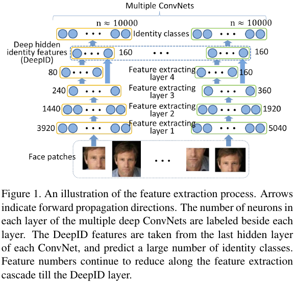

如上图所示的为特征提取部分（本文主要在于特征提取，验证任务就用联合贝叶斯做二分类就好了）的示意图。首先，从输入人脸中扣除一些face patches，然后把这些patch输入同一个结构不同参数的ConvNet中提取160维DeepID特征，把这些DeepID特征concate起来就是这个人脸的feature了。

这里需要注意如下几点：

1. 不是一整张人脸作为输入的，**输入的是人脸上抠图出来的一些patch**；
2. **每个patch都有单独的一个ConvNet**提取对应的子DeepID特征；
3. DeepID特征是在**最后一个隐层提取**，而不是输出层，那个10000个节点的输出层，是训练时候才有的；
4. 多个patch的DeepID concate成最后整个人脸的特征，所以最后一张人脸的**特征长度是160乘以patch的个数**，而不是仅仅160维。

### 网络结构

上面介绍了整体的特征提取流程，下面介绍特征提取所用的子ConvNet的结构

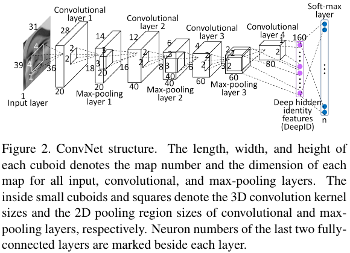

共5层网络，越往上的神经元的个数就越少，到最后就剩下160个神经元的输出，上面的Face patches是对齐过后的的人脸块，也就是说已左（右）眼为中心的人脸区域块，嘴角为中心的人脸区域块等等，这样就有多个不同的输入块输入到CNN中，采用了把**Max pooling layer3+Conv layer4的输出作为特征**（不同层次的特征抽象程度不一样；而且经过连续的降采样，Conv layer4所含的神经元已经太少，前面损失了太多的信息，所以加入Max pooling layer3里面的信息中和一下）。

输入图像：39x31xk 个矩形人脸图像块+31x31xk（这里k在彩色图像时为3，灰度时k为1）个人脸正方形块（因为后面要考虑到是全局图像还是局部图像，灰度图像和彩色图像，且需要考虑到尺度问题），使用ReLU非线性处理，用随机梯度下降优化网络。

### 一个人脸最后的特征

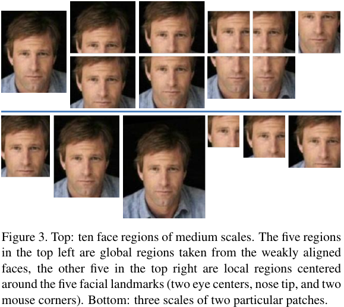

如上图所示，每个人脸会提取**3个Scale**的**10个patch**(以鼻头，左眼，右眼，左嘴角，右嘴角为中心)，然后**彩色图加上灰度图**，加上**水平翻转**数量又翻倍，一共是**3scalex10patchx2typex2flip=120**个输入图片分别送入**60个Conv Net**（水平翻转和原图，用同一个Conv Net），提取了一共120x160=**19200维**的特征向量，作为这个脸的最终送入联合贝叶斯做分类或者验证的特征。

另外有些特例，两个以嘴角和两个眼球为中心的这四个patch，不做翻转操作，直接用他们的对称patch最为他们翻转图的特征。

### 网络训练

#### 样本准备

在DeepID的实验过程中，使用的外部数据集为CelebFaces+，有10177人，202599张图片；8700人训练DeepID，1477人训练Joint Bayesian分类器。切分的patch（也就是上图这样的数据）数目为100，使用了五种不同的scale。每张图片最后形成的向量长度为32000，使用PCA降维到150。如此，达到97.20%的效果。使用某种Transfer Learning的算法后，在LFW上达到97.45%的验证精度。

#### 目标函数

训练Conv Net使用10000分类的**交叉熵**最为目标函数。

### 实验结论

论文最后作者做了一系列实验，比较重要的结论有：

1. 使用Multi-scale patches的Conv Net比只使用一个只有整张人脸的patch的效果要好；
2. DeepID自身的分类错误率在40%到60%之间震荡，虽然较高，但**DeepID是用来学特征的**，并不需要要关注自身分类错误率；
3. 如果只DeepID神经网络的最后一层Softmax层作为特征表示，效果很差；
4. 随着DeepID的训练集的增长，DeepID本身的分类正确率和LFW的验证正确率都在增加。

## [DeepID2](https://arxiv.org/abs/1406.4773)

### 简单介绍

在DeepID1取得了97.45%的人脸验证准确率之后，作者团队再接再厉，**同一年在NIPS**上发表《Deep Learning Face Representation by Joint Identification-Verification》一文，将LFW上人脸验证的准确率从97.45%提升到了99.15%，因为本文的方法直接迭代于上文中的DeepID1，大家就叫它DeepID2。

从论文题目可以看出来，DeepID2的主要创新点在于在训练网络的时候**同时使用了分类损失信号和鉴定损失信号**，这两种互补的信号来监督训练，得到的特征比DeepID1只用分类信号来比，更具有辨别力（不同类之间的距离大，同类之间的距离小）。这个思路和[线性判别分析LDA](https://github.com/Captain1986/CaptainBlackboard/blob/master/D%230014-%E6%95%B0%E6%8D%AE%E9%99%8D%E7%BB%B4%E5%B8%B8%E7%94%A8%E6%96%B9%E6%B3%95%E6%80%BB%E7%BB%93(LDA%2CPCA)/D%230014.md)思路相似，不同的是线性判别分析用的是线性映射，而这里的卷积神经网络用的是复杂的非线性映射。

### 算法流程

DeepID2的大致流程和DeepID1一样的，都是单独训练网络用来提取各个patch的DeepID特征，然后输入给另外单独训练的贝叶斯分类器去做人脸验证。

### 网络结构

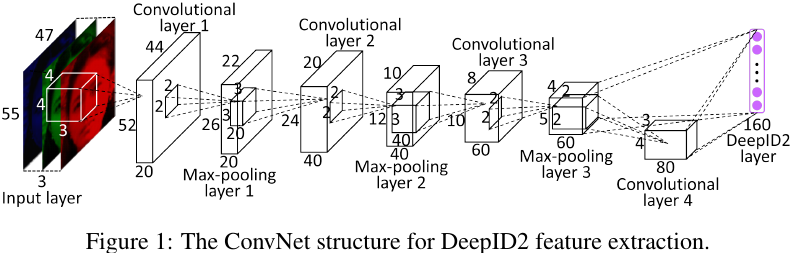

上图所示为DeepID2的网络结构示意图。输入稍微变大了一些，但是同样使用了Max pooling layer3和Conv layer4的输出联合起来作为160维的DeepID特征。

### 一个人脸最后的特征

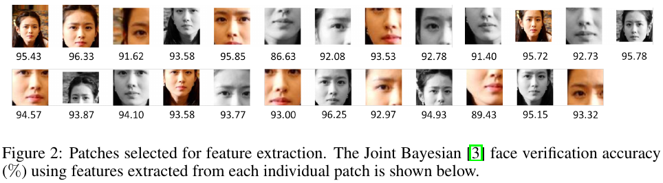

1. 作者使用400个face patch训练了200个ConvNet；

2. 使用了**forward-backward greedy**算法从400个face patch挑选了如上图所示的25个patch，提取出25个160维特征，也就是25x160=4000维的特征向量；

3. 然后，利用**PCA**做特征选择，进一步将这4000维的特征向量压缩到180维。

顺便提一句，作者最后利用这180维特征向量训练出来一个联合贝叶斯分类器作为人脸验证任务的分类器。

### 网络训练

#### 样本准备

DeepID2使用的外部数据集仍然是CelebFaces+，但先把CelebFaces+进行了切分，切分成了CelebFaces+A(8192个人)和CelebFaces+B(1985个人)。首先，训练DeepID2，CelebFaces+A做训练集，此时CelebFaces+B做验证集；其次，CelebFaces+B切分为1485人和500人两个部分，进行特征选择，选择25个patch。最后在CelebFaces+B整个数据集上训练联合贝叶斯模型，然后在LFW上进行测试。在上一段描述的基础上，进行了组合模型的加强，即在选取特征时进行了七次。第一次选效果最好的25个patch，第二次从剩余的patch中再选25个，以此类推。然后将七个联合贝叶斯模型使用SVM进行融合。最终达到了99.15%的结果。

#### 目标函数

同时使用识别**交叉熵损失**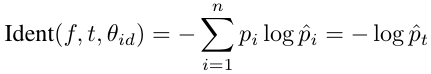加上验证**L2损失**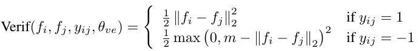作为网络训练的目标函数。

**交叉熵损失主要是为了增大不同id的人(inter-personal)提取出来的特征的距离；而L2损失是为了使同一个id的人(intra-personal)的特征，尽可能的聚拢在一起。**

### 实验结论

1. 作者验证了lamda（即验证loss相对于识别loss的权值）对人脸验证准确率的影响。当lamda=0（相当于不用验证loss）或lamda=正无穷大(相当于不用识别loss)，人脸验证效果都不如lamda在俩者之间的取值。作者采用不同的lamda取值测试L2人脸验证模型和联合贝叶斯人脸验证模型，从实验结果可以看出lamda从0增加到+无穷大时，两种人脸验证模型的准确率都是先升高后降低；

2. 当用于训练DeepID2的人脸类别越丰富（即人脸类别数），通过CNN学习的特征在人脸识别阶段会越有效，该结论与DeepID1是类似的；

3. 作者测试了不同形式的验证loss函数（L2+ loss, L2- loss, 余弦loss）对于人脸验证结果的影响，此处不作介绍；

4. 作者选取了七组不重复的特CNN特征组合，用联合贝叶斯方法处理后，进一步采用SVM对结果融合，得到最终结果在LFW上达到了99.15%的验证精度（太过Trick了）

总之，作者通过**修改CNN网络模型**（输入分辨率）和**Loss**（最重要的修改）的方式训练得到新的DeepID2特征，通过进化版本的特征组合方式，实现了99.15%的人脸验证准确率。

## [DeepID2+](https://arxiv.org/pdf/1412.1265v1.pdf)

### 简单介绍

DeepID2+论文《Deeply learned face representations are sparse, selective, and robust》发表于**2015年CVPR上**。其主要做了如下两点工作：

1. 通过在DeepID2的基础上，**增加网络中间层的维度和对浅层卷积增加监督训练的方法，用新的DeepID2+网络**，提升LFW上的识别精度到了99.47%；
2. 通过对DeepID2+网络的的实验分析，得出三点结论：
   + **稀疏性：网络的神经元输出有适度的稀疏性**，适度的稀疏性有助于最大化输出特征的辨别力；甚至使在**二值化**后，网络的输出还能保证良好的识别精度；
   + **选择性：高层神经元对个体相关的属性比较敏感**，即对同一个人的人脸来说，总有一些特定的高层神经元的输出要么一直处于激活状态，要么一直处于抑制状态；
   + **鲁棒性：虽然训练集中没有部分遮挡的样本，但是DeepID2+依然对遮挡很鲁棒**。

### 算法流程

大致和DeepID2一致的，不再赘述。

### 网络结构

和DeepID2的网络结构类似，不过输出**特征从DeepID的160维增大到了512维**。

### 网络训练

#### 样本准备

与DeepID2的8千人的16W训练样本相比，DeepID2+**扩充了训练数据集**，合并了CelebFaces+，WDRef数据集还有新增的一些人脸样本，一共收集了来自于1.2W人的29W人脸样本。

#### 目标函数

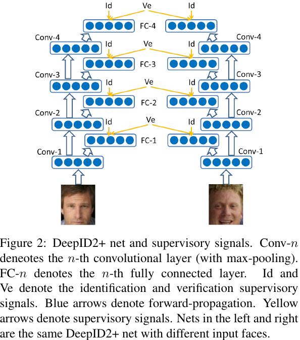

和DeepID2一样，识别信号用**交叉熵**，验证信号用**L2损失**，两者加权为网络训练时候的总损失。

所不同的是，如上图所示，在训练的时候，对Conv layer1, Conv layer2这些浅层也**增加了监督信号**来训练。

### 实验结论

这里有两个比较有价值的实验：

1. 二值化实验：

   作者发现，DeepID2+的网络输出的特征具有稀疏性和选择性，即对每个人，最后的DeepID层都大概有半数的单元是激活的，半数的单元是抑制的。**而不同的人，激活或抑制的单元是不同的**。基于此性质，如下图所示，使用阈值对最后输出的512维向量进行了二值化处理，发现效果降低有限。

   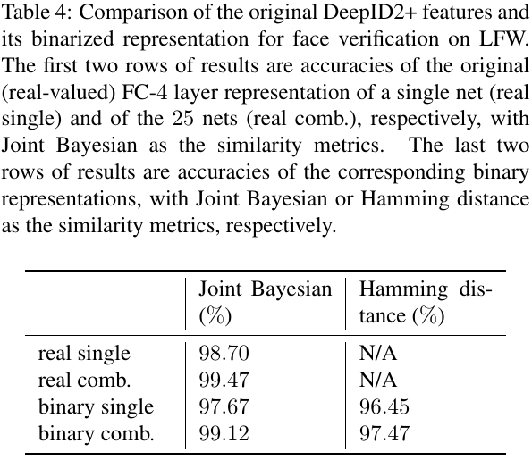

   二值化后会有好处，即通过计算**汉明距离**就可以进行检索了。然后精度保证的情况下，可以使人脸检索变得速度更快，更接近实用场景。

2. 遮挡实验：

   在训练数据中没有遮挡数据的情况下，DeepID2+自动就对遮挡有了很好的鲁棒性。

   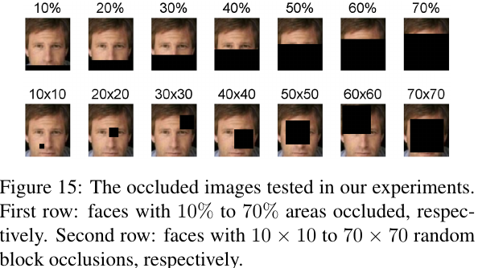

   如上图所示，有两种方式对人脸进行多种尺度的遮挡，第一种是从下往上进行遮挡，从10%-70%。第二种是不同大小的黑块随机放，黑块的大小从10×10到70×70。

   两种遮挡的实验对性能的影响如下图所示，

   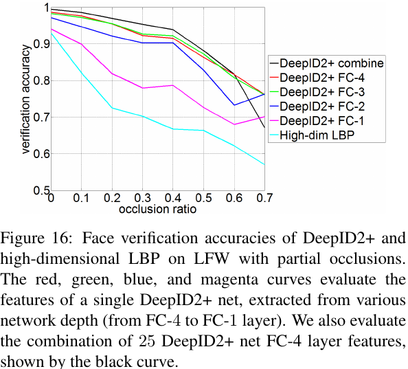

   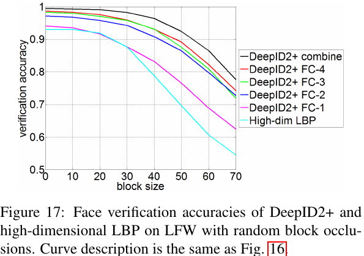

   结论是遮挡在20%以内，块大小在30×30以下，DeepID2+的输出的向量的验证正确率几乎不变。

## [DeepID3](https://arxiv.org/pdf/1502.00873.pdf)

### 简单介绍

DeepID3是DeepID系列最后一篇，**主要是探索性质为主**，亮点并不是很多，发表于**2015年**，它在DeepID2+的基础上，借鉴ILSVRC 2014表现不俗的VGG和GoogLeNet的启发，尝试使用更深的网络和Inception层来提升识别率。最终识别率在LFW上达到了99.53%，和DeepID2+的最终结果99.47%差不多，而且LFW数据集里面有三对人脸被错误地标记了，在更正这些错误的label后，两者准确率均为99.52％。

### 算法流程

与DeepID2+一样，不再赘述。

### 网络结构

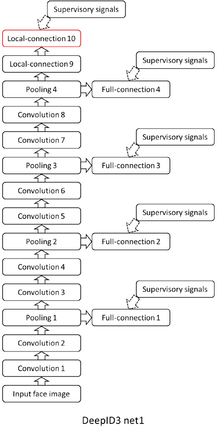

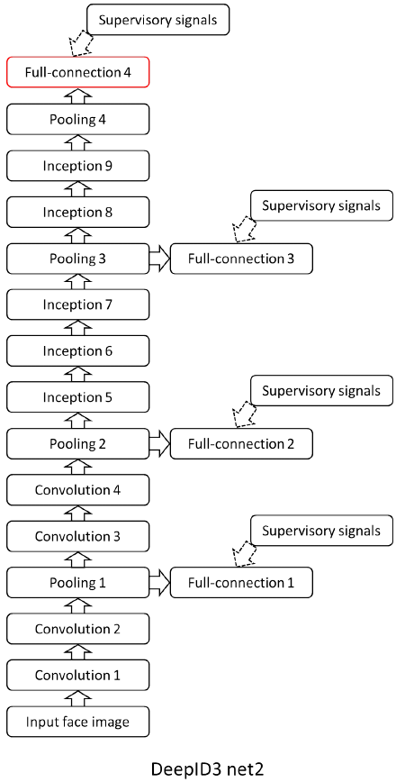

DeepID3分别借鉴于VGG和GoogLeNet提出了两种网络结构，与DeepID2+相比，不同点在于：

1. **网络深度更深了**；
2. 出现了**连续两个conv layer直接相连**的情况，这样使得网络具有更大的receptive fields和更复杂的nonlinearity，同时还能限制参数的数量；
3. DeepID3 Net2使用了**Inception结构**。

### 网络训练

#### 样本准备

在训练样本上，DeepID3仍采用**原来DeepID2+中使用的样本**。

#### 目标函数

同样的交叉熵加上L2，不同的是在网络的前段加入了**更多的监督分支**，目的有：

1. 监督前段网络学习更好的信号；
2. 使深网络更容易训练。

### 实验结论

DeepID3在LFW上的face verification准确率为99.53％，性能上并没有比DeepID2+的99.47％提升多少。而且LFW数据集里面有三对人脸被错误地标记了，在更正这些错误的label后，两者准确率均为99.52％。因此，作者对于具有更深的架构网络是否具有更强的优势没有下定论，可能是数据集少了，这么深的网络训练不充分，也可能是别的原因。为之后的研究方向。

## 综合比较
|  论文  |  发表年份  |  创新点  | 目标函数 | 分类信号 | 验证信号 | LFW性能 |
| :----: | :------: | :-----: | :-----: | :----: | :-----: | :----: |
| DeepID | 2014CVPR | **多patch训练；多层特征图融合** | 交叉熵 | YES | NO | 97.45% |
| DeepID2| 2014NIPS | **增大网络输入分辨率；加入验证信号** | 交叉熵，L2 | YES | YES | 99.15% |
| DeepID2+ | 2015CVPR | **训练增加浅层的监督信号；讨论稀疏性，选择性和遮挡鲁棒性** | 交叉熵，L2 | YES | YES | 99.52% |
| DeepID3 | 2015N/A | **借鉴VGG和GoogLeNet，堆叠Conv，添加Inception层** | 交叉熵，L2 | YES | YES | 99.52% |

## 总结

本文总结了2014~2015年出现的DeepID系列人脸识别模型，虽然属于比较早期的算法思路，但是其基本思想和创新点，比如DeepID1的不同层的特征图做融合，比如DeepID2的验证信号和识别信号做融合，DeepID2+的多层信号监督训练，DeepID2+的二值化和遮挡实验，DeepID3的借鉴经典网络这些思路，都是做算法研究和实际项目时候可以学习的东西。

温故而知新，可以为师矣。

## 参考资料

+ [Deep Learning Face Representation from Predicting 10,000 Classes](http://mmlab.ie.cuhk.edu.hk/pdf/YiSun_CVPR14.pdf)
+ [Deep Learning Face Representation by Joint Identification-Verification](https://arxiv.org/abs/1406.4773)
+ [Deeply learned face representations are sparse, selective, and robust](https://arxiv.org/pdf/1412.1265v1.pdf)
+ [DeepID3: Face Recognition with Very Deep Neural Networks](https://arxiv.org/pdf/1502.00873.pdf)
+ [DeepID1,DeepID2](https://www.cnblogs.com/venus024/p/5632243.html)
+ [DeepID人脸识别算法之三代](https://blog.csdn.net/stdcoutzyx/article/details/42091205)
