# 　　　　　　Batch-Normalization层原理与分析
## 引言

BN层发表于2015年，由于其对随机梯度下降SGD和S函数激活良好的训练加速效果，且还能在一定程度上提升网络泛化能力，在之后的CNN网络中被广泛应用。

**欢迎探讨，本文持续维护。**

## 实验平台

N/A

## 问题提出

### 内部协变量漂移(Internal Covariate Shift)

首先来看一下什么是协变量漂移。我们知道，基于统计的机器学习理论里面，有一个基础性的假设，就是**“源空间(Source domain)”和“目标空间(Target domain)”的数据分布是一致的**（如果不一致，那需要用到迁移学习(Transfer learning/Domain adaptation)）。协变量漂移属于分布不一致的一个分支情况，它是指**源空间和目标空间的条件分布一样，而边缘分布不一样的情况**。即对所有样本x，有P_s(Y|X=x) = P_t(Y|X=x)，但是P_s(X) != P_t(X)。

然后来看深度卷积神经网络，后面的层的输入是前面的层的输出，所以，这些串联起来的层可以看成是一层一层的**复合函数**。考虑最简单的两层卷积级联的情况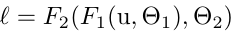，令第一层网络的输出x = F_1(u,theta_1)，它也是第二层网络F_2的输入，那么前面第二层的输出也可以表达为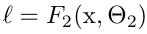。在用梯度下降法优化更新第二层网络参数theta_2的时候，参数更新规则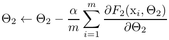，可以看到**这就正是网络F_2在学习x的分布。**每次mini-batch跑一次，梯度下降法**更新一次theta_1的值，都会导致x的分布发生变化（即前文所说P_s(X) != P_t(X）），而标签没变（即上文所说的P_s(Y|X=x) = P_t(Y|X=x)），网络层数如果深了（深度学习的网络经常这样），那么这种分布的变化就会层层累积！这就称之为内部协变量漂移(Internal Covariate Shift)**，之所以叫内部，是因为这是对层间信号的分析。如果每次mini-batch跑一次去参数更新来学习的时候，所要学习的输入的分布和上一次mini-batch跑的时候是稳定的的话当然是好事。所以可以合理假设，如果**x的分布在整个网络优化期间可以更稳定**的话（例如，有同样的均值和方差），那么优化theta_2也会更加有效率，毕竟在每次mini-batch迭代的时候，**theta_2不必去补偿上一次迭代由于theta_1的变化而带来的x分布的变化。**

另外，在网络**使用S形函数这类有饱和区的激活函数的时候**，如果每层的输出x（也就是下一层的输入）不稳定的话，随着网络的优化参数的迭代可能就会漂移到激活函数饱和区，饱和区的梯度很小，梯度下降时，每次更新参数的幅度很低，训练效率很低，拉长了训练时间。而且**随着网络层数的增加**，ICS使训练效率下降的这个问题更加严重。虽然这个问题可以通过**使用不带饱和区的激活函数（比如ReLU）**，或者**仔细挑选网络初始化参数**，又或者**选择小的学习率**来缓解，但毕竟不是从根本上解决了ICS，毕竟有的网络使用S函数比ReLU好（比如LSTM和GRU）。

### BN层作用

上面介绍了ICS和它带来的不好的影响，而BN层的作用，就是为消除ICS而提出的解决方案，使训练时每层的输入的分布更加**稳定**，从而：

1. **加速训练**，首先，网络**不必学习每次迭代带来的分布变化**（学习任务更加简单了），其次，训练时可以**选择比较大的学习率**，可以减去drop，Local Response Normalization层，减少训练时对careful weight initialnization依赖，减轻梯度爆炸和梯度消失，在论文中，模型收敛速度提高x10倍以上；
2. **正则化**功能，提升泛化能力，减轻对dropout和L2的依赖；
3. **网络可以采用具有非线性饱和特性的激活函数**（比如：S型激活函数）；

第一点加速训练和第三点可以采用有饱和区的激活函数，前面都有解释，这两点都是比较好理解的。关于第二点，可以这么理解，使用BN训练时，一个样本只与mini-batch中其他样本有相互关系；**对于同一个训练样本，网络的输出会发生变化**，这些效果有助于提升网络泛化能力。

## BN流程

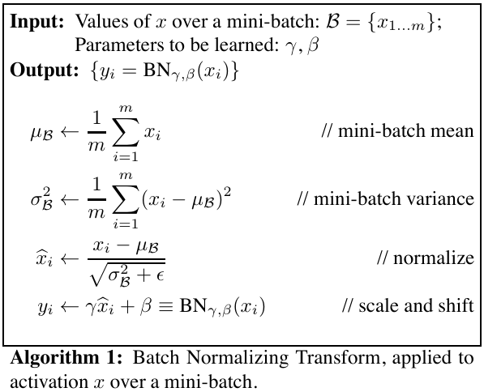

如上图为对一个mini-batch做BN层处理的流程。一共分为四步：

1. 计算当前mini-batch所有样本的**均值**；

2. 计算当前mini-batch所有样本的**方差**；

3. 对当前mini-batch内每个样本用前面的均值和方差做**归一化**；

4. 对归一化后的样本，乘以一个**缩放**系数，再做一次**平移**；

前面的三步，都是直接为了稳定x的分布，缓解ICS而做的归一化处理。

第四步的缩放和平移（缩放和平移参数都是学习到的），是为了使BN层的输出有**重构**原来没有加BN层的时候的网络的输出的能力！

有1~3步不就可以缓解ICS了吗？为什么还要加这个重构步骤呢？

可以这么理解，1~3步简单地对样本进行normalize处理会把数据限制在均值0，方差1的范围内，对于型激活函数来说，只使用了其线性部分，会**限制模型的表达能力**。

可能这样说还是不好理解，这样理解：如果是仅仅使用上面的1~3步对网络某一层A的输出数据做归一化，然后送入网络下一层B，这样是会影响到本层网络A所学习到的特征的。打个比方，比如我网络中间某一层学习到特征数据本身就分布在S型激活函数的两侧，你强制把它给我归一化处理、标准差也限制在了1，把数据变换成分布于S函数的中间部分，这样就相当于我这一层网络所学习到的特征分布被你搞坏了，这可怎么办？加上这两个可训练的缩放系数正是为了缓解**最大限度地保存模型的表达能力**（如果真的特征数据分布在S激活函数的两侧，学习一个方差一个均值还是可以学习回来的嘛）。

## BN部署

在部署阶段，我们模型的输入一般就是一个图片，没有了mini-batch的概念，那么均值和方差和缩放平移系数从哪里来呢？其实这些参数都是在训练完成后就**固定不变**了的。

### 部署细节

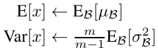

部署时候的均值和方差，都是用的每个mini-batch均值、方差的无偏估计。再配上学习来的缩放、平移系数，最终的BN层在预测时候的输出就是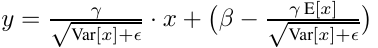。可以看到，**BN层总的效果就是做了一次缩放，一次平移。**

### BN在CNN中的变化

通过上面的介绍，我们知道BN层是对于每个神经元做归一化处理，而不是对一整层网络的神经元进行归一化。既然BN是对单个神经元的运算，那么在CNN中卷积层上要怎么搞？假如某一层卷积层有6个特征图，每个特征图的大小是100x100，这样就相当于这一层网络有6x100x100个神经元，如果采用BN，就会有6x100x100个参数γ、β，这样岂不是太恐怖了。因此卷积层上的BN使用，其实也是使用了类似**权值共享**的策略，把一整张特征图当做一个神经元进行处理：

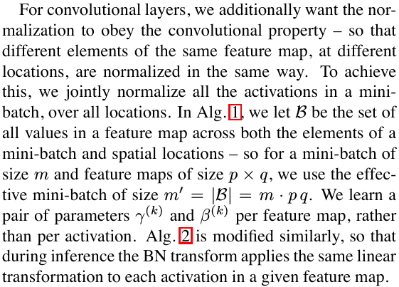

CNN中卷积层输出的是一系列的特征图，如果训练的min-batch sizes为m，那么网络下一层输入数据可以表示为四维矩阵(m,f,p,q)，m为min-batch sizes，f为特征图个数，p、q分别为特征图的宽高。在CNN中我们可以把每个特征图看成是一个特征处理（一个神经元），因此在使用Batch Normalization的时候，mini-batch size的大小就是：**mxpxq**，于是对于**每个通道的特征图都只有一对可学习参数：γ、β**。说白了，这就是相当于求取所有样本所对应的一个特征图的所有像素的平均值、方差，然后对这个特征图每个像素统一做归一化。

### 加速方法——BN融合

BN层在训练时学习到了参数缩放γ、平移β、均值u和σ，可以单独作为预测时候的一个层，但更好的方案是和上一个层做融合，消去一个单独BN层带来的计算量。

假设上一层卷积输出为w\*x + b，BN层输出为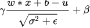，则从卷积层的输入x到BN层的输出为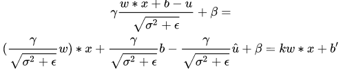。所以在预测阶段，跟在卷积层后面的BN层可以直接融合到这个卷积层中，只需要改造一下卷积核参数和偏移量，而且并没有增加卷积层的计算量。

## 另一种声音

BN论文里面提出BN的原因是在于解决ICS问题，但是2018年NIPS也有[论文](https://arxiv.org/abs/1805.11604)对此提出质疑，并且主张：

1. **BN起作用与ICS无关，就算有ICS，BN也可以正常工作**

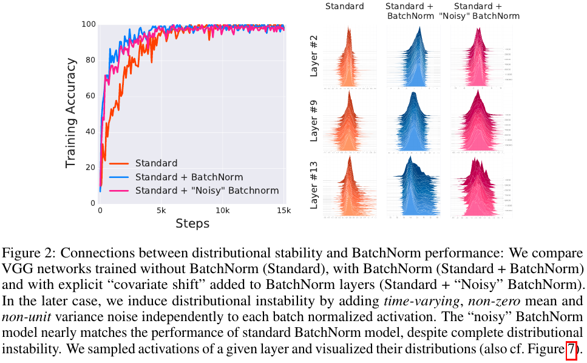

2. **BN有效的本质原因在于其能够使优化空间optimization landscape变得平滑**

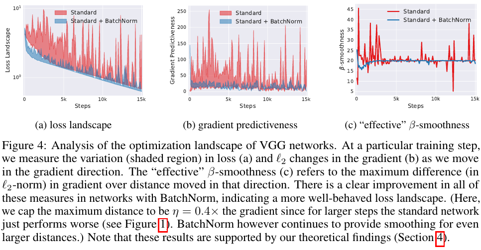

3. **其他的Normalization方法，例如L1，L2，L无穷大，也可以起到和BN一样的效果**

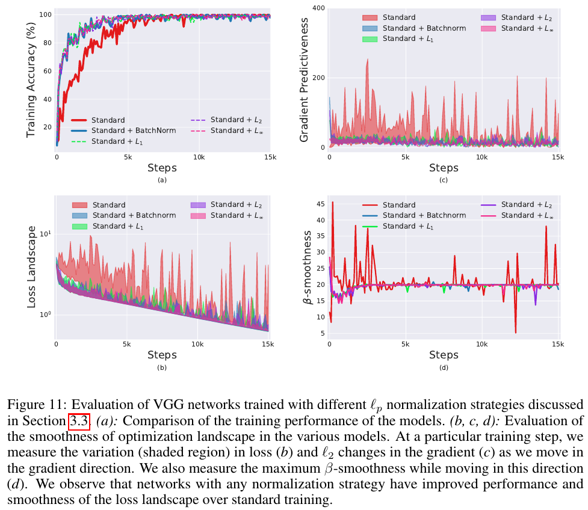

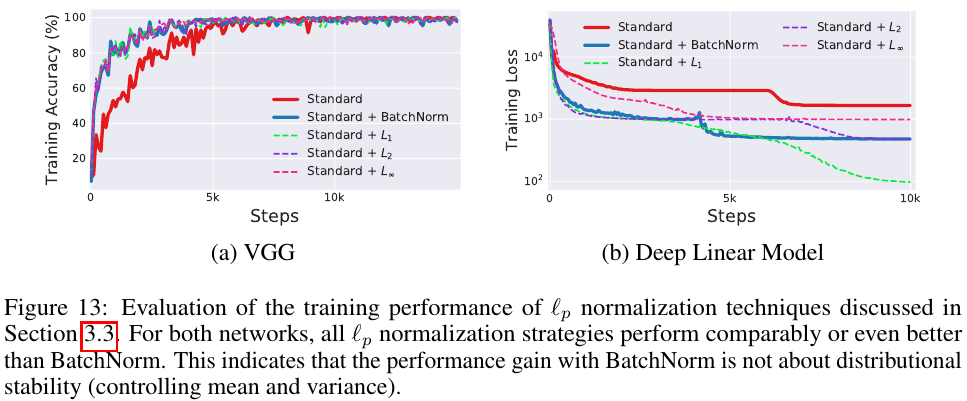

## 总结

BN层技术对网络训练的加速作用使其在提出之后迅速被广泛应用，本文从BN论文的脉络出发，先介绍了ICS，然后介绍了BN层的技术细节和部署方式，最后略带了一下别的研究者对BN的理解和拓展。

## 参考资料

+ [Batch Normalization: Accelerating Deep Network Training by Reducing Internal Covariate Shift](https://arxiv.org/abs/1502.03167)
+ [<深度学习优化策略-1>Batch Normalization（BN）](https://zhuanlan.zhihu.com/p/26702482)
+ [Batch Normalization 学习笔记](https://blog.csdn.net/hjimce/article/details/50866313)
+ [为什么Batch Normalization那么有用？](https://zhuanlan.zhihu.com/p/52749286)
+ [How Does Batch Normalization Help Optimization?](https://arxiv.org/abs/1805.11604)
+ [网络inference阶段conv层和BN层的融合](https://zhuanlan.zhihu.com/p/48005099)
+ [《机器学习与应用》](https://book.douban.com/subject/30445238/)
+ [CNN_book](http://210.28.132.67/weixs/book/CNN_book.pdf)
