# 　　　　　　机器学习中的过拟合及其解决办法
## 引言

机器学习的目标是从训练集中学习一个模型去预测没有见过的测试集，最终判断一个模型好不好是要它在看测试集上的性能。如果一个模型，在训练集上性能很好，但是在测试集上性能很差的话，那么就是发生过拟合。本文介绍了机器学习中的过拟合和解决过拟合的常用手段。

**欢迎探讨，本文持续维护。**

## 实验平台

N/A

## 过拟合和欠拟合

### 过拟合

做模型训练时，我们会把收集到的所有样本分为互不相交的三类：训练集，验证集，测试集。我们在训练集上进行模型训练，跑出来训练集上的的误差叫**训练误差**，在验证集上进行调参，这个“训练->调参->训练->...”迭代完之后，我们会拿得到的的模型在测试集上跑一下，得出来一个**测试误差**。

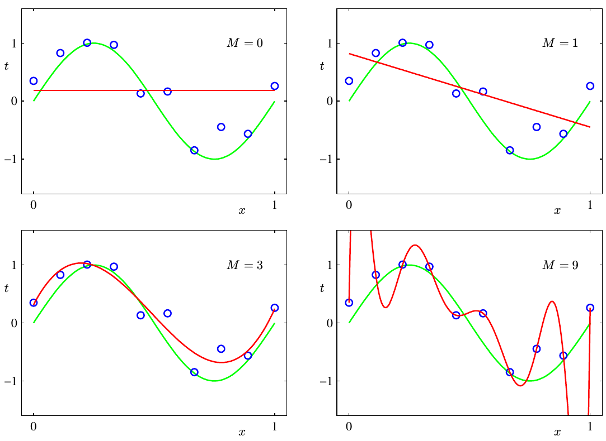

有时候，我们为了减少训练误差，会倾向于使用更多的特征（如上图），更复杂的模型（有时候更多的特征和更复杂的模型是一回事）或者更精巧的训练，但是这些模型在测试集上一跑，性能很差（如下图）。

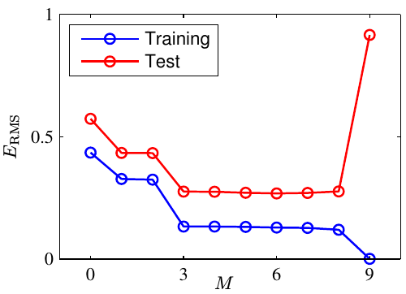

这种随着模型容量的增大，或者训练次数的增加，模型性能在训练集上很好，但是在测试集上很差的现象叫做**过拟合(Over-fitting)**（模型过度over拟合fitting了训练集内的数据）。模型在训练集上性能很好，在多大程度上也能将这种性能推广到**从未见过**的测试集的能力叫做模型的**泛化能力**，我们要泛化能力好的模型。

过拟合的原因有很多，**本质原因还是因为模型的容量(Capacity)相对于数据的复杂度和学习任务的难度太强了，导致学到了太多的抽样误差**，类似于一个记忆力很强的学生，通过死记硬背的方式把《三年高考五年模拟》都记下来了题目和标准答案（训练集），在《三年高考五年模拟》这本书上的题目都会做，扣分很少（训练集上误差小），但是缺少举一反三的能力，但是在真实高考的时候得分很差（测试集上误差大）。

### 欠拟合

欠拟合就是过拟合的反面，模型容量太小或者训练不充分，学习能力差，在训练集上误差都很大（更不要谈测试集上的误差了）。

### 不要老怪过拟合

上面介绍了过拟合和欠拟合的一些内容，过拟合也是模型训练的基本概念和训练中经常经常碰到的，但有的新手听多了过拟合，一看到模型在验证集上性能不好就怪过拟合，就跑去爬更多的数据，这是很低效和不负责任的。

在验证集上性能不好，有可能是优化求解过程的问题，比如：

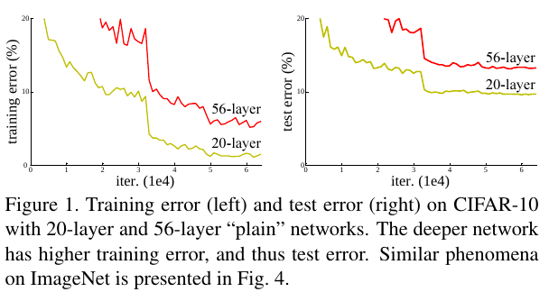

上图是[ResNet](https://arxiv.org/abs/1512.03385)中的，56层的网络在训练集上性能还没有20层的好，是**训练过程退化**的原因，不是过拟合；

又比如有的网络，本身就太简单，**在训练集上性能就不咋地！**在验证集上那当然也是不咋地啦，这种情况也不是过拟合，那是欠拟合。

## 过拟合解决办法

上面介绍了过拟合的原因，我们很自然就可以从**(1)数据**、**(2)模型**、**(3)训练方法**三个方面去思考解决过拟合的方法啦。

### 数据增强

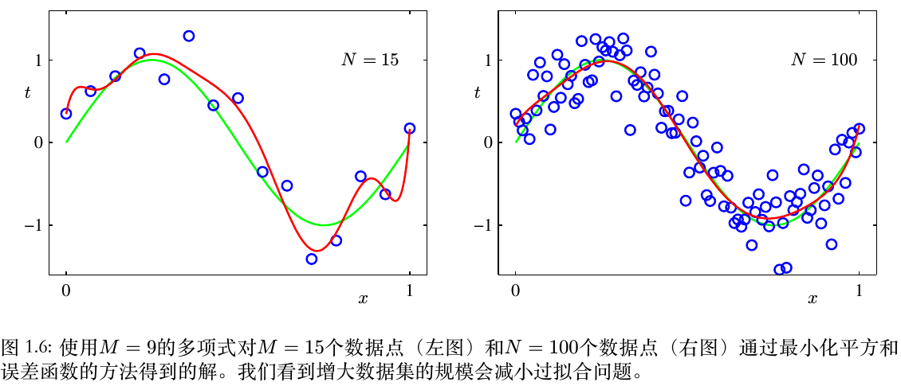

如上图所示，在同样模型假设空间的情况下，数据越多，学习到的模型（红线）过拟合越轻。一般来说，训练数据的数目不应该小于模型参数的若干倍（比如5或10）。这里就不继续介绍数据增强的方法了，感兴趣的朋友可以参见[《深度学习中不平衡样本的处理》](https://github.com/Captain1986/CaptainBlackboard/blob/master/D%230016-%E6%B7%B1%E5%BA%A6%E5%AD%A6%E4%B9%A0%E4%B8%AD%E4%B8%8D%E5%B9%B3%E8%A1%A1%E6%A0%B7%E6%9C%AC%E7%9A%84%E5%A4%84%E7%90%86/D%230016.md)一文中的“数据增强”小节。

### 改造网络Capacity

#### 减层，减特征图通道数

通过去掉CNN中的层，或者减少特征图的数量可以快速减小模型的学习能力，减轻过拟合。这个原理很直观，不过哪些层可以去掉哪些层不能去，这需要反复实验和深入的分析之后才能做。比如利用BN层的gamma系数来做[网络剪枝](https://arxiv.org/abs/1708.06519)。

### 早停Early Stop

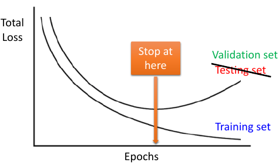

当训练一个有足够大表达能力的大模型时，随着训练的迭代，训练集的损失和**验证集**的损失都会会慢慢变小，到了过拟合点之后，训练集的损失继续降低，而验证集的损失会回升，这种现象几乎一定会出现。如果我们训练时检测模型在这两个样本集上的性能，在验证集损失降低到最小（此时也有理由预期在测试集上损失也最小）的时候终止迭代，这种训练方式叫**早停**。

### 限制权重的惩罚的正则化

正则化是机器学习中通过显示**控制模型复杂度来避免模型过拟合**的一种有效方式。

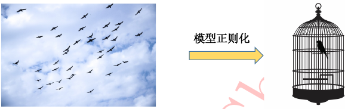

如上图所示，如果将模型原始的假设空间比作“天空”，那么天空中自由的小鸟就是模型可能收敛到的一个个最优解。在模型加了正则化之后，就好比将原假设空间（“天空”）约束到一定空间范围内（“笼子”），这样一来，鸟的活动范围（可能得到的最优解）也变得相对有限了，这个笼子就是正则化。

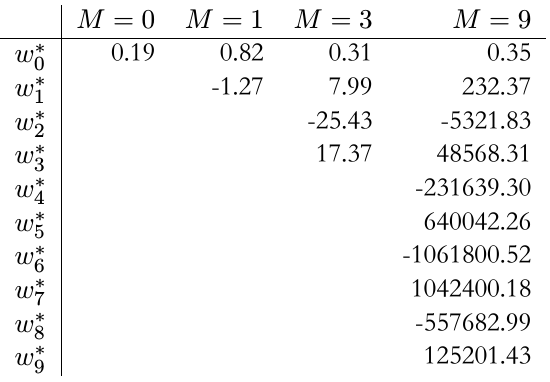

那这个笼子应该怎么造呢？还是继续PRML中的例子，如上图中，我们可以发现，当模型阶数越高时，有一些特征所对应的系数绝对值也特别大，这些特别大的绝对值对应的就是模型曲线比较Sharp的地方（**噪音都是比较Sharp的，去学习噪音去了**），而好的模型，不会出现这些Sharp的地方，就没有这些特别大的系数，如果我们可以以某种方式约束最后的模型里面没有这样大的参数，那不就可以了吗。

#### L2正则化

L2正则化，在训练时的目标函数里面添加模型所有系数的平方和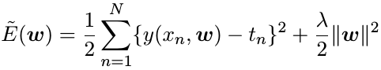，其中lamda是调节L2正则化强度的超参数。可以看到，如果学习到的解有一些比较大的系数，那么损失也比较大，这样，就在优化过程中诱导优化学习方法去寻找那些具有小绝对值权重系数的解。

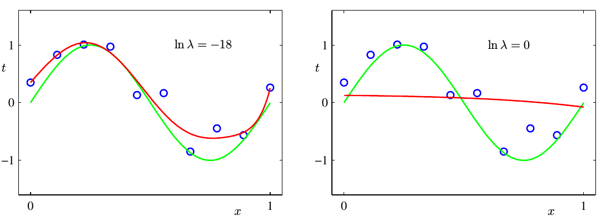

正则化不是越大越好的，如上图所示lamda越大，那么最终的模型越趋近于一条直线（针对PRML中用多项式模型去学习Sin分布的例子），太简单了也不好。当取不同lamda大小的时候对模型权重和误差的影响如下：

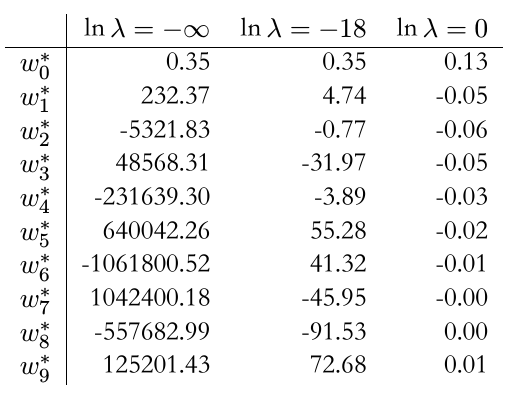

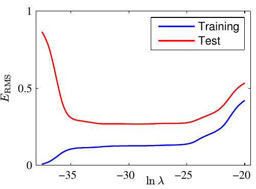

可以看到，正则太强了（对应上上表最右列），学习到的权重都太小，模型没有分辨力（上上上图右边红色曲线）；正则太弱了（对应上上表最左列），学到的权重都太大，过拟合；只有适当的正则强度（上上图中间列），才能学习到好的模型（上上上图左边红色曲线）。

L2正则化在深度学习中常见的说法叫**“权重衰减”(Weight decay)**，在机器学习中常叫为“岭回归”(ridge regression)。

#### L1正则化

L1正则化，就是以绝对值的和作为正则项去限制模型优化空间，原理和L2正则化类似，不赘述。不过L1与L2不同的是，L1比L2相比，还可以驱赶权重往0靠，有**稀疏化和特征选择**的作用，推理详见本人前作[《拉格朗日乘子法》](https://github.com/Captain1986/CaptainBlackboard/tree/master/D%230008-%E6%8B%89%E6%A0%BC%E6%9C%97%E6%97%A5%E4%B9%98%E5%AD%90%E6%B3%95)。

### 集成学习方法

#### 随机失活Dropout

在训练时，对网络的全连接层做随机失活，可以理解为是一种高效的**集成学习**方法（但不需要学习多个模型）。

随即失活就是在训练的时候，随机将一些神经元的激活输出**以概率p设置为0(dropout)**，减小了该神经元和未失活神经元的复杂协同效应(complex co-adaptation)，减小了模型的容量，然后在预测的时候，对各个失活的神经元的**激活输出又乘以(1-p)**。

失活的神经元无法参与训练，因此每次训练（一次前向，一次反向）相当于在训练一个新的网络。而在预测的时候，又相当于若干个子网络的平均集成(**ensemble**)。

另外，需要注意在深度学习训练框架（例如Caffe）的随机失活层代码(caffe_root/src/caffe/layers/dropout_layer.cpp)中，并没有完全遵照前面的原理，而是在训练阶段直接将未失活神经元的激活输出乘以**scale = 1/(1-p)**，这样的好处是**在测试阶段就不需要再做scale调整了**，这种失活的方式称之为**“倒置随机失活”(inverted dropout)**，很聪明。

#### Bagging

Bagging（也称Bootstrapping）方法是通过**综合几个模型的结果**来降低泛化误差的技术。主要思路是训练几个不同的模型，然后以某种规则综合考虑各个模型的输出来做预测。

Bagging学习奏效的原因是**不同的模型通常不会在测试集上产生完全相同的误差**。

Bagging虽然是减少泛化误差非常强大可靠的方法，但是在学术中通常不鼓励使用集成学习的方法来提升整体性能，因为任何机器学习算法都可以从集成学习中获得性能提升（几倍地牺牲计算和存储为代价）。在实践中，因为涉及到成倍增加的训练工作量，在落地的时候计算量和存储也是成倍地增加，所以相比于其它缓解过拟合的方法，Bagging也不大使用。用Bagging最多的地方，应该是一些刷榜刷分的比赛吧？

## 总结

本文先介绍了过拟合，欠拟合，和模型泛化能力的基本意义，然后从数据，模型和训练的角度介绍了一些基本的常用的缓解过拟合的手段。

## 参考资料

+ [《机器学习与应用》](https://book.douban.com/subject/30445238/)
+ [CNN_book](http://210.28.132.67/weixs/book/CNN_book.pdf)
+ [《深度学习》](https://book.douban.com/subject/27087503/)
+ [《Pattern Recognition And Machine Learning》](https://www.douban.com/group/471521/)
+ [Deep Residual Learning for Image Recognition](https://arxiv.org/abs/1512.03385)
+ [Learning Efficient Convolutional Networks through Network Slimming](https://arxiv.org/abs/1708.06519)
