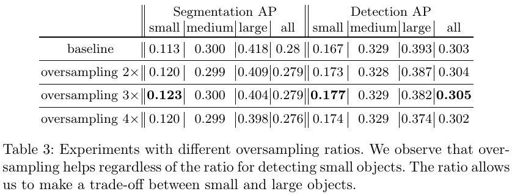
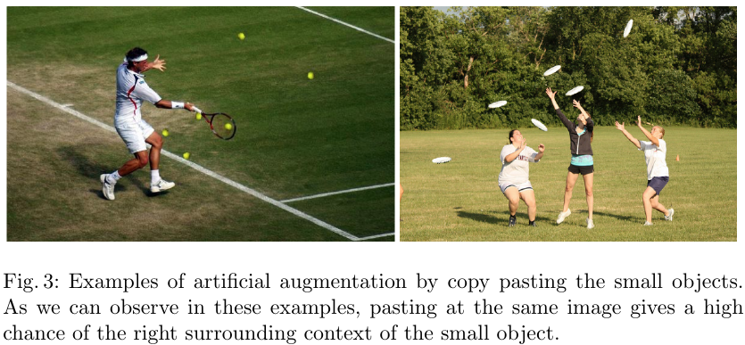
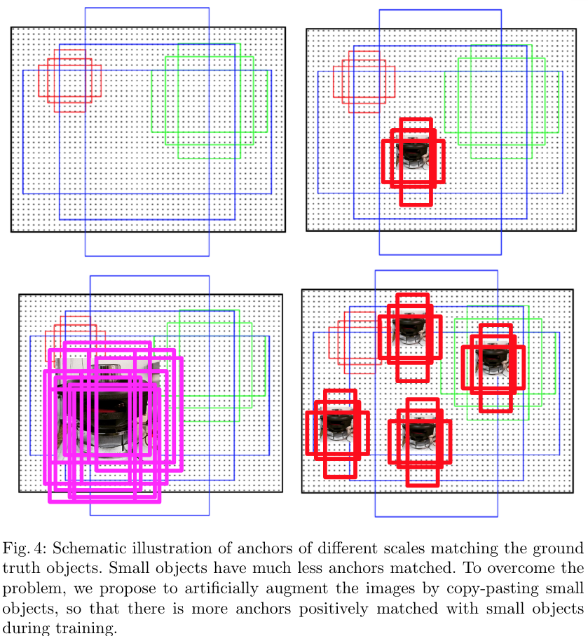
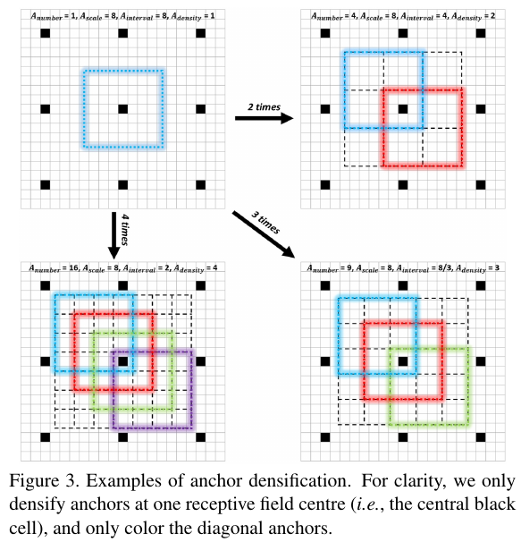

# 　　　　　　　　　                   深度学习检测小目标常用方法
## 引言

在深度学习目标检测中，特别是人脸检测中，小目标、小人脸的检测一直是一个实际且常见的困难问题。不过在这几年的发展中，也涌现了一些提高小目标检测性能的解决手段，本文对这些手段做一个分析、整理和总结。

**欢迎探讨，本文持续维护。**

## 实验平台

N/A

## 简单粗暴又可靠的Data Augmentation

深度学习的效果在某种意义上是靠大量数据喂出来的，小目标检测的性能同样也可以通过增加训练集中小目标样本的种类和数量来提升。在[《深度学习中不平衡样本的处理》](https://github.com/Captain1986/CaptainBlackboard/blob/master/D%230016-%E6%B7%B1%E5%BA%A6%E5%AD%A6%E4%B9%A0%E4%B8%AD%E4%B8%8D%E5%B9%B3%E8%A1%A1%E6%A0%B7%E6%9C%AC%E7%9A%84%E5%A4%84%E7%90%86/D%230016.md)一文中已经介绍了许多数据增强的方案，这些方案虽然主要是解决不同类别样本之间数量不均衡的问题的，但是有时候小目标检测之难其中也有数据集中小样本相对于大样本来说数量很少的因素，所以其中很多方案都可以用在小样本数据的增强上，这里不赘述。另外，在19年的论文[Augmentation for small object detection](https://arxiv.org/pdf/1902.07296.pdf)中，也提出了两个简单粗暴的方法：

1. 针对COCO数据集中包含小目标的图片数量少的问题，使用过采样Oversampling策略；

2. 针对同一张图片里面包含小目标数量少的问题，在图片内用分割的Mask抠出小目标图片再使用复制粘贴的方法（当然，也加上了一些旋转和缩放，另外要注意不要遮挡到别的目标）。

   

在同一张图中有更多的小目标，在Anchor策略的方法中就会匹配出更多的正样本。

## 特征融合的FPN

## 合适的训练方法SNIP以及SNIPER

## 更稠密的Anchor采样和匹配策略S3FD,FaceBoxes

在前面Data Augmentation部分已经讲了，复制小目标到一张图的多个地方可以增加小目标匹配的Anchor框的个数，增加小目标的训练权重，减少网络对大目标的bias。同样，反过来想，如果在数据集已经确定的情况下，我们也可以增加负责小目标的Anchor的设置策略来让训练时对小目标的学习更加充分。例如人脸检测中的[FaceBoxes](https://arxiv.org/abs/1708.05234)其中一个Contribution就是Anchor densification strategy，Inception3的anchors有三个scales(32,64,128)，而32 scales是稀疏的，所以需要密集化4倍，而64 scales则需要密集化2倍。在[S3FD](http://openaccess.thecvf.com/content_ICCV_2017/papers/Zhang_S3FD_Single_Shot_ICCV_2017_paper.pdf)人脸检测方法中，则用了Equal-proportion interval principle来保证不同大小的Anchor在图中的密度大致相等，这样大脸和小脸匹配到的Anchor的数量也大致相等了。

## 先放大再检测的GAN

## 利用Context信息的Relation Network和PyramidBox

## 总结

## 参考资料

+ [《深度学习中不平衡样本的处理》](https://github.com/Captain1986/CaptainBlackboard/blob/master/D%230016-%E6%B7%B1%E5%BA%A6%E5%AD%A6%E4%B9%A0%E4%B8%AD%E4%B8%8D%E5%B9%B3%E8%A1%A1%E6%A0%B7%E6%9C%AC%E7%9A%84%E5%A4%84%E7%90%86/D%230016.md)
+ [Augmentation for small object detection](https://arxiv.org/pdf/1902.07296.pdf)
+ [ScratchDet: Training Single-Shot Object Detectors from Scratch](https://arxiv.org/pdf/1810.08425.pdf)
+ [FaceBoxes: A CPU Real-time Face Detector with High Accuracy](https://arxiv.org/abs/1708.05234)
+ [S3FD: Single Shot Scale-Invariant Face Detector](http://openaccess.thecvf.com/content_ICCV_2017/papers/Zhang_S3FD_Single_Shot_ICCV_2017_paper.pdf)
