# 　　　　　　　                   聊聊2017 ImageNet夺冠的SENet
## 引言

SENet是由Momenta出的一种在通道维度(channel-wise)进行信息调整的结构，在2017年的ImageNet分类任务中夺得了第一名的成绩(SENet-154 top-5 error为2.251%)。SENet网络结构思路清晰，实现简单，适用范围广(可以很方便地将其植入ResNet, MobileNet或者Inception中)，它不但对于提高分类性能有作用，而且也可以把使用了SENet结构的分类网络作为backbone来提升网络的特征提取能力，对提升分割和检测任务的性能也有帮助。

**欢迎探讨，本文持续维护。**

## 实验平台

N/A

## 传统卷积结构的局限性

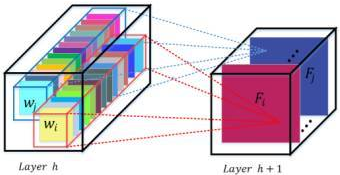

如上图所示的是传统卷积结构，传统卷积利用一组3D立体filter在w, h空间维度和c的通道维度提取聚合上一层特征图的信息组成新的特征图。卷积神经网络则是由一系列串联的(当然，局部会有并联)卷积层、非线性激活层和下采样层等构成，这样它们能够从全局感受野上去捕获图像的特征来进行图像的描述。

但是由于优化算法的能力有限或者是数据有限等等原因，要直接从这样的网络(搜索空间太巨大)中学习出强劲的参数是非常困难的。于是，类似于Inception结构，膨胀卷积(Dilated Conv)等等这样利用丰富感受野、扩大感受野这样的结构被提出来，也取得了明显的效果。但是这些手段只是着眼于在空间维度(W和H维)对网络结构进行了改造，而且取得了不错的效果；而像分组卷积(Group Conv)和深度卷积(Depth-wise Conv)这样的卷积，确实在通道维度上做了改造，但是主要也不是提升性能而是提升速度的，而且分组的手段略显粗暴；很自然的就会想，能不能在通道维度(C维)来改造网络，自动学习一组参数对上层通道输出进行调整来提升网络性能呢？有，这就是SENet。

## SENet模块介绍

### A Big Picture

SENet模块的构造很简单，如下图所示：

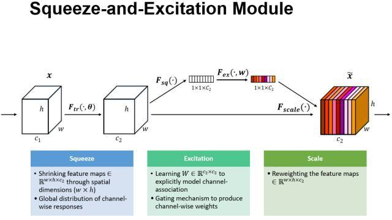

首先给定一个输入特征图x，其特征通道数为c1，通过一系列传统卷积Ftr等一般变换后得到一个特征通道数为c2的特征图。与传统的CNN不一样的是，接下来通过三个操作在通道维度上来**重标定**前面得到的特征图。

看上面的支路，首先是Squeeze操作Fsq，顺着空间维度(W,H维度)来进行特征压缩，将每个二维的特征通道变成一个实数，这个实数某种程度上具有全局的感受野，并且输出的维度和输入的特征通道数相匹配。它表征着在特征通道上响应的全局分布，而且使得靠近输入的层也可以获得全局的感受野，这一点在很多任务中都是非常有用的。紧接着是Excitation操作Fex，它通过一组显示学习到的参数来讲Squeeze的输出转换为一组标定用的权值。

最后是一个Reweighting的操作，就是一个在**通道维度的缩放操作**，将Excitation的输出的权重看做是进过特征选择后的每个特征通道的重要性，然后通过乘法**逐通道加权**到先前的特征上，完成在通道维度上的对原始特征的重标定。

### 细节分析

上面的讨论还是比较抽象，这里来一个个分析SENet结构的实现细节。

1. Ftr: 首先是Ftr操作，这是一个传统卷积操作，输出c2xhxw形状的特征图，由于传统卷积对各个channel的卷积结果做了sum，所以channel特征关系与卷积核学习到的空间关系混合在一起。而SE模块就是为了抽离这种混合，使得模型直接学习到channel特征关系；

2. Squeeze: 然后是Fsq操作，上面一步的卷积Ftr只是在一个局部空间内进行操作，很难获得足够的信息来提取channel之间的关系(上面解释了，由于sum操作混合了空间维度信息和通道维度信息)，为此，SENet提出Squeeze操作，将一个channel上整个空间特征编码为一个全局特征，论文中是采用global average pooling来实现，单原则上也可以采用更复杂的编码策略；这一层的输出是c2x1x1的特征图；

   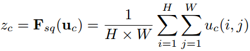

3. Excitation: 前看的Squeeze操作只是得到了一个包含空间上全局信息的编码，接下来需要另外一种变换来抓取各个channel之间的关系。这个变换需要满足两个准则：首先要灵活，它要可以学习到各个channel之间的非线性关系；第二点是学习的关系不是互斥的，因为这里允许多channel特征，而不是one-hot形式(所以不能用Softmax，Softmax的假设输入的各个类别应该都是互斥关系)。基于此，这里采用Sigmoid形式的gating机制：

   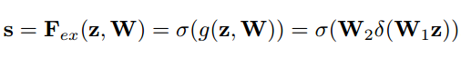

   其中W1是C通道输入，C/r通道输出的全连接层的权重，W2是C/r通道输入，C通道输出的全连接的权重，r是控制模型复杂度的超参数。内层激活函数是ReLU，外层激活函数是Sigmoid(为了输出范围在0~1的权重)。因为通道缩放系数r大于0，所以这个Excitation操作可以看成是两个全连接层组成的bootneck结构。

4. Fscale: 在学习到了通道权重后，用Fscale操作来把原来特征图的权重做一次缩放，也可以认为是重标定操作。

   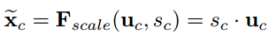

## 在Inception和ResNet结构应用SENet

SENet的结构小巧灵活，在AlexNet或者VGG中怎么用是显而易见的，这里介绍SENet在更新的Inception和ResNet结构中的用法，其余结构也是类似的。

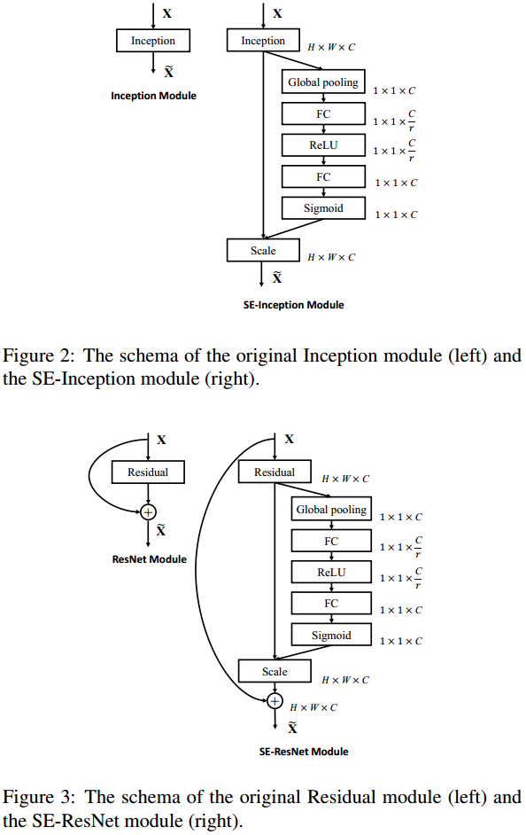

对于Inception就是直接嵌入在Inception module之后就行了，好像没什么说的。对于ResNet，SENet模块嵌入到残差结构中的残差学习分支中(直接嵌入在identity map中，那还叫ResNet吗？嘿嘿)。

同样地，SE模块也可以应用在其它网络结构，如ResNetXt，Inception-ResNet，MobileNet和ShuffleNet中。这里给出SE-ResNet-50和SE-ResNetXt-50的具体结构，如下表所示：

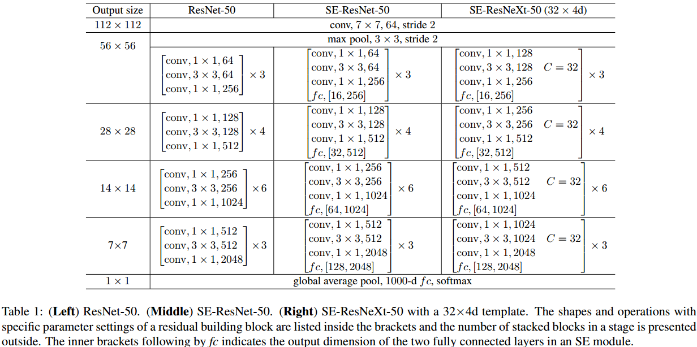

## 参数数量和速度分析

### 参数数量分析

对于一个采用了经典结构的SENet：Global Pooling没有参数；对于第一个FC层，输入C输出C/r，它的参数数量是(C^2)/r；对于ReLU激活层，没有参数；对于第二个FC层，输入C/r通道输出C通道，他的参数数量也是(C^2)/r；最后Sigmoid激活，也没参数。所以，对一个SENet，增加参数数量为2*(C^2)/r个，对一个有S个stage(每个stage又repeat应用了N次SENet结构)都采用了SENet结构的网络，总共增加的参数数量就为：

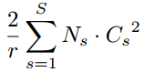

### 速度分析

对于速度，因为和优化能力有关系，这里只给个论文中对计算量GFLOPS的大概估计：当r=16时，SE-ResNet-50只增加了不到10%的参数量，且计算量（GFLOPS）却增加不到1%。

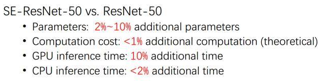

## 模型效果

如下图所示是作者把SENet结构嵌入到ResNet，ResNeXt和Inception这种流行基础网络后的性能结果，可以看到性能指标都用一定的提升：

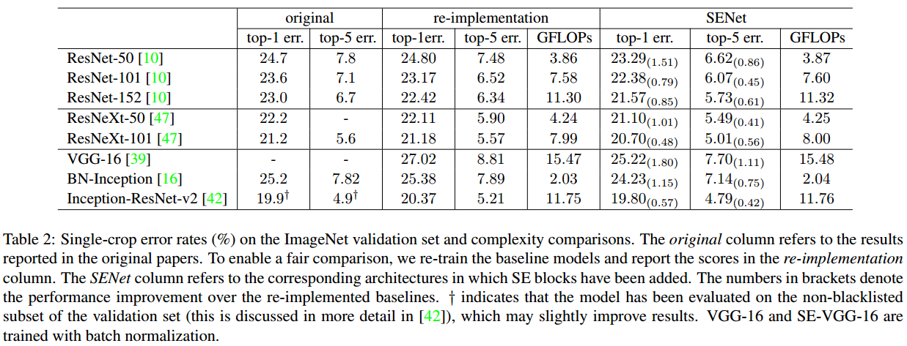

在轻量级网络MobileNet和ShuffleNet中，性能也有提升：

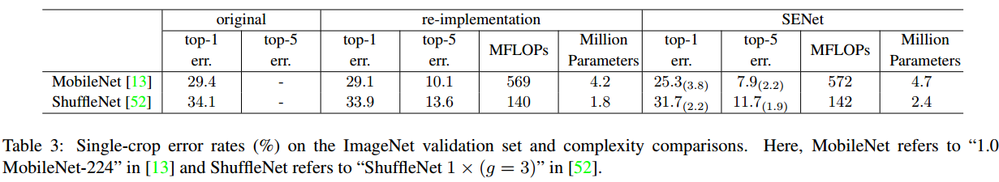

## 进一步思考和1x1卷积的区别

TODO: 大家都知道1x1卷积也可以做到通道之间特征的融合

## 总结

本文介绍的SENet模块主要为了**提升模型对channel特征的敏感性**，该模块是轻量级的，而且可以很方便地应用在现有的网络结构中，只需要增加较少的计算量就可以带来性能的提升，在2017年ImageNet的比赛中也取得了冠军名次。另外，在CVPR 2019中Momenta还有一篇与SENet非常相似的网络[Selective Kernel Networks](https://arxiv.org/abs/1903.06586)，SKNet主要是**提升模型对感受野的自适应能力**，后面有空再专门介绍。

想到在channel维度做更精细化的操作，想到进行按通道的缩放都很容易，但这只是想到；难的是去用自己积累的知识和从前人那里学到的思路，去构造出一个结构来做缩放而且去验证这个结构很有效果，这需要积累，需要insight，需要不断多次细心尝试，甚至还需要一点运气。这也是一些做出成绩的人和一般人的区别吧，自勉。

## 参考资料

+ [Squeeze-and-Excitation Networks](https://arxiv.org/abs/1709.01507)
+ [SENet GitHub](https://github.com/hujie-frank/SENet)
+ [如何评价Momenta ImageNet 2017夺冠架构SENet?](https://www.zhihu.com/question/63460684)

