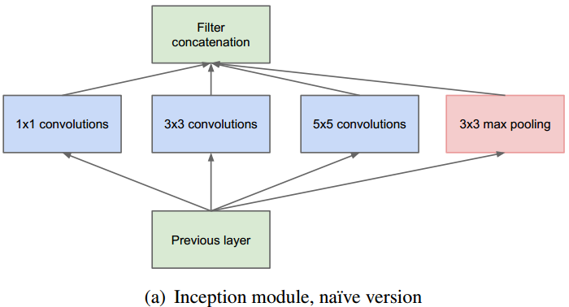
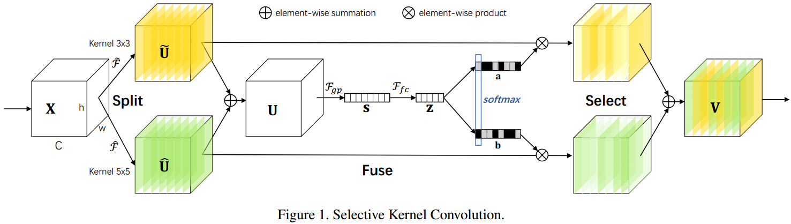
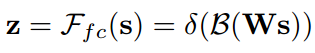
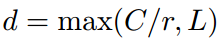
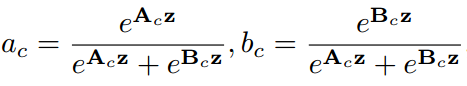
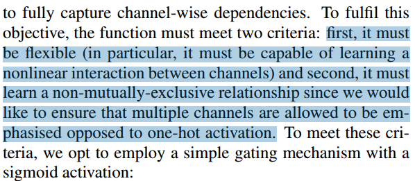

# 　　　　　　　                 再聊SENet的孪生兄弟SKNet
## 引言

上节[《聊聊2017 ImageNet夺冠的SENet》](https://github.com/Captain1986/CaptainBlackboard/blob/master/D%230027-%E8%81%8A%E8%81%8A2017%20ImageNet%E5%A4%BA%E5%86%A0%E7%9A%84SENet/D%230027.md)对SENet这种在通道维度(channel-wise)进行显示学习来做信息调整的结构做了介绍。SENet的思想(显示学习不同通道特征图的重要性来标定不同通道)如果用在Kernal Size这个维度会怎样呢？不同尺寸的Kernal学习到的特征图，能不能用一种显示的方式来学习他们的输出权重进行标定融合呢？发表在2019 CVPR上的论文[Selective Kernel Networks](https://arxiv.org/abs/1903.06586)对此做了一些有益的分析，此文也是Momenta出的，可谓和SENet思路一脉相承，就像孪生兄弟一下，这里也简单介绍一下。

**欢迎探讨，本文持续维护。**

## 实验平台

N/A

## 从Inception到SKNet

SKNet和SENet的渊源关系在前面引言部分已经交代清楚了，这里讲讲SKNet和经典的Inception结构之间的关系。

如上图所示的是基本的Inception结构，该结构在上一层的输入上用多个不同Kernal size的卷积核进行卷积加上max polling操作得到输出的各个特征图，然后各个特征图Concate起来组合成输出的特征图。不同Kernal size的特征图上的像素点具有不同大小的感受野，所表达的信息在空间上大小不同，这样就丰富了所提取的特征，加强了信息的丰富程度和特征的表达能力，进而提升了网络的性能。

但是，这样的Concate还是觉得有点粗暴，能不能用类似于SENet的显示学习的方法，根据特征图的内容，去学习一套更精细的组合规则(系数)呢？而且，根据神经学的研究也发现，单个神经元的感受野的大小也不是固定不变的，而是根据输入的刺激的大小来做相应调整的。这就是SKNet要做的事情。

## SKNet模块介绍

### A Big Picture

SKNet模块的构造很简单，以最简单的两个不同尺寸卷积核为例，如下图所示：

首先给定一个输入特征图X，用两个不同尺寸的卷积核对其进行卷积得到黄色和绿色特征图，然后把这两个特征图加起来得到特征图U，对这个特征图U进行Global average polling得到特征图S，进行全连接得到Z，然后Softmax Attention得到两组权重向量a,b，用这两组权重向量对前面最先得到的黄色绿色特征图进行加权求和得到SKNet模块的输出V。

### 细节分析

上面的讨论还是比较抽象，这里分成三个阶段Split, Fuse和Select来一个个分析SKNet结构的实现细节。

1. **Split**: 首先是Split操作，Split操作用两个不同尺寸的卷积核对同一个输入X分别做卷积，得到两个特征图（上图中3x3卷积核生成黄色特征图，5x5卷积核生成绿色特征图）。在这里，为了减少计算量，卷积可以采用分组卷积的方式，后面加上BN层和ReLU激活函数；更进一步，可以采用dilation = 2的3x3空洞卷积作为这里的5x5卷积在不增加计算量的前提下得到更大的感受野；

2. **Fuse**: 再看中间，是Fuse操作。这里先把前面卷积出来的蓝色和绿色特征图加起来，然后和SENet类似地，用一个Global average pooling操作在空间维度压缩特征图S，获取全局感受野，然后对S采用全连接(先做全连接，再做BN，最后ReLU)的方式得到Z，当然，这里Z的长度也是可以用超参数控制的；

3. **Select**: 前得到的Z只是得到了一个包含不同感受野特征图和空间上全局信息的编码，接下来需要另外一种变换来抓取各个卷积核的特征图之间的关系。这里作者用了Softmax Attention机制：

   

   这里ac和bc是互补关系，如果想在更多的核做Select，那么就可以扩展到更多的Softmax输出。这里得到的ac和bc作为权重，对开始左边的黄色特征图和绿色特征图做加权求和，可以得到最终SKNet模块的输出特征图V。

## 我的一点困惑

在前面的SENet的分析中，对于SENet的Excitation步骤，用的是**Sigmoid**来把1x1xC的特征转换成1x1xC的权重，论文给的理由是各个Channel的特征不一定要互斥，这样允许有更大的灵活性(例如可以允许多个通道同时得到比较大的权值)，原文如下图：

但是，在SKNet里面，为什么就要用Softmax这种one-hot前提的形式的函数来转换呢？难道作者认为不同Kernal Size得到的特征图是mutually-exclusive的吗？这一点我觉得作者没解释得很清楚，也可能是我理解错了，如果哪位读者有好的理解，欢迎探讨。

## 总结

本文介绍的SKNet模块通过显示地学习一组权重，可以在一定程度上对不同的输入自适应地融合不同尺寸的卷积核得到的不同感受野的特征图的信息。思路是和SENet差不多，只不过SENet是显示地学习Channel-wise的权重来重标定通道特征图，它把SENet的思想迁移到了Inception上来显示地学习不同Kernal Size的特征图的权重。

## 参考资料

+ [Squeeze-and-Excitation Networks](https://arxiv.org/abs/1709.01507)
+ [SENet GitHub](https://github.com/hujie-frank/SENet)
+ [Going Deeper with Convolutions](https://arxiv.org/abs/1409.4842)
+ [Selective Kernel Networks](https://arxiv.org/abs/1903.06586)
+ [depthwise separable convolutions in mobilenet](https://github.com/Captain1986/CaptainBlackboard/blob/master/D%230004-depthwise_separable_convolutions_in_mobilenet/D%230004.md)
+ [《聊聊2017 ImageNet夺冠的SENet》](https://github.com/Captain1986/CaptainBlackboard/blob/master/D%230027-%E8%81%8A%E8%81%8A2017%20ImageNet%E5%A4%BA%E5%86%A0%E7%9A%84SENet/D%230027.md)

