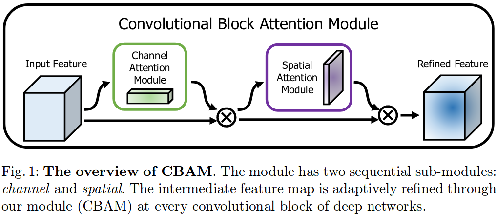
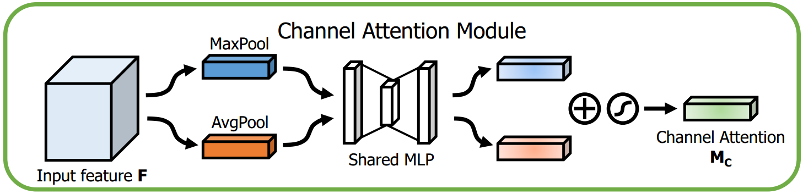
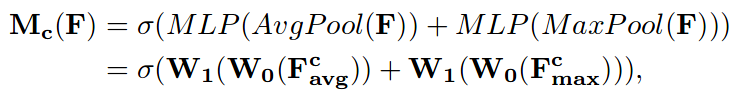
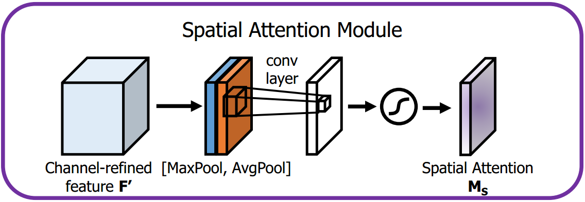
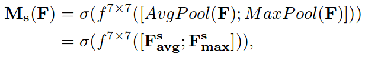

# 　　　　　　　                 CV中的注意力机制
## 引言

注意力机制最早在自然语言处理和机器翻译对齐文本中提出并使用，并取得了不错的效果。在计算机视觉领域，也有一些学者探索了在视觉和卷积神经网络中使用注意力机制来提升网络性能的方法。注意力机制的基本原理很简单：它认为，网络中每层不同的（可以是不同通道的，也可以是不同位置的，都可以）特征的重要性不同，后面的层应该更注重其中重要的信息，抑制不重要的信息。比如，性别分类中，应该更注意人的头发长短、胸部隆起情况这些和性别关系大的特征的抽取和判断，而不是去注意人体和性别关系不大的，像腰部粗细、身高头部比例，这些特征。

本文以2018年在ECCV发表的论文《CBAM: Convolutional Block Attention Module》为具体例子介绍计算机视觉中注意力机制的应用。

**欢迎探讨，本文持续维护。**

## 实验平台

N/A

## 网络设计考虑的三个点：深度、宽度和感受野

在工程师和研究者设计新的网络的时候，为了提升网络的容量和性能，通常会从三个方面着手：

1. 增加网络深度：例如，从开始的LeNet-5，到VGG-16，到ResNet-101，等等。网络的设计越来越深，性能也越来越好。网路深了，简单地讲，下一层的输出是上一层的线性组合加激活，可以复合出更多更灵活的特征（其实就是更复杂的复合函数嘛）；

2. 增加网络宽度：这里的网络宽度即特征图的通道数。这里的典型例子可以从LeNet-5，到VGG-16，Wider ResNet。增加网络宽度，特征图通道数多起来了，更多的卷积核可以得到更多更丰富的特征，网络的表达能力自然就强了；

3. 丰富网络感受野：这里可以参考Inception中的不同分辨率的卷积核组成的小网络，还有FPN，SSD里面的各种变种，都有增加感受野的多样性来提升性能的路子。感受野不同，对不同大小的目标的特征提取和表达能力就不同，一般是特征图上感受野大的像素更能代表大的目标上面提取的信息，感受野小的像素，只能看到大目标的一部分；反过来想，感受野大的像素，看到的视野太大，对于小目标就掺杂了太多的冗余信息和噪音。所以，使用不同分辨率的感受野，丰富网络的感受野来提升网络，让大感受野处理大目标，小感受野处理小目标，各司其职，来提升网络性能也就成了很多网络设计的自然手段了。

当然，很多网络设计也是同时考虑组合这三者进行更加精细的设计，思想本质还是一样的。

CBAM和上面提的三种思路都不同，它不增加网络深度，不增加网络的宽度，也不增加不同Kernel size的卷积核；它在现有的特征图上做有选择地更精细地调整（标定？）来提升网络的性能。

## CBAM模块介绍

### A Big Picture

CBAM模块的构造很也简单，如下图所示：

首先给定一个输入特征图Input Feature，首先通过输入特征图，计算出一个通道注意力模块Channel Attention Module，然后按照通道顺序乘以这个模块；然后继续计算出空间注意力模块Spatial Attention Module，继续按照宽高维度乘以这个模块，最后输出经过调整的特征图Refined Feature。在这里注意，并不是谁规定了Channel Attention Module一定要在Spatial Attention Module前面，而是作者**通过实验**得出在前面会更好些的这个结论。

### 细节分析

上面的大致介绍了CBAM的通道注意力机制和空间注意力机制是怎么样串联起来一个流水线的，这里深入它的两个注意力模块介绍一下。

1. **Channel Attention Module**: 首先来看通道注意力模块，首先，输入特征图F按照取每个通道的Max Pooling和Global Avg Pooling的结果，然后**分别**送入一个三层感知机MLP，输出结果直接加起来，然后送入ReLU激活函数，得到通道注意力模块的特征图Mc。Mc怎么使用在Input Featre列成公式这个过程就是：，因为前面的讲解很清晰，而且过程也并不复杂，这里就不一一介绍各个符号的意义了；

2. **Spatial Attention Module**: 在通道注意力模块执行完之后，中间结果特征图会被送入空间注意力模块继续处理，得到运用了空间注意力机制的最终的特征图。如上图所示，由通道特征图机制处理后的特征图F'(其实就是前面的Mc(F))，首先在**通道维度(扫描宽高)**上计算出Global Max Pooling和Global Average Pooling的两张特征图，将其Concate起来，然后用一个传统卷积处理一次，最后使用Sigmoid激活就得到了空间注意力模块用到的特征图Ms，Ms怎么用到F'上可以参考。

## 在ResNet结构应用CBAM

CBAM的结构小巧灵活，在AlexNet或者VGG中怎么用是显而易见的，这里介绍SENet在更新的ResNet结构中的用法，其余结构也是类似的。

对于ResNet，CBAM模块嵌入到残差结构中的残差学习分支中(直接嵌入在identity map中，那还叫ResNet吗？嘿嘿)。

## 进一步思考：发(水)论文的正确姿势

瞎扯时间到，最近连续写了三篇文章，[《D#0027-聊聊2017 ImageNet夺冠的SENet》](https://github.com/Captain1986/CaptainBlackboard/blob/master/D%230027-%E8%81%8A%E8%81%8A2017%20ImageNet%E5%A4%BA%E5%86%A0%E7%9A%84SENet/D%230027.md)，[《D#0028-再聊SENet的孪生兄弟SKNet》](https://github.com/Captain1986/CaptainBlackboard/blob/master/D%230028-%E5%86%8D%E8%81%8ASENet%E7%9A%84%E5%AD%AA%E7%94%9F%E5%85%84%E5%BC%9FSKNet/D%230028.md)和本篇[《D#0029-CV中的注意力机制》](#CV中的注意力机制)。两篇CVPR和一篇ECCV，在CV界都是很好的会议。三个论文的着眼点不一样，但是思路其实是一样的，SENet把注意力机制用到了通道维度，对特征图通道做调整；SKNet把注意力机制用到了Kernel Size的选择上，对不同Kernel Size出来的特征图做加权；而本文中介绍的CBAM则把注意力机制分别用到了通道维度和分辨率维度，再将其组合起来了。Taste不是很高，Insight也不是很深刻，但也算是做了前人没有做的工作。

所以，多看Paper，就可以看到很多论文的方法就是在各种排列组合和更灵活的扩展泛化，然后做实验证明这种排列组合有效。

## 总结

本文通过CBAM这个具体的例子，介绍了注意力机制及其在计算机视觉领域的应用。最后还对于计算机视觉领域的科研创新做出了进一步的思(tu)考(cao)。

## 参考资料

+ [CBAM: Convolutional Block Attention Module](https://arxiv.org/abs/1807.06521)
+ [《D#0027-聊聊2017 ImageNet夺冠的SENet》](https://github.com/Captain1986/CaptainBlackboard/blob/master/D%230027-%E8%81%8A%E8%81%8A2017%20ImageNet%E5%A4%BA%E5%86%A0%E7%9A%84SENet/D%230027.md)
+ [《D#0028-再聊SENet的孪生兄弟SKNet》](https://github.com/Captain1986/CaptainBlackboard/blob/master/D%230028-%E5%86%8D%E8%81%8ASENet%E7%9A%84%E5%AD%AA%E7%94%9F%E5%85%84%E5%BC%9FSKNet/D%230028.md)

