# 　　　　　　　                 类MTCNN的360RIP人脸检测器PCN
## 引言

最近在看一些RIP 360度人脸检测方法时看到了一篇中科院山世光老师的《Real-Time Rotation-Invariant Face Detection with　**P**rogressive **C**alibration **N**etworks》，简称PCN，发表于2018年的CVPR。顾名思义，这个人脸检测器有两个显著特点：

1. **速度快**，可以在CPU和GPU平台做到实时性；
2. **旋转不变形**，可以检测RIP内360度旋转的人脸；

看了内容之后，发现其思路和训练方式都和以前做过的MTCNN思路很像，都是三个小网络做Cascade，分类和回归多任务训练，其和MTCNN最大的不同是：

1. FCN为了做到360度人脸都检测，**去掉了MTCNN预测5点landmark的任务，换成了子网络加上了额外的预测人脸角度的任务，逐步旋转图像做角度校正**；
2. FCN第一个网络采用的是滑窗加多层金字塔的形式穷举人脸可能的位置，不如MTCNN生成热力图的方式做的聪明；

**欢迎探讨，本文持续维护。**

## 实验平台

N/A

## 检测旋转人脸常用的三个招式

人脸检测是一个基础而且通用的功能，学界工业界都对其做了很多的研究，其中Rotation-In-Plane的人脸检测，是一个比正脸人脸检测更具有挑战性的任务。为了做RIP360度的人脸检测，通常会从三个方面着手：

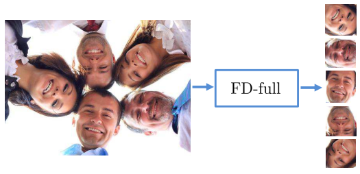

1. **数据增强Data Augmentation**：数据增强来做旋转人脸检测，就是把各种各样的人脸样本在图像平面内各个方向上做旋转，生成许多的旋转人脸加入训练集中去训练网络，企图使**一个网络**(如上图)自动学习通用于各种旋转人脸的特征来检测旋转的人脸。这种方法的优点是，可以直接套用到现有的人脸检测网络中去直接训一把看看效果，缺点也很明显，它网络要学习到更加通用更加对旋转不变的特征，学习任务变难了，势必要增加网络的容量，也势必计算量大网络大，耗时很多。总之，这种大力出奇迹简单粗暴的方法做旋转人脸检测，在实践中不多见；

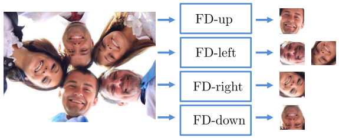

2. **分治法Divide-and-Conquer**：这个思路也很清晰，既然一个大的网络做360度人脸检测太吃力了，那么能不能用几个小的人脸检测网络，各自负责检测一定角度范围内的人脸，然后把各自检测出来的人脸再合并一下不就是所有角度的人脸了吗？例如上图，用四个小检测器检测上下左右四个方位的人脸，然后合并。这样做理论上也是可以的，不过需要四个网络，需要检测四次，总的时间怕也不会少。在CNN发展到现在这么强的时候去这样做，也显得不够聪明；

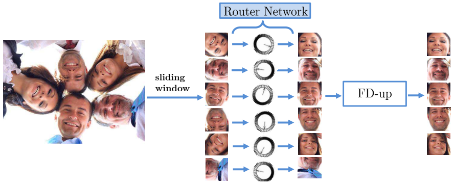

3. **旋转路由Rotation Router**：既然旋转人脸检测与普通向上的人脸检测难点主要来自于人脸是旋转的，那么很自然的，如果能先预测出人脸的旋转角度，然后把它转成向上的人脸，再用普通的正脸人脸检测器去做检测(分类和回归)不就可以了吗？示意图如上，使用滑窗法和图像金字塔穷举所有可能出现人脸的位置，送入**一个**Router网络，预测出旋转角度，使用这个角度旋转人脸，再送入正脸检测器得到最终结果。这种方式，要求Router网络能精确预测旋转角度，这是一个困难的问题，必然会使网络增大，而预测不了精确的角度，又会使最终召回率降低。

## PCN的思路

### A Big Picture

为了降低角度预测的难度，PCN使用三个Cascade网络递进预测人脸角度，递进地旋转人脸，使得每个网络不需要预测得很准，任务难度降低，更快更好；再配合MTCNN的人脸分类和框回归任务来做人脸检测，网络的大致示意图如下：

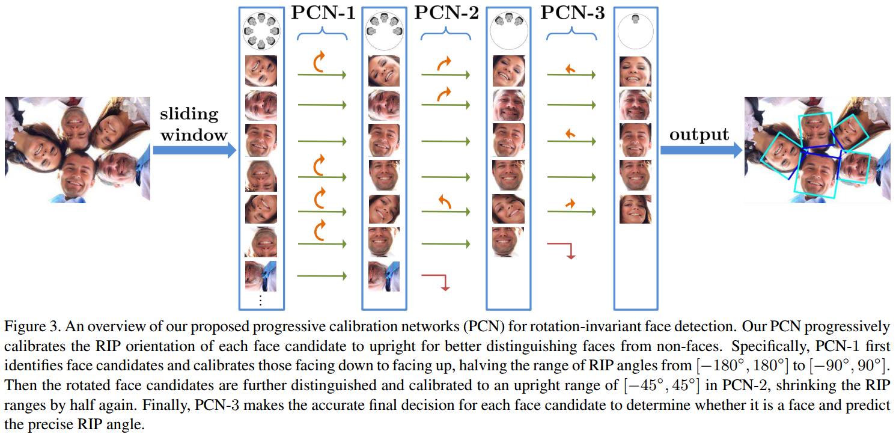

PCN网络分为三个Cascade子网络，每个子网络分别负责一个阶段。首先给定一个输入图片，依然通过滑窗和金字塔穷举所有可能的人脸位置，送入第一阶段PCN-1。第一阶段负责预测一个角度信息打分，告诉这个人脸是向下的还是向上的，如果向下的，则旋转180度，如果向上的，则不变。第一阶段保证送入第二个阶段PCN-2的人脸都是向上的(向左向右也算向上)。然后第二阶段PCN-2拿到向上的图后，继续预测这个人脸是正上，还是向左、向右，根据判断结果，继续调整人脸到正向上。PCN-3拿到正方向的人脸后，预测一个更精细的旋转角度打分，并回归出人脸框位置。

上面没有仔细介绍的是，每个网络都也会做人脸/非人脸的分类和框回归任务，可以在中途过滤掉一些非人脸；每个网络都会做角度预测，但是只有前两个预测会去旋转人脸，第三个预测不用再去旋转人脸了。

三个阶段由粗到细地分类人脸，回归人脸框，预测角度，最后总结并输出人脸的角度和框。

### 细节分析

上面的大致介整个PCN网络的处理流水线，下面我们仔细看看组成它的三个子网络，PCN-1，PCN-2和PCN-3。

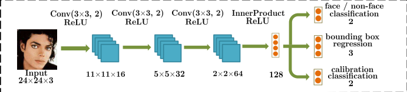

上面是PCN-1的结构图，PCN-1的任务主要有三个：1. 人脸/非人脸分类；2. 人脸框回归；3. 预测人脸角度。

这个网络的主要任务还是人脸分类，对于人脸分类，使用常用的交叉熵损失函数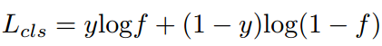优化。对于第二个任务，人脸框回归，使用Smooth L1损失函数来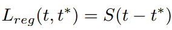优化，其中S是Smooth L1损失函数，t是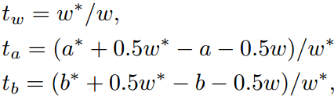代表宽高和中心点的偏移，t\*是对应的要预测是真值。对于第三个任务，预测人脸是向上还是向下，是一个二分类任务，还是使用二分类交叉熵损失函数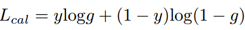。最后，综合这三个任务的损失韩式，并加上调整因子，就得到了训练PCN-1的目标函数了。

在训练好PCN-1网络后，可以用这个网络的人脸非人脸分类能力先滤掉大量的候选框。对于剩下的它认为是人脸的候选框，利用输出的角度预测值，用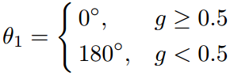判断人脸朝向并旋转人脸。这里需要注意一点，网络输出的是一个打分g，代表它认为输入是向上的人脸(g>0.5)还是向下的人脸(g<0.5)，实际得到的是一个**二值化的判断**，要么是0度旋转要么是180度旋转，而不是根据g打分再算一个别的什么值。这样做的原因前面已经讲过了，控制任务的难度，控制网路复杂度。

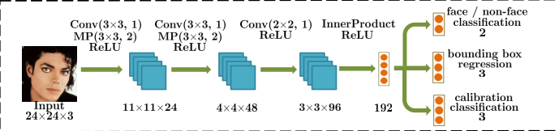

讲完了PCN-1，继续来看PCN-2。上面是PCN-2的结构图，PCN-2的任务同样有三个：1. 人脸/非人脸分类；2. 人脸框回归；3. 预测人脸角度。前面两个功能和PCN-1的大差不离，主要是第三个预测人脸角度有点不一样。这里PCN-2输出三个打分来预测人脸角度(PCN-1是2个打分)，预测方式如下图：

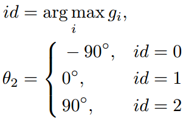

它预测人脸是向左偏、正中间还是向右偏。然后再根据预测的结果调整图片给下一个网络PCN-3。

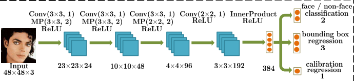

继续看PCN-3，如上图。同样滴，也做三个事情，同样的，主要的不同也在角度预测上。这里PCN-3网络预测的结果不是打分了，而**直接是偏转的角度**。

这样，PCN-1输出的角度判断，加上PCN-2输出的角度判断，再加上PCN-3输出的角度预测值，就是原始图像上的人脸偏转角度了。

## 数据分析

### 网络性能

作者将数据增强策略用在了Faster R-CNN，RFCN和SSD500；实现了一个Cascade CNN，通过旋转图片的形式跑四次；第三，用PCN-1作为Router网络接一个1998年的人脸检测器[Rotation invariant neural network-based face detection](https://www.researchgate.net/publication/3758608_Rotation_Invariant_Neural_Network-Based_Face_Detection)。并和以上几个对比方法得出的结果如下

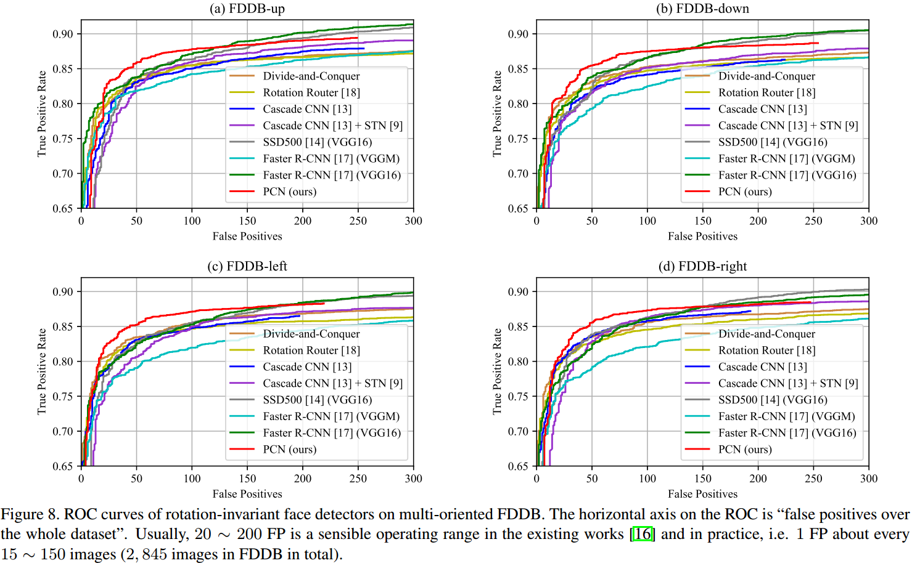

可以看到，以FDDB为测试集，在误报数量为100的条件下，FCN是召回率最高的方法。

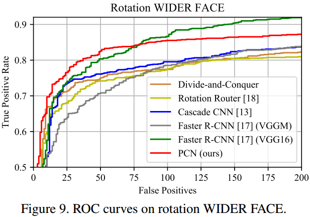

在WIDER FACE上，当误报数量为50的条件下，PCN也是召回率最高的。

### 网络速度

在FDDB上，误报数量设置为100个，输入640x480的VGA分辨率图片，最小人脸设置为40x40时，速度测量结果如下：

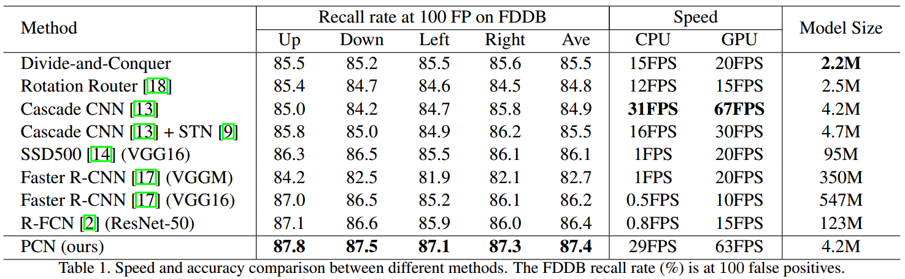

可以看到，PCN速度和Cascade CNN差不多，比Faster R-CNN(VGG16)，SSD500(VGG16)和R-FCN(ResNet-50)快不少。模型文件的size也比较小。

## 总结

本文介绍的PCN网络是一个RIP360度检测的网络，它通过在MTCNN的思路上去掉五点预测加上角度预测，来一步步地校正图像来实现RIP360度的人脸检测，从数据上来看，**性能不是最好的**(不说比最新的RetinaFace，连FaceBoxes都比不上)，**速度也不是最快的**，但是**优势在旋转不变**。

## 参考资料

+ [Real-Time Rotation-Invariant Face Detection withProgressive Calibration Networks](http://openaccess.thecvf.com/content_cvpr_2018/papers/Shi_Real-Time_Rotation-Invariant_Face_CVPR_2018_paper.pdf)
+ [《D#0017-MTCNN和FaceBoxes》](https://github.com/Captain1986/CaptainBlackboard/blob/master/D%230017-MTCNN%E5%92%8CFaceBoxes/D%230017.md)
