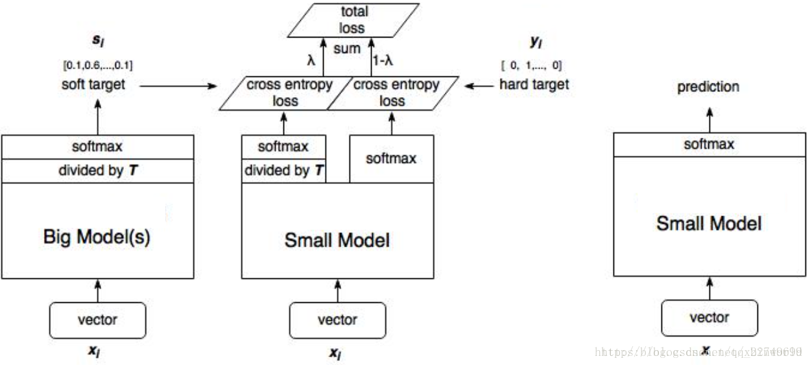
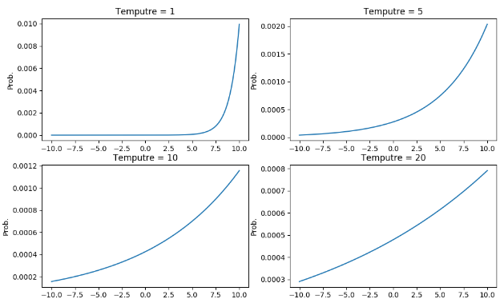
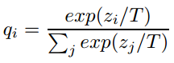

# 　　　　　　　                 知识蒸馏Knowledge Distillation
## 引言

作为模型压缩和加速的经典方法之一，知识蒸馏(Knowledge Distillation)是不得不了解的一个领域。14年NIPS上由Google 的Hinton发表的《[Distilling the Knowledge in a Neural Network](https://arxiv.org/abs/1503.02531)》是首次提出知识蒸馏这个概念的文章，本文对这个文章做一个初步理解。

**欢迎探讨，本文持续维护。**

## 实验平台

N/A

## 知识蒸馏的基本思路

一般来讲，越是复杂的网络，参数越多，计算量越大，其性能越好；越是小的网络，越难训练到大网络那么好的性能。或者用一些大的模型来做集成学习（例如最简单地投票）来提升整体性能。

### 提升性能和落地部署不要用相同的模型

在工作中，一般常见的开发范式是，以一个大模型结构，在很大的数据上，训练出一个性能很好的模型，然后在部署阶段，也部署这个模型以预测实际情况下的数据。作者这里认为，部署用的模型和训练提高性能用的模型，其实应用场合不一样，**用一样的模型是不对的**！应该用不一样的模型（训练用复杂大模型，目标为提高性能；而部署用小模型，目标是为了速度和节约资源），就好像很多昆虫有专门为了从环境中提取能量和营养的幼体形态和专门为了迁徙和繁殖的成虫形态一样，我们也应该用大模型来学习抽取大规模，强冗余的训练集信息，然后利用新的训练方法（这里称之为**蒸馏**）把大模型学到的知识转移到一个更适合部署的小模型上。

### 大模型的Softmax输出概率里面富含知识

这里有一个在概念上的认识障碍，就是我们通常认为模型学到的知识是体现在它学习到的具体的参数中的，而这些参数我们又很难轻易精简。我们可以从更上一层的概念想一下，其实我们学到的知识，**是一个函数，它把样本的输入向量映射到输出向量**。例如，我们的VGG模型，就是把输入的224x224x3的图片向量映射成1000维的输出的每类概率向量。而在训练VGG的过程中，我们会最大化真值那一类的概率。但是，我们模型输出的结果，还有个另外的作用，就是为不是真值的那些类也赋予了一定的概率，虽然这些概率一般比较小，但是也有些是比其他的大一些的，**这相对大小里面也包含了很多大模型学习到的信息**！比如，输入给训练好的VGG模型一个宝马轿车图片，虽然只有很小的概率会被分类为垃圾车，但是这个概率怎么来说也会比VGG将其分类成一个胡萝卜的概率大许多倍吧，这里这些错误分类的概率里面，其实也包含了大模型VGG是怎么分类的大量的有用信息的。

### 我们要学的不是真值标签！要学的其实是泛化能力！

我们训练模型的目标函数越能反应真实场景下用户所要达到的目标越好。用户的目标是模型的泛化能力好，对未见过的样本要正确分类。然而由于条件所限，我们一般把提升模型的泛化能力这个目标简化为训练模型在训练集上对真值标签的预测能力，我们也认为，训练得到的模型对真值标签的预测能力越强，它的泛化能力也应该越强，这也是很合理的。但是，**如果我们已经有了一个泛化能力很强的模型，那么为什么不去用一个小模型直接学习这个很强的模型的泛化能力呢**？那不是舍本逐末吗？

### 怎么学习泛化能力呢？知识蒸馏！

那么问题来了。如果我们有了一个大模型，泛化能力很好，我们怎么才能让一个小模型去学习它的泛化能力呢？换句话说，怎么让大模型的泛化能力转移到小模型身上去呢？这里就用到了论文里面介绍的方法：知识蒸馏。

简单地说，知识蒸馏就是把大模型对样本输出的概率向量作为软目标“soft targets”，去让小模型的输出尽量去和这个软目标靠（原来是和One-hot编码上靠）。知识蒸馏过程所用的训练样本可以和训练大模型用的训练样本一样，或者另找一个独立的Transfer集也行。**因为“soft targets”比One-hot编码所携带的信息更多**，所以我们在**训练小模型时可以用比训练大模型时更少的训练集和更大的学习率**。

### 当“soft targets”携带信息太少怎么办？用高温T煮出来！

想象有一种情况，比如对于类似于MNIST这样的简单任务来说，大模型表现地很好，它输出的soft targets几乎和真值的One-hot编码一样（真值那一位有一个巨接近1.0的概率，其余各位概率都很小），大多数的关于大模型泛化能力的信息都集中在那些值很小的概率上。比如，某个2的测试图像，输出它是3的概率为10^-6，是7的概率为10^-9，而另外一个2的测试图像，输出它是3的概率为10^-9而是7的概率为10^-6。很显然，这些很小的概率（10^-6和10^-9）体现了两个测试图上2的写法和3更像还是和7更像，它们是携带了很重要的信息的。但是在Transfer阶段计算交叉熵的时候，由于它们的值很小，他们对于Transfer阶段的目标函数的影响很小，这是不应该的！怎么样解决这个问题呢？怎么样放大这些小概率值里面所携带的信息呢？[Caruana](https://www.cs.cornell.edu/~caruana/compression.kdd06.pdf)所采取的方法是用logits（Softmax的输入）作为学习的“Soft targets”（而不是前面Hinton说的Softmax的输出），然后计算大模型的logits和小模型的logits的均方差来优化小模型。而我们本文说的Hinton，用了一种更通用的称之为蒸馏的办法，**引入温度参数T去放大（蒸馏出来）这些小概率值所携带的信息**。后文我们会证明，Caruana教授的方法只是Hinton大牛方法的一个特例。

### 关于训练集

用来做知识蒸馏训练小模型的训练集合可以是无标签的数据，也可以是最初用来训练大模型的数据（反正我们要学的是模型的泛化能力，知道模型的输入输出就行了）。不过，在实际做知识蒸馏的时候，如果**有最初训练大模型的带标签的训练集训练效果会更好**，这时我们可以在训练小模型的目标函数里面加入让小模型也预测出训练样本标签的目标函数（原始目标函数是让小模型预测出大模型的输出Soft target）。而且，有时候小模型直接去学习输出Soft target有难度，加上让它去学习样本真值的损失，去诱导小模型的输出往样本真值上靠也会对学习Soft target有帮助作用。

## 蒸馏过程

### 训练和预测

如上图所示为怎么做知识蒸馏的示意图。左边和中间的图为训练过程，右边的图为预测过程。

首先第一步，肯定是训练一个大的模型，让它在训练集上性能良好（有一个好的大模型是知识蒸馏的前提）；

然后是用这个大模型来训练小模型。在训练时，对样本xl，大模型的倒数第二层先除以一个温度T，然后通过Softmax预测一个软目标Soft target，小模型也一样，倒数第二层除以同样的温度T，然后通过Softmax预测一个结果，再把这个结果和软目标的交叉熵作为训练的total loss的一部分。训练的total loss的另一部分是正常的输出和真值标签(hard target)的交叉熵。Total loss把这两个损失**加权**合起来做为训练小模型的最终的loss。在小模型训练好了，预测的时候，就不需要再有温度T了，直接按照常规的Softmax输出就可以了。

### 再来说说T的取值

这里的温度T是干什么的，前面已经提到了，就是引入温度T去放大小概率所携带的信息。可以用下面这个图来解释：

上面第二张图中的公式是怎么由倒数第二层的zi产生软目标qi，上面第一张图是在不同的温度T的取值下，各个横轴的zi得到的纵轴的qi的变化规律。可以看出有连个值得关注的点：

1. 当温度T越高的时候，软目标越平滑，信息不会集中在少数分量上，这样增大温度参数T相当于放大（蒸馏出来）这些小概率值分量所携带的信息；

2. 第二点，不管温度T怎么取值，Soft target都有忽略小的zi携带的信息的倾向（产生的Prob小）

至于T在实际训练时候的取值，这还比较玄学，T取值小，那就忽略了小的zi所携带的信息；T取值大一点，那就放大了小的zi所携带的信息（但这些信息，也可能是噪音）。 Which of these effects dominates is an **empirical question**。但是从经验上来说，当小模型相对于大模型和任务来说非常非常小的时候，取一个适中（偏小）的温度T效果最好。

## 总结

Hinton首次提出知识蒸馏这个概念并且引入了温度系数来进行操作。知识蒸馏可以作为模型加速和压缩的方法用。本文重点结合原始论文讲了知识蒸馏的来龙去脉和提出思路，后面简要介绍了知识蒸馏的大致过程。具体在操作中还有一些细节（例如温度的选择，数据集的选择）没有涉及很深入，需要在具体应用时再去深入看。

## 参考资料

+ [Distilling the Knowledge in a Neural Network](https://arxiv.org/abs/1503.02531)
+ [ModelCompression](https://www.cs.cornell.edu/~caruana/compression.kdd06.pdf)
+ [知识蒸馏、在线蒸馏](https://blog.csdn.net/xbinworld/article/details/83063726)

