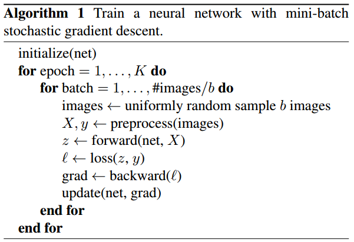
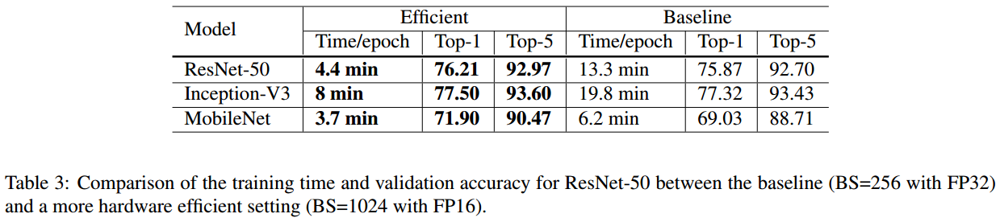
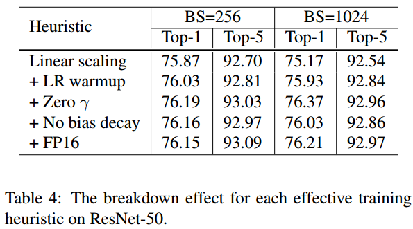
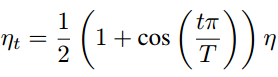
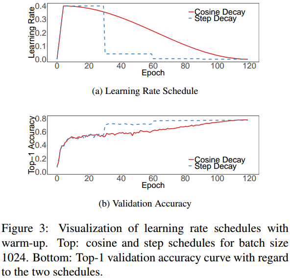
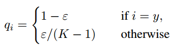
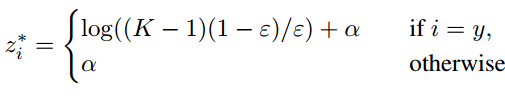
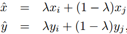

# 　　　　　　　                 一些分类网络的训练技巧
## 引言

最近再看李沐老师的论文《Bag of Tricks for Image Classification with Convolutional Neural Networks》，里面总结了一些分类网络的训练技巧，这里简单做个记录。

**欢迎探讨，本文持续维护。**

## 实验平台

N/A

## 训练加速手段

通常我们训练模型都是使用fp32浮点精度来表示图像、中间结果、保存权重和进行优化，但是fp32需要占用4字节内存，但是有研究表示，用低精度的浮点数，比如fp16来训练，最终性能也不会降低太多，而且可以增大batch size。建议用**低精度浮点数和适当大点的batch size来训练**，这样能加速训练过程，而且不会牺牲模型性能，甚至在某些时候还会提升。

### 大的batch size来训练

如上图所示的为Mini-batch SGD的训练流程。每个epoch，会把所有训练样本划分为b个batch，每次参数更新会用一个batch里面的所有样本综合的结果来算loss和梯度，再更新权重。Mini-batch SGD之所以用多个图片组成batch来训练，为的是提升计算的并行性和减少数据通信带来的overhead。但是，太大的batch size也不一定好，因为对于凸优化问题，优化过程收敛的速率（而不是收敛的结果！）会随着batch size的增大而降低。换句话说，同样的数量的epoch前提下，大batch size训练的模型验证机精度要比小batch size训练的模型差。

为了用大的batch size提升模型性能，且让训练过程速度提升，这里有四个Trick：

1. **初始学习率线性缩放**：随着batch size的增大，batch样本总的variance变小，梯度中的噪音会变小，所以我们可以适当增大学习率来加速训练。我们可以像Goyal建议的那样，**随着batch size的增大，线性增大学习率**。例如，何恺明在训练ResNet的时候，batch size设置为256，相应初始学习率设置为0.1，如果我们设置batch size为b，那我们的初始学习率可以设置为0.1 x b/256。

2. **学习率预热到初始学习率**：在网络开始训练的时候，给它的初始化权重一般都是随机赋值的，和最终要学习到的结果相去甚远。所以开始学习的时候，权重更新的梯度很大，如果用一开始就用很大的学习率，很可能造成训练中数值不稳定。所以，最开始训练的时候，应该用比较小的学习率，然后训练过程稳定之后切回到最初的初始学习率。我们可以像Goval建议的那样做一个学习率预热，最开始用0学习率，然后随着训练的过程，把学习率线性增加到初始学习率。比如，假设我们用头m个batch做这个预热的过程，**初始学习率设置为η，那么在batch i(1 ≤ i ≤ m)的时候，学习率设置为iη/m**，让学习率逐步增大到初始学习率η；

3. BN层γ用零初始化：ResNet的残差块中，非等量映射的那一支的最后一层可能是BN层。在常规初始化策略中，这个BN层的γ和β一般分别初始化为1和0，但是如果把γ初始化为0的话，那样**残差块就相当于没有了，整个网络的层数也相当于减少了**，这样在训练的最初阶段更好训练一点。

4. 不要bias decay：**只在卷积层和全连接层做weight decay(L2正则化)**，其他参数，例如bias和BN层的γ和β不要做正则。

### 低精度训练

一般都用fp32的浮点数来训练模型，但是在某些GPU上有增强的算数逻辑单元可以处理低精度数据类型。例如Nvidia
V100在fp32运算时提供了14TFLOPS的算力，在fp16运算时算力可以达到100TFLOPS(提升了6+倍)。如上图所示，在V100低精度配置下，就算用了更大的batch size，训练速度也有2~3倍的提升。

在低精度训练时也要注意，不要产生数值溢出问题干扰了训练过程。Micikevicius等建议**用fp16表示权重和激活值，梯度计算也用fp16，同时，在参数更新的时候，所有的参数转换为fp32来表示**。

把上面说的那些训练手段做消融实验的结果如上图，可以看到，**那些Trick对模型的性能最终的好坏其实没有多大影响，最主要的还是帮助用大bacth size加低精度的fp16做训练这一点，可以让训练速度加快，更快拿到实验结果**。

## 训练细节微调

### 余弦学习率

训练中学习率的调整策略是至关重要的。按照一定比例在一定数量epoch后缩小学习率的step decay这种策略最为常见。这里也可以用按照余弦函数来将学习率从初始学习率降为0的策略。

如果一轮epoch中有T个mini batch，那么在第t个mini batch时的学习率ηt可以表示为。

用余弦学习率和step decay学习率相比较的训练如上图所示(都有几轮的学习率预热过程)。可以看到，step decay对于精度的提升更快，但是如果训练充分的话，**余弦学习率和step decay最终达到的精度都差不多的**。在李沐老师这个文章中，并没有看出来余弦学习率的优势所在（相反还有点劣势），原文也是说“Compared to the step decay, the cosine decay starts to decay the learning since the beginning but remains large until step decay reduces the learning rate by 10x, which **potentially** improves the training progress.”，可能在别的模型上效果更明显吧。

### 标签平滑

假设Softmax层输入叫score，输出叫probability。如果标签是采用one-hot形式的，那么为了达到损失函数最小，必然会促使probability_i = 1,其他的都是0。等于说**促使score_i等于无穷大**，其余的score分量为0。这样很大值的值出现很可能会导致网络的过拟合。

解决这一问题的办法是将one-hot的标签做一下如上图所示的处理，使其由hard-target变为soft-target。这样，最优解的socre就变成了。不同score分量的最大gap = log((K − 1)(1 − eps)/eps) ，当eps变大，gap就会变小。

### 知识蒸馏

用知识蒸馏来提升网络性能，这一点在[《D#0031-知识蒸馏Knowledge-Distillation》](https://github.com/Captain1986/CaptainBlackboard/blob/master/D%230031-%E7%9F%A5%E8%AF%86%E8%92%B8%E9%A6%8FKnowledge-Distillation/D%230031.md)已有详细介绍，本文不再解释。不过，做知识蒸馏的时候，最好用结构相似(**same family**)的大小网络来做，效果会更有保证一点。

### Mixup数据增强训练

除了传统的数据增强手段，Mixup数据增强用上图所示的公式同时加权求和训练样本**和其对应的标签**得到新的训练数据。并（丢弃原来的训练数据）只用新的训练数据做训练。Mixup得到的新样本比原始单独的样本更难一点，所以训练的过程也会长一点。

## 总结

本文简单地总结了李沐老师在论文《Bag of Tricks for Image Classification with Convolutional Neural Networks》总介绍的一些训练经验和技巧，有的技巧可能在某些情况下不是很通用，可以在自己的项目里有筛选的借鉴。

## 参考资料

+ [Bag of Tricks for Image Classification with Convolutional Neural Networks](https://arxiv.org/abs/1812.01187)
+ [《D#0031-知识蒸馏Knowledge-Distillation》](https://github.com/Captain1986/CaptainBlackboard/blob/master/D%230031-%E7%9F%A5%E8%AF%86%E8%92%B8%E9%A6%8FKnowledge-Distillation/D%230031.md)
+ [Highly scalable deep learning training system with mixed-precision: Training imagenet in four minutes](https://arxiv.org/pdf/1807.11205.pdf)
+ [Accurate, Large Minibatch SGD: Training ImageNet in 1 Hour](https://arxiv.org/abs/1706.02677)
+ [Training and investigating residual net](http://torch.ch/blog/2016/02/04/resnets.html)
