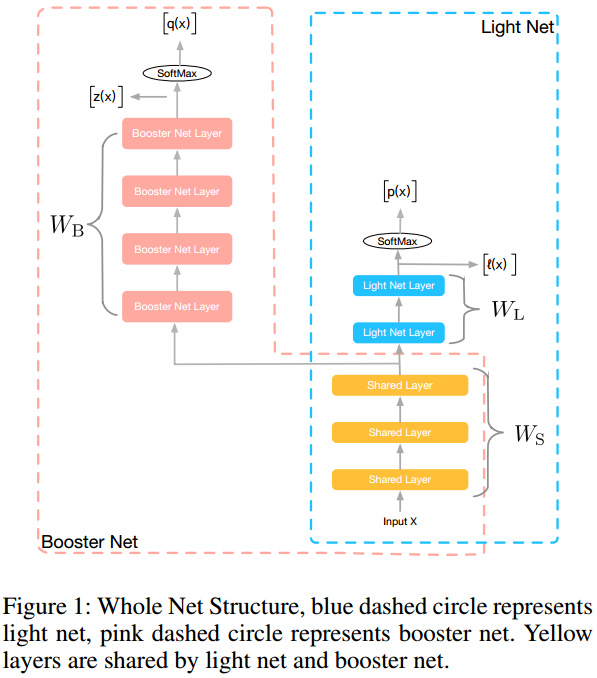
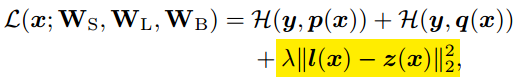
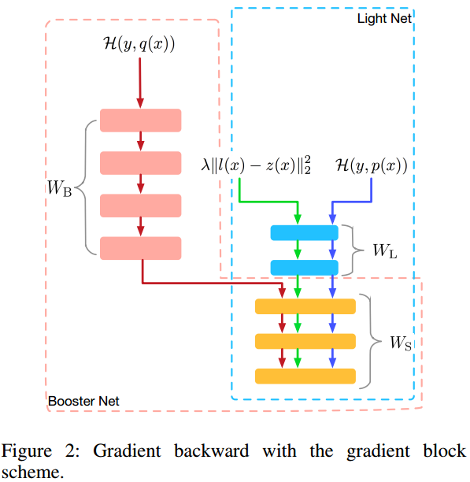

#                                 火箭发射：阿里巴巴的轻量网络训练方法

## 引言

一般而言，简单的网络速度快，但性能不如复杂的网络好；复杂的网络性能好，但是计算量大，也快不了。如何能结合小网络的速度和大网络的性能是一个很难也很重要的问题。主流的思路有这么几种：

从模型上来讲，

1. 模型的**剪枝和压缩**，先训练一个性能好的大的模型，然后进行裁剪减小计算量；
2. **轻量级网络**，比如MobileNet, ShuffeNet等；
3. [**知识蒸馏**](https://arxiv.org/abs/1503.02531)，用性能好的大模型作为“教师”指导小模型训练，让小模型模仿大模型的泛化行为（[《**D#0031-知识蒸馏Knowledge-Distillation**》](https://github.com/Captain1986/CaptainBlackboard/blob/master/D%230031-%E7%9F%A5%E8%AF%86%E8%92%B8%E9%A6%8FKnowledge-Distillation/D%230031.md)已有介绍）；

从工程上讲，

4. 模型**量化**，例如在某些平台上，用int8代替float32来做预测；

5. **算子融合**，比如BN融合（[《**D#0020-Batch-Normalization层原理与分析**》](https://github.com/Captain1986/CaptainBlackboard/blob/master/D%230020-Batch-Normalization%E5%B1%82%E5%8E%9F%E7%90%86%E4%B8%8E%E5%88%86%E6%9E%90/D%230020.md)中也有介绍）, Scale融合等；

这些只是简单列举了几种，而且他们也并不是互斥的，比如用了剪枝和压缩之后也可以继续做算子融合。

这里介绍一种**训练方法**，出自于**阿里巴巴**在2018 AAAI上的论文《Rocket Launching: A Universal and Efficient　Framework for Training Well-performing Light Net》，思路上像知识蒸馏，实际上是借鉴了知识蒸馏思路的一种通用的高效训练方法。但与传统的知识蒸馏相比，它的创新点和优势在于：能同时训练复杂和简单两个网络，而不是先训练一个复杂网络，然后用其训练一个简单网络，**缩短了总的训练时间**。

**欢迎探讨，本文持续维护。**

## 实验平台

N/A

## 火箭发射思路简介

火箭发射升空过程分为多个阶段，最开始的一个阶段，多级助推器朝着一个目标共同飞行，在后期稳定阶段，第一级助推器脱离，只用第二级助推器飞行。在“火箭发射”训练方法中，训练时，同时训练**共享底层特征**的复杂和简单两个网络，让他们朝着同样的目标优化的同时，用复杂网络**实时**的输出结果作为hint去指导简单网络来提升小网络的性能；在预测时，**砍掉**复杂网络，只用简单网络做预测来减小预测时间。

## 火箭发射训练细节

如上图所示为训练时候大的框架：粉色虚线框住的是复杂网络，蓝色虚线框住的是简单网络；底下黄色的层是复杂网络和简单网络共享的层，粉色的那些层是复杂网络独有的层，蓝色的层是简单网络独有的层；z(x)是复杂网络训练时候输出的logits score，q(x)是z(x)通过Softmax激活得到的概率，l(x)和p(x)同理。

上图是训练时候的前向预测的Loss，前两两项很好理解，是分类常用的**多分类交叉熵**，最后黄色那一项也很好理解，是复杂网络的score和简单网络的**score的均方差**，称之为**Hint Loss**，这两项的差应该尽量小，代表复杂网络在教简单网络。

值得注意的几点：

1. **参数共享**：在网络的底层，黄色的那几层是大网络和小网络共享的。很好理解，浅层的特征表达的都是一些很基本的信息，比如线和边，这些信息是后面层做更高层抽象表达的原材料，如果小网络共用了大网络的这些层，无疑是**复用了大网络学习到的优良的原材料**，是有好处的；

2. **同步训练**：在最初的知识蒸馏中，是先有了大的复杂网络，然后用复杂网络的输出去监督小的简单网络训练。而这除了训练过程时间变长（训练复杂网络的时间加训练简单网络的时间大于同步两者一起训练的时间）的问题之外，还有一个潜在的缺点，那就是大网络学习的**过程中的信息**丢掉了，如果同时训练，用大网络每一个mini-batch的结果去监督小网络，那么小网络学习的知识可能更多；

3. **Hint Loss**：在最初的知识蒸馏中，大网络给小网络的监督信号是q(x)，然后加入温度超参数T来调节，取交叉熵作为loss，而这里**训练用的监督信号是z(x)，取MSE作为loss**；

   

4. **梯度拦截Gradient Block**：大网络有更强的表达能力，要给大网络更大的自由去学习，**不能让小网络的结果去干扰了大网络的训练**，所以，在参数更新，损失梯度回传的时候更新Wb的信号应该**只来自于大网络的输出和真值的交叉熵**，小网络更新Wl的时候，损失应该来自于他自己输出和真值的交叉熵还有他的输出l(x)和大网络的z(x)之间的Hint Loss。

## 总结

火箭网络的训练框架思路清晰，实现也比较简单，从论文中给出的效果来看，比传统的知识蒸馏效果要好一点，可以作为在网络提速项目中知识蒸馏方向的一个有益的思路拓展和另外一个选择，此记。

## 参考资料

+ [Distilling the Knowledge in a Neural Network](https://arxiv.org/abs/1503.02531)
+ [Rocket Launching: A Universal and Efficient Framework for Training Well-performing Light Net](https://arxiv.org/abs/1708.04106)
+ [《D#0020-Batch-Normalization层原理与分析》](https://github.com/Captain1986/CaptainBlackboard/blob/master/D%230020-Batch-Normalization%E5%B1%82%E5%8E%9F%E7%90%86%E4%B8%8E%E5%88%86%E6%9E%90/D%230020.md)
+ [《D#0031-知识蒸馏Knowledge-Distillation》](https://github.com/Captain1986/CaptainBlackboard/blob/master/D%230031-%E7%9F%A5%E8%AF%86%E8%92%B8%E9%A6%8FKnowledge-Distillation/D%230031.md)
