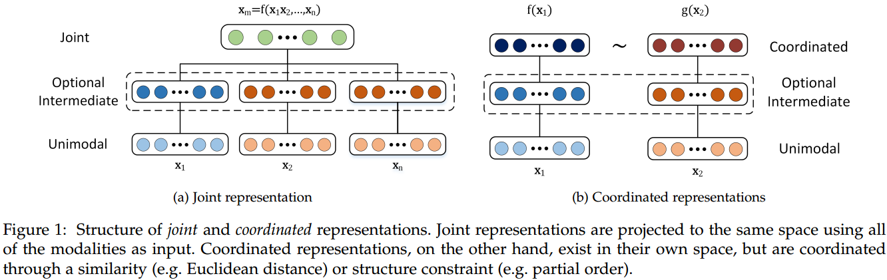
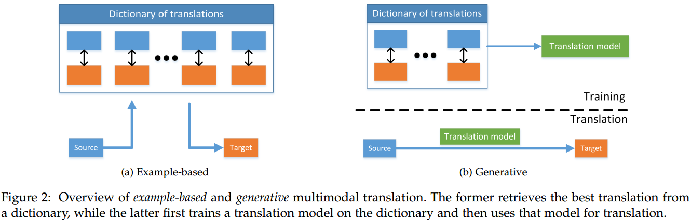
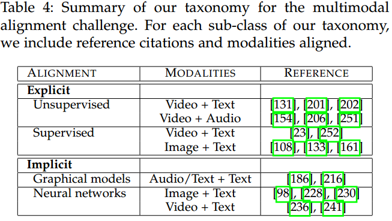
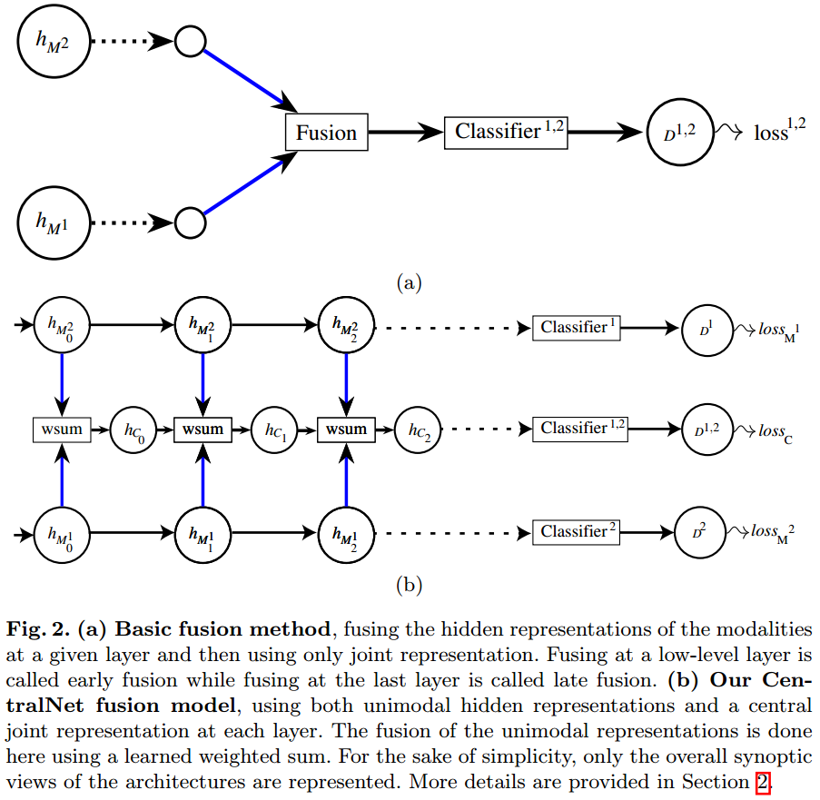
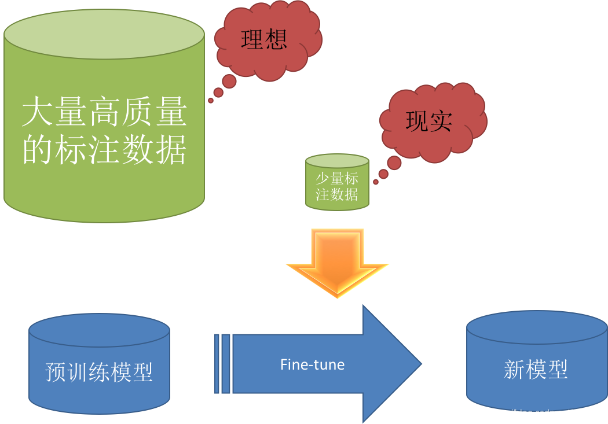
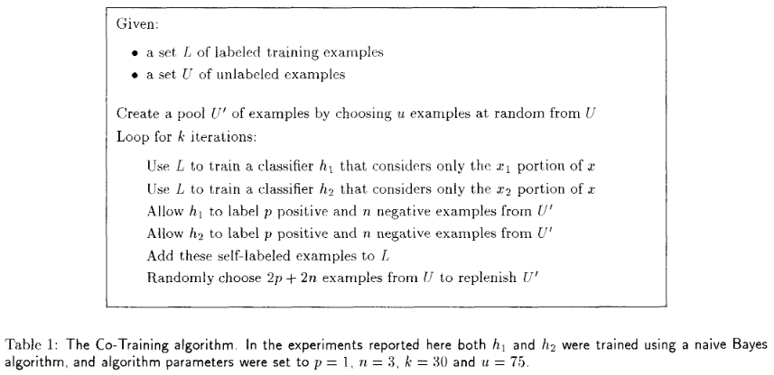

#                                                海量短视频打标问题之Multi-Modal-Machine-Learning

## 引言

接着[《D#0035》](https://github.com/Captain1986/CaptainBlackboard/blob/master/D%230035-2KW%E7%9F%AD%E8%A7%86%E9%A2%91%E6%89%93%E6%A0%87%E9%97%AE%E9%A2%98%E4%B9%8BActivate-Learning/D%230035.md)讲，既然我们是给视频打标签，那么肯定就不能只局限于图像上做文章。视频文件包含的信息很多，一个短视频除了有一帧一帧的图像，还有声音信息，甚至还有字幕或者用户打的标签和文字评论之类的这些信息，那么怎么把这些不同类别的信息抽取并利用起来，就是一个很关键的问题了。研究这类多种不同信息源做机器学习问题的领域就是今天要聊的“多模态机器学习”(Multi-Modal Machine Learning)。

**欢迎探讨，本文持续维护。**

## 实验平台

N/A

## 什么是多模态机器学习

这里不想去扣多模态严格的学术定义，只需要把多模态理解成不同来源或不同形式的信息就可以了，比如视频里面的声音和图像就是多模态。对图像用CNN抽取特征，对声音用CNN进行特征抽取，这叫多模态的特征**学习**；将汉语用算法转换成英语，这叫多模态的**转换**；对抽取出来的图像和声音特征在时间维度进行对齐，这叫多模态特征的**对齐**；人身上有眼耳口鼻等不同的器官，根据这些器官检测到周围各种信息，比如图像、声音、味道、温度等，再根据这些不同来源的信息综合起来做出判断，这叫多模态特征的**融合**；物理学家利用他丰富的物理学知识去教一个人学化学原理，这叫多模态**学习**。而**多模态机器学习**就是研究这些的。

## 多模态机器学习的研究点

多模态机器学习广泛应用于视频理解（比如UGC短视频打标），机器翻译，情感分析，图片搜索和内容推荐等领域，而这些领域所侧重的研究点又各有不同，这里一一做个简单介绍。

### 多模态特征学习Representation

普通做图像深度学习，只考虑单个图像的特征，只需要学习图像中例如纹理，形状这种特征，只需要考虑学习到的这类特征的表达能力好就可以了。而多模态的深度学习需要考虑到不同modal信息的特征一起学习出来为任务目标服务，他们是要考虑相互的影响的，要学习到的各模态特征之间有更多互补性，剔除模态间的冗余性，要处理不同modal中带的不同大小的噪音，缺失值怎么处理。

多模态特征学习是多模态机器学习的基础问题。

多模态特征学习主要的研究方向有**联合表示（Joint Representations）**和**协同表示（Coordinated Representations）**。

如上图所示，联合表示的方法（上图左边），是把多个独立modal得到的特征映射到**一个统一的特征空间**；而协同表示的方法是各个modal各自映射自己的特征到**两个相关的特征空间**。

### 多模态的转换Translation

把一种模态的信息映射为另一种模态，这叫模态的转换。比如，机器翻译中把汉语映射为英语，图片描述（Image Captioning) 或者视频描述（Video Captioning)把图片和视频信息生成一段描述语句。对于海量短视频打标签这种问题来说，会遇到一个问题就是评价的**主观性**。

不同模态转换的方法大致可以分为两类，**基于样本（Example based）**的和**生成式（Generative）**的。

如上图所示，左边是基于样本的，首先用许多样本构建一个从Source modal到Target modal的**转移字典**，然后在转换的时候，根据这个事先构建的字典做模态转换。而右边的是生成式的转移方法，它利用转移字典训练一个转移模型，然后用这个转移模型去做Source modal到Target modal的状态转移。

### 多模态特征的对齐Alignment

不同模态特征之间可能有某些对应关系，比如视频的某一帧和它的声音的切片之间的对应关系，在做多模态机器学习的时候，一个很重要的步骤是将不同模态特征做对齐（当然，有的时候也不需要对齐或者不同模态特征已经对齐了）。多模态对齐方法主要分为显示对齐和隐式对齐两种，具体分类可见下表：

### 多模态特征的融合Fusion

多模态特征融合是多模态机器学习最初开始研究的主题，现在也是研究的主要热点。它主要是**集成**多模态的特征，来输出一个预测结果（这个结果在分类问题中是类别，在回归问题中是一个连续值）。多模态特征融合按照融合发生的阶段是离原始信息近还是离多模态特征近可以分为早期融合（Early Fusion），晚期融合（Late Fusion）和混合式融合（Hybrid Fusion）。现在主要是做混合式的了，后面抽空我会再写一篇CV领域做混合式融合的方法CentralNet（示例如下图），这个文章比较有代表性。

### 协同学习Co-learning

协同学习是最后一个要介绍的模块。协同学习就是用一个资源丰富模态下的模型去帮助资源不丰富模态下模型的学习。这样说可能比较抽象，但是多模态协同学习还是经常用到的，比如CV训练模型很多都是把ImageNet这个资源丰富的模态下训练的模型的权值拿到新的模型上复用，然后用资源不丰富的样本做fine-tune，这种**迁移学习**（Transfer Learning），也属于协同学习的一类。

另外，在多模态问题中，以有限带标签样本来生成更多带标签训练样本的**协同训练**（Co-training）问题，也是协同学习的一类。

如上图是协同训练比较经典的文章《Combining labeled and unlabeled data with co-training》（T. Mitchell也是机器学习的泰斗）。这里简单介绍一下协同训练：

比如我们要做图片猫狗分类任务，已经有一批已经标注了的猫狗图片集L，和一批未标注的图片集U。我们可以训练两个分类器，比如SVM和Baysian分类器，分别命名为h1和h2（这里取SVM和Baysian分类器是因为这两个分类器原理很不一样，希望可以抓住图片的**不同方面**的特征，后面还要投票）。分别用h1，h2为U集合打标签，然后分析他们各自打的标签，如果对U里面同一个样本u打了一样的标签，那么可以把这个标签和u样本绑定，加入到L集合中，如果不一样，那么还是放回到U集合中；然后L扩大了，进行下一轮，再训练两个分类器h1,h2，再对U里面的样本进行打标，如此迭代，直到U为空。

## 总结

多模态机器学习肯定是未来发展的方向，为了追求更高的预测性能，单单依赖于一种模态提供的信息来做决策肯定是不可靠的，多模态机器学习，CV、Speech和NLP的融合肯定会有很大的未来。

## 参考资料

+ [Multimodal Machine Learning: A Survey and Taxonomy](https://arxiv.org/abs/1705.09406)
+ [Multimodal_learning wiki](https://en.wikipedia.org/wiki/Multimodal_learning)
+ [Multimodal Deep Learning](https://towardsdatascience.com/multimodal-deep-learning-ce7d1d994f4)
+ [Combining labeled and unlabeled data with co-training](http://cms.brookes.ac.uk/research/visiongroup/talks/rg_july_09_ss_learning/p92-blum.pdf)
+ [爱奇艺短视频分类技术解析](https://mp.weixin.qq.com/s/t801Q3OO_DBrgI60fKSJxQ)
+ [PRCV2018 美图短视频实时分类挑战赛第一名解决方案介绍](https://www.leiphone.com/news/201811/yhkoD7Ty8WRaCBqe.html)
