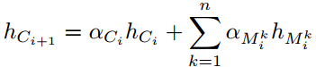
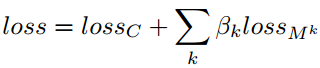
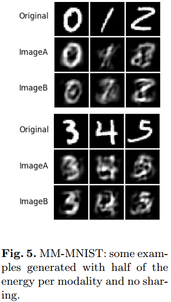
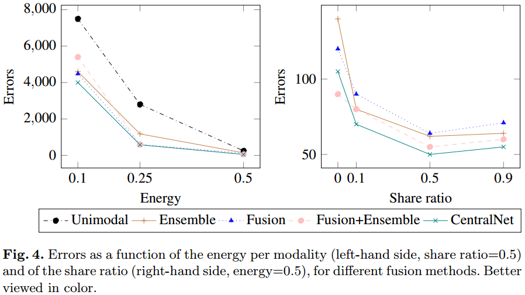
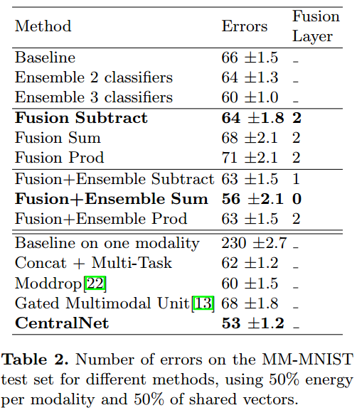
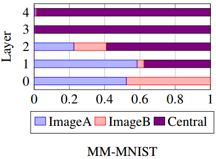
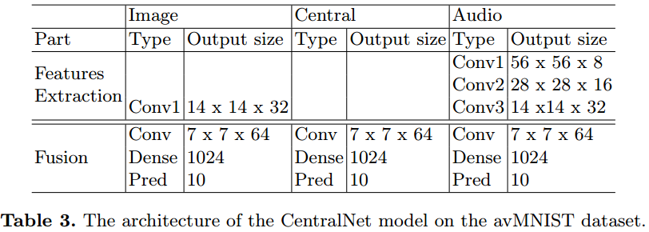
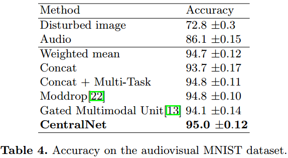
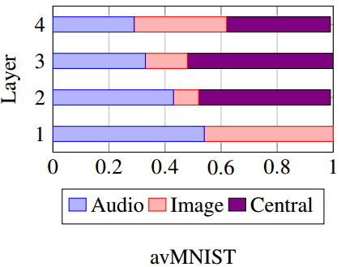

#                                                CentralNet做多模态融合

## 引言

在[《D#0036》](https://github.com/Captain1986/CaptainBlackboard/blob/master/D%230036-2KW%E7%9F%AD%E8%A7%86%E9%A2%91%E6%89%93%E6%A0%87%E9%97%AE%E9%A2%98%E4%B9%8BMulti-Modal-Machine-Learning/D%230036.md)里面简单介绍了一下多模态机器学习的各个研究点，本文继续了解一下多模态融合的问题。[《D#0036》](https://github.com/Captain1986/CaptainBlackboard/blob/master/D%230036-2KW%E7%9F%AD%E8%A7%86%E9%A2%91%E6%89%93%E6%A0%87%E9%97%AE%E9%A2%98%E4%B9%8BMulti-Modal-Machine-Learning/D%230036.md)说了，多种模态的信息是研究怎么集成到一起来帮助我们做预测，而且有早期融合，晚期融合和混合融合几种大类。本文要介绍的是2018年ECCV上发表的一篇对CNN模型做混合融合的方法，[CentralNet](https://arxiv.org/abs/1808.07275)（注意不要和做检测的CenterNet混淆）。

**欢迎探讨，本文持续维护。**

## 实验平台

N/A

## 最基础的多模态融合Concatenate

顾名思义，Concate的方式就是将每种模态抽取出来的表达连接到一起后（连接全连接）学习整体的表达，这种方式简单，并且能够提供一个不错的基线。

## CentralNet相比于Concatenate的创新点

Concate的方法相当于在各自模态的特征分别独立抽取之后做融合，但是不干预特征抽取的过程。这显然会漏掉一些不同模态之间的相关性的信息，比如，一个人尖叫的视频片段，里面有人的嘴巴长得很大的这种视觉特征，也会有尖叫声这种声音特征，这两种特征出现的时间都是相关连的。如果在抽取特征的过程中，**相互有一个监督或者借鉴的关系**，那样应该会更好，这是CentralNet提出的动机。CentralNet把两个可以独立在各自模态做出判断的网络的中间层联系起来，利用联合多任务训练来优化，最后也得到了不错的结果。

## CentralNet细节

### 网络结构

上图中的a是基本的多模态融合方法，首先独立的模型M1,M2提取出来各自模态的特征，然后一起输入到融合Fusion模块进行融合，融合得到的特征送入分类器去分类。

下图中的b是CentralNet的示意图，它各个模态模型M1,M2中间的特征也拿到，用上图公式加权送入下一层。如此一层一层地做，传到最后一层得到一个融合特征hcx，利用这个融合特征送入分类器分类。

CentralNet思路简单，架构清晰，也没有难理解的地方。

### 训练方法

CentralNet模型借助多任务对每个模态的表达进行约束，以期Fusion后的表达能够获取更好的泛化能力。

训练的损失函数是各个模态损失和融合后特征送入融合分类器后得到的损失的一个加权和：。

### 实验结果

作者在Multimodal MNIST和Audiovisual MNIST，Montalbano和MM-IMDb数据集上都做了对比试验。这里简单介绍前两个数据集上的结果和结论。

#### Multimodal MNIST

Multimodal MNIST是把原始Mnist数据集用PCA方法做分解，用分解出来的特征向量重构出来的数据集。 energy和share ratio分别表示各自重构用的特征向量的个数和两个模态公用的特征向量的比例。下面是两个生成数据集里面样本的示意图：

*重构的两个数据集，虽然都是图像信息，不能算严格的多模态，但是这里只是一个玩具性质的实验，而且用PCA做了分解和各自重构，勉强算模拟了多模态吧。而且做PCA分解再合成的方法比另外有人做的直接切1/4图片的方法相比有可以控制各个模态信息量和各自模态信息之间依赖性的好处。*

作者用来实验的各自模态的网络就是简单的LeNet5，中间做融合的网络也是用的同样结构的LeNet5结构。

上图是控制重构特征向量的多少和控制两个模态共享特征向量的多少的实验结果。左边没什么说的，重构用的特征向量越多，效果越好，符合我们的预期。需要注意的是，右边显示，**两个模态共享的信息太多或者太小，对所有的方法都效果不好**。从左右两个图中都可以看出来，简单三个LeNet做Ensemble的效果都比CentralNet方法效果差，这也证明了CentralNet的性能提升**不是单单依靠更多的参数达到的**。

从上图可以看出来，简单Fusion和Ensemble联合起来的方法要好于单独做简单Fusion的方法，说明他们有互补性。

上面的结果是比较有意思的，显示的是CentralNet中三个LeNet5子网络各自的贡献大小。可以看到Central的网络，随着网络加深，贡献越来越大。到第三层和第四层，ImageB对应的网络贡献很小，似乎可以考虑做剪枝。

#### Audiovisual MNIST

Audiovisual MNIST也是作者自己建的一个测试集。图像部分是把原始28x28的Mnist数据集做PCA，采用25%能量的特征向量重构（之所以这么低质量的重构，是为了更好的验证多模态融合方法好不好，能不能得到互补的更好的特征）。声音样本是读数字，然后加上一些噪音合成出来的。

图像部分继续用LeNet5进行实验，声音部分用自己设计的一个简单的6层CNN网络，具体实现结构如上。

上图显示了实验结果，结果表明，**各自模态单独做预测的结果都不好，不管用哪种融合的方法，所得到的性能都比单独做好**，而且CentralNet能做到最好。

上图是分析每层各自哪个模态权重较大，可以看到，每个模块都对最终的性能发挥了作用。

## 总结

人有各种感觉器官收集信息去做判断，如果我们在做短视频打标，能把图像，声音，字符等信息综合起来去做判断，无疑是更科学的。

## 参考资料

+ [CentralNet: a Multilayer Approach for Multimodal Fusion](https://arxiv.org/abs/1808.07275)
+ [爱奇艺短视频分类技术解析](https://mp.weixin.qq.com/s/t801Q3OO_DBrgI60fKSJxQ)
+ [PRCV2018 美图短视频实时分类挑战赛第一名解决方案介绍](https://www.leiphone.com/news/201811/yhkoD7Ty8WRaCBqe.html)
