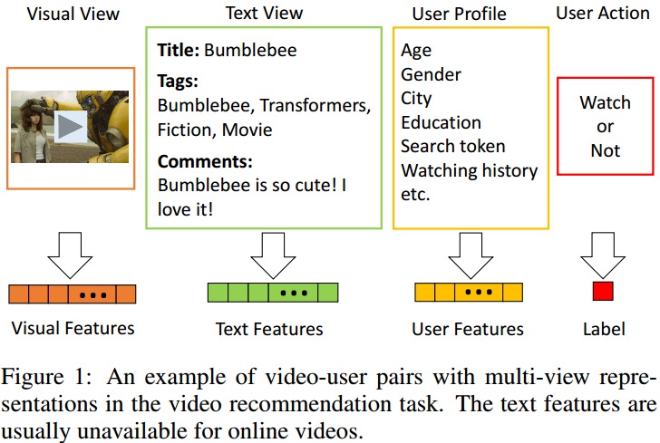
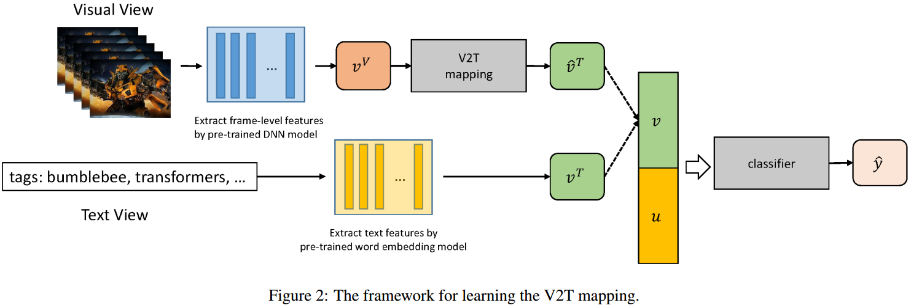
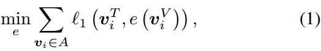
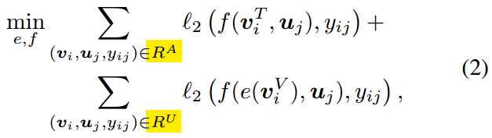
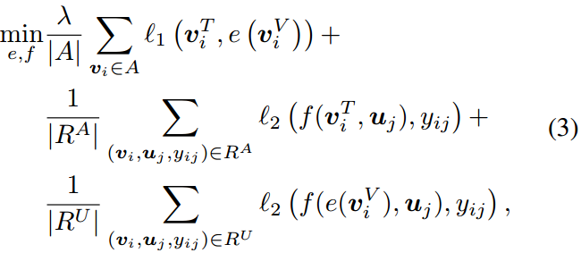
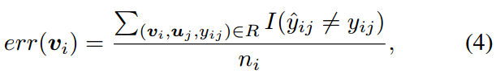
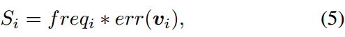
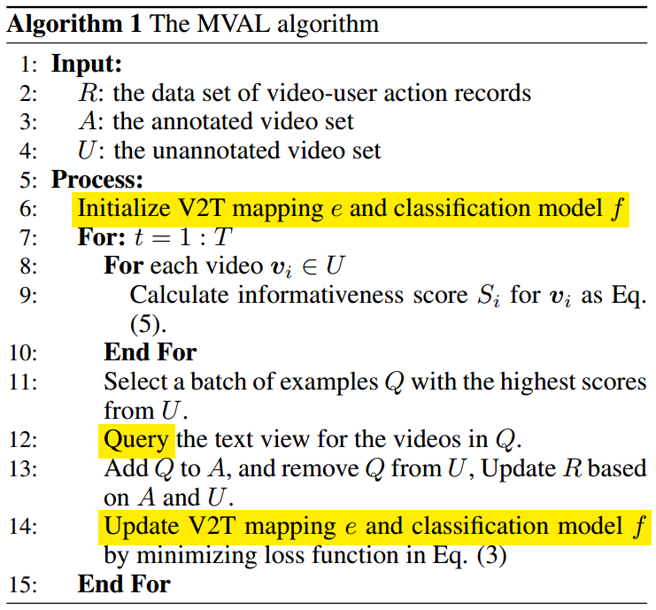

#                                                Multi-View Active Learning做视频推荐

## 引言

今天介绍的是阿里优酷Cognitive and Intelligent Lab做的用Multi-View Active Learning做视频推荐的方法，[论文](https://www.ijcai.org/proceedings/2019/0284.pdf)发表于2019年的IJCAI上。与[D#0035](https://github.com/Captain1986/CaptainBlackboard/blob/master/D%230035-2KW%E7%9F%AD%E8%A7%86%E9%A2%91%E6%89%93%E6%A0%87%E9%97%AE%E9%A2%98%E4%B9%8BActivate-Learning/D%230035.md)和[D#0036](https://github.com/Captain1986/CaptainBlackboard/blob/master/D%230036-2KW%E7%9F%AD%E8%A7%86%E9%A2%91%E6%89%93%E6%A0%87%E9%97%AE%E9%A2%98%E4%B9%8BMulti-Modal-Machine-Learning/D%230036.md)做海量视频打标不一样，这里是把主动学习和多模态(转换)的方法运用到了**视频推荐**这个问题上。

**欢迎探讨，本文持续维护。**

## 实验平台

N/A

## 问题提出和整体思路

视频推荐系统要做的事情就是把你喜欢（或者可能喜欢）的视频喂给你。推荐规则的学习方法分成两种：1. 是从你以往视频浏览痕迹或者是2. 和你类似的人的浏览痕迹来学习到的。后者就是有名的[协同过滤](https://en.wikipedia.org/wiki/Collaborative_filtering)方法，前者是基于内容的方法。协同过滤方法在早期推荐系统中运用比较多，但是面临着**冷启动**问题，后面更多流行的是基于内容的推荐方法或者两者的混合方法了。

但是，基于内容的方法得要有丰富的内容才行。而带标签的数据都是很珍贵的。

比如，现在主流做基于内容的推荐方法，都是用和视频相伴文本信息（靠视频的信息会有semantic gap的问题，不如文本信息可靠）来做预测，预测用户喜欢还是不喜欢这个视频。但是这些文本信息不一定每个视频都有，特别是UGC视频。不过，视频信息是每个视频都有的，我们可以用深度学习方法理解这个视频，为这个视频生成相应的文本信息。有了这些视频生成的文本信息后，再用分类器去分类用户是不是喜欢，根据预测的结果和真值比对，根据比对的结果来挑选一些信息量大的未标记样本主动送给专家去做文本标记，如此迭代来提升推荐系统的性能。

根据上面的描述，下面分别介绍这两个比较关键的点，一个是由视频生成文本信息怎么生成（即Video to Text映射），第二个是在学习到Video to Text映射之后，根据映射的结果怎么去主动选择一些未标记（文本信息）的样本去做手工标记。

## Video to Text映射

上图是学习V2T映射的大框架，看起来有点复杂，其实思路很通顺，让我们来一个个拆解。

首先我们要学习一个从视频到文本的映射，而有的样本已经有已知的文本信息了，那么最直观的想法就是**看V2T这个映射能不能把视频信息映射到已知的文本信息，或者它映射的差距有多大**。换句话说就是以文本信息监督V2T函数的学习，损失函数如下：

式子中e就是V2T映射函数，A是带标签的样本集合。

另外，我们有用户行为的记录y（用户点了视频还是没有点视频），这个记录的信息每个样本都有。由视频文本信息v和用户自身信息u到用户点没点视频y之间的关系可以用函数f建模（就是图2中的classifier），假设f是可靠的，那么可以根据V2T映射出来的文本信息输入到f中，看f的预测，是不是和y的真值一致的。也就是，**加上y的信息来监督V2T函数的学习**。

式子(2)的前部分是在带完整文本信息的数据集上学习f，后部分是在不带文本信息的数据集上学习V2T，这是一个**联合学习**的过程。

最后，综合式子(1)和(2)，得到最终联合学习e和f的损失函数

在作者的实现中，把V2T和f的学习都融合到一个神经网络中去优化，损失都用的是均方差。

## 未标记样本的主动选择

由上面学习到的V2T和f，是不是事情就这么完了呢？不是的，学习到的V2T和f，毕竟是从很少的信息里面学到的，不一定可靠，为了增加V2T和f的性能，需要更多的带真值文本信息的样本，那么就涉及到**主动学习**，怎么挑选样本去给人工做标注了。

首先容易想到的是对在未标记集合U中的每个视频样本v，用V2T处理得到它的文本信息，再集合用户信息用f得到点击没点击的预测值，根据预测值和真值的偏离程度来选择是不是把v送去人工标注其文本信息，选择标准如下：

ni是在未标记集合中视频i出现的次数。

再进一步，如果视频在总的记录中出现的次数多，送入做人工标记肯定对模型的性能帮助更大，那么，用它在总记录中出现的次数来做一个加权，也就是顺理成章的事情了：

再再进一步，搞得更复杂一点，考虑到不同长短的视频标记成本是不一样的，为了平衡标记成本和对模型性能帮助大小这两个因素，可以把视频长短当做一个因子去除Si得到考虑到标记成本的新的Si。

最后，综合上面"Video to Text映射"和"未标记样本的主动选择"两节介绍的内容，Multi-View Active Learning的算法流程图如下：

## 总结

本文介绍了一种综合利用了多目标学习，多模态学习和主动学习等技术来做视频推荐系统的一种方法。

## 参考资料

+ [Multi-View Active Learning for Video Recommendation](https://www.ijcai.org/proceedings/2019/0284.pdf)
+ [D#0035-2KW短视频打标问题之Activate-Learning](https://github.com/Captain1986/CaptainBlackboard/blob/master/D%230035-2KW%E7%9F%AD%E8%A7%86%E9%A2%91%E6%89%93%E6%A0%87%E9%97%AE%E9%A2%98%E4%B9%8BActivate-Learning/D%230035.md)
+ [D#0036-2KW短视频打标问题之Multi-Modal-Machine-Learning](https://github.com/Captain1986/CaptainBlackboard/blob/master/D%230036-2KW%E7%9F%AD%E8%A7%86%E9%A2%91%E6%89%93%E6%A0%87%E9%97%AE%E9%A2%98%E4%B9%8BMulti-Modal-Machine-Learning/D%230036.md)
