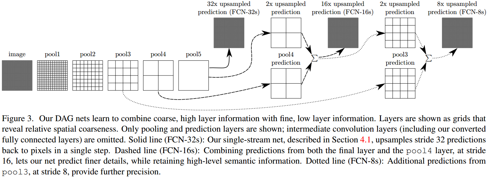
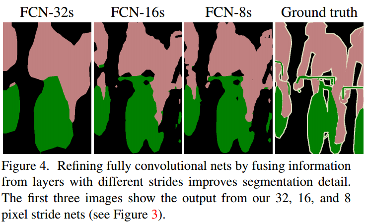
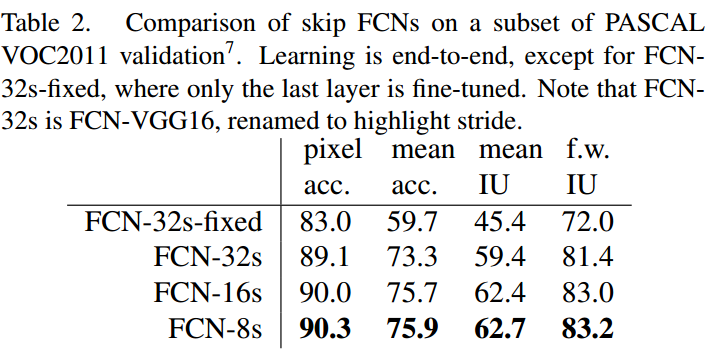

# 用FCN做分割

图像分割是计算机视觉中比较常见的技术，广泛应用于智能交通、自动驾驶等领域。恰好船长最近正在做图像分割的项目，也调研了一些图像分割的经典方法，准备把用CNN做图像分割的方法都做个记录，这里是第一篇FCN，原始论文发表于15年的CVPR，属于用深度学习做图像分割的挖坑之作（褒义）。

**欢迎探讨，本文持续维护。**

## 实验平台

N/A

## 语义分割：从整体图片分类到像素级分类

在FCN提出之前，CNN（AlexNet，VGG，GoogLeNet，RCNN和SPPNet）都已经在图像分类和目标检测领域攻城拔寨，既然CNN可以在整图分类和部分图片分类上取得成功，那么把CNN来做pixel-to-pixel的分类进而解决图像分割问题也就是可以想象的了。

以AlexNet为例，它的开始的几层是卷积层，最后卷积层后面连接全连接Softmax层输出一个长度为1000的向量代表分类的类别概率。它的最后输出是针对整个图的分类结果，此时空间信息消失了。如果在去掉全连接层，换上卷积层，那么一样也可以输出分类的结果，还保存了空间维度上的信息，示意图如下图所示：

这里就不再赘述，在[《D#0025-CNN中使用卷积代替全连接》](https://github.com/Captain1986/CaptainBlackboard/blob/master/D%230025-CNN%E4%B8%AD%E4%BD%BF%E7%94%A8%E5%8D%B7%E7%A7%AF%E4%BB%A3%E6%9B%BF%E5%85%A8%E8%BF%9E%E6%8E%A5/D%230025.md)已有比较详细的介绍，感兴趣的朋友可以去看。

然后，既然FCN可以生成整张图大小的热力图，那么如果这个图的大小和输入图像大小一致，且有了输入图中每个像素的真值标签(Ground Truth)，那么就可以用这个标签来监督FCN的训练，让热力图和标签趋向一致，原理如下图所示。有了每个像素的分类信息，那么做分割就是个太简单的事情了。

## FCN做分割的网络架构

### 基础网络

作者试用了AlexNet，VGG-16，VGG-19和GoogLeNet等在分类任务上表现较好的网络，首先把它们的Softmax砍掉，第二步把全连接层改成卷积层，第三步附加一个1x1的卷积层生成21个PASCAL分类的热力图，最后添加一个双线性采样的upsample层作为Deconvolution层来把热力图扩充到输入图像的分辨率。在做了这些改造之后，如上图所示，实验发现复用了VGG-16的卷积部分的效果最好，VGG-16可以作为特征提取的主干网络。

### Skip连接Combining what and where

像VGG这样的网络是一层一层的层次性结构，不同的层感受野不同，特征图所能表达的含义也不同。浅层的特征感受野小，可以表达一些精细的特征，能回答**在哪里**的问题；而深层的特征感受野大，适合表达一些整体的语义，适合回答**是什么**的问题。如果把不同层次的特征图融合起来，整个网络形成一个有向无环图DAG，那么应该适合于分割这类既要回答是什么，又要（精确到像素级地）回答在哪里的问题。

上图是FCN的网络结构图，VGG不同层的特征在upsample之后会进行(sum或者concate)融合，最终融合到pool3这一层，得出来一个和原图大小一样的图。

上图可以看出，不做不同层特征图的融合会怎么样。可以看到，**融合的浅层特征越多，分割得越精细**。

上表是作者给出的实验数据，具体地证明了上上图的结论。

### UpSample

在类似VGG这样的分类网络中，因为卷积Stride和Pooling层的作用，特征图的空间分辨率是随着层数越来越深递进地越来越小的，但是分割要做pixel-to-pixel的分类任务，真值标签是原图分辨率地像素级的图，那么分割网络的输出也要是同样的分辨率，即输入图片大小的分辨率。

FCN作者这里为了放大特征图分辨率采用了很简单地x2 Upsample层，具体来说就是添加了一个**类似于双线性插值**的层，来根据位置坐标计算输出图的像素级标签。当然，这里说是类似于双线性插值的层，是因为这一层它的插值系数是可以学习的，不是定死了的。

## 总结

本文介绍了一种早期较为经典的分割网络FCN，可端对端地进行全图训练。该网络特征提取部分还是基于VGG-16，改造成全卷积网络。添加了Skip连接融合浅层细节和深层语义特征，采用了可学习的UpSample层使网络输出分辨率和输入一致。

## 参考资料

+ [《D#0025-CNN中使用卷积代替全连接》](https://github.com/Captain1986/CaptainBlackboard/blob/master/D%230025-CNN%E4%B8%AD%E4%BD%BF%E7%94%A8%E5%8D%B7%E7%A7%AF%E4%BB%A3%E6%9B%BF%E5%85%A8%E8%BF%9E%E6%8E%A5/D%230025.md)
+ [Fully Convolutional Networks for Semantic Segmentation](https://arxiv.org/pdf/1411.4038.pdf)
+ [Fully Convolutional Networks for Semantic Segmentation](https://arxiv.org/pdf/1605.06211.pdf)
