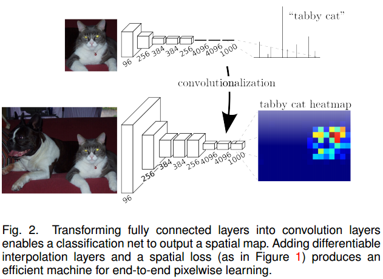
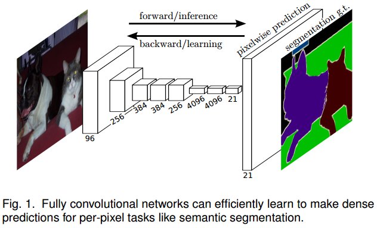

# 用FCN做分割

图像分割是计算机视觉中比较常见的技术，广泛应用于智能交通、自动驾驶等领域。恰好船长最近正在做图像分割的项目，也调研了一些图像分割的经典方法，准备把用CNN做图像分割的方法都做个记录，这里是第一篇FCN，原始论文发表于15年的CVPR，属于用深度学习做图像分割的挖坑之作（褒义）。

**欢迎探讨，本文持续维护。**

## 实验平台

N/A

## 语义分割：从整体图片分类到像素级分类

在FCN提出之前，CNN（AlexNet，VGG，GoogLeNet，RCNN和SPPNet）都已经在图像分类和目标检测领域攻城拔寨，既然CNN可以在整图分类和部分图片分类上取得成功，那么把CNN来做pixel-to-pixel的分类进而解决图像分割问题也就是可以想象的了。

以AlexNet为例，它的开始的几层是卷积层，最后卷积层后面连接全连接Softmax层输出一个长度为1000的向量代表分类的类别概率。它的最后输出是针对整个图的分类结果，此时空间信息消失了。如果在去掉全连接层，换上卷积层，那么一样也可以输出分类的结果，还保存了空间维度上的信息，示意图如下图所示：

这里就不再赘述，在[《D#0025-CNN中使用卷积代替全连接》](https://github.com/Captain1986/CaptainBlackboard/blob/master/D%230025-CNN%E4%B8%AD%E4%BD%BF%E7%94%A8%E5%8D%B7%E7%A7%AF%E4%BB%A3%E6%9B%BF%E5%85%A8%E8%BF%9E%E6%8E%A5/D%230025.md)已有比较详细的介绍，感兴趣的朋友可以去看。

然后，既然FCN可以生成整张图大小的热力图，那么如果这个图的大小和输入图像大小一致，且有了输入图中每个像素的真值标签(Ground Truth)，那么就可以用这个标签来监督FCN的训练，让热力图和标签趋向一致，原理如下图所示。有了每个像素的分类信息，那么做分割就是个太简单的事情了。

## FCN做分割的网络架构

### 基础网络

。

### Skip连接

。

## 总结

。

## 参考资料

+ [《D#0025-CNN中使用卷积代替全连接》](https://github.com/Captain1986/CaptainBlackboard/blob/master/D%230025-CNN%E4%B8%AD%E4%BD%BF%E7%94%A8%E5%8D%B7%E7%A7%AF%E4%BB%A3%E6%9B%BF%E5%85%A8%E8%BF%9E%E6%8E%A5/D%230025.md)
+ 
