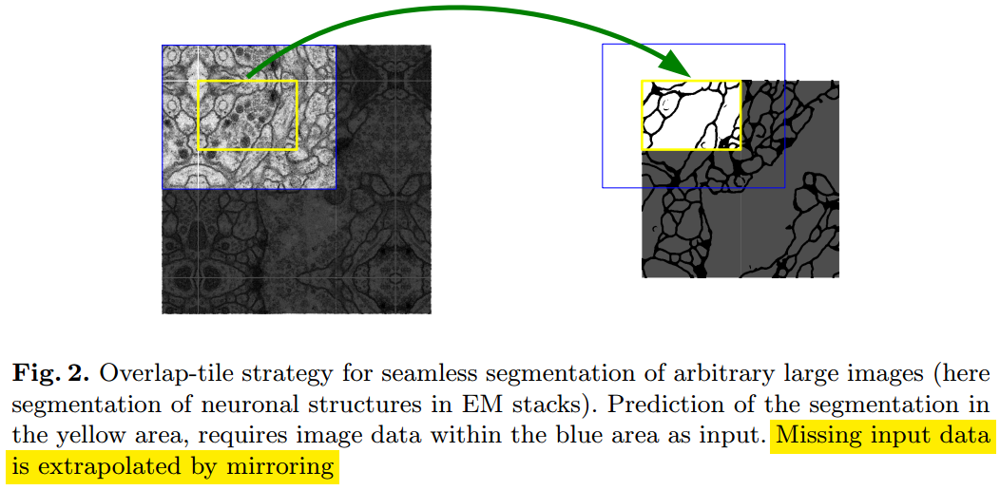
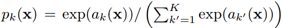
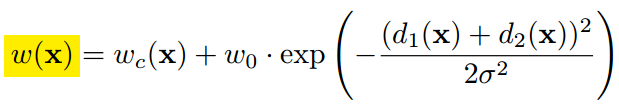
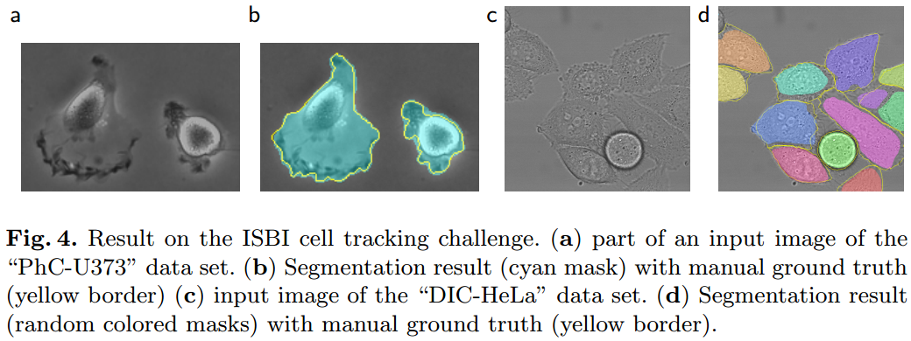

#                                 用U-Net做分割

这里继续介绍第二篇著名的图像分割模型，U-Net。论文由德国弗莱堡大学的研究人员发表于15年MICCAI，初始是应用于医学图像分割上的。论文思路清晰，和[《D#0039-用FCN做分割》](https://github.com/Captain1986/CaptainBlackboard/blob/master/D%230039-%E7%94%A8FCN%E5%81%9A%E5%88%86%E5%89%B2/D%230039.md)一样也是一个**全卷积网络**，网络结构简单，而且U-Net具有速度快，需要的**训练样本少**的优势。

**欢迎探讨，本文持续维护。**

## 实验平台

N/A

## 网络结构

如上图所示，U-Net的结构非常清晰和**U形对称**，整体呈一种U型结构。在左半边，是它的编码结构，论文中成为**收缩路径**(contracting path)，分辨率逐渐由输入的572x572减小到最小的28x28；右边是**对称的扩张路径**(expanding path)，分辨率由28x28逐渐扩张到半个输入分辨率的大小388x388。只做灰度图上的细胞轮廓分割，所以输入是1通道，输出是2通道的，由1x1的卷积产生。

另外还可以看到，在扩张路径的过程中，也crop了前面收缩路径产生的特征图进行融合，形成了一种不同感受野特征的融合，也是希望结合局部的精细的信息和整体的分类的信息以求更好的分割效果，比较常见的手段。

## 外围边界处理策略

因为是全卷积模型，所以理论上可以输入任意分辨率的图片。但是，在边缘处的像素，由于缺少部分（至少缺少上、下、左、右其中之一）上下文信息，得到的Segmentation map会不准确。为了解决这个问题，如上图所示，作者简单地对边缘处的像素做了个镜像弥补边缘的上下文信息，以让输出的Segmentation map的每个像素反算到输入都有有效像素点（而不是null）。

## 训练方法

### 损失函数

作者使用的是pixel-wise Softmax输出最后的Segmentation map。损失函数用的是交叉熵。不过，为了让各个相接触的细胞与细胞之间的小边缘得到更好的分割效果，在预先算出了一个weight map对每个pixel的损失进行加权。

### 初始化

对于有许多卷积层而且不同path的模型，好的参数初始化策略对于模型的优化是不可轻视的。在最佳情况下，每个层的参数应该初始化到输出的特征图分布拥有**单位方差**最好。对于U-Net这样的只有卷积层和ReLU激活层的模型，用**He初始化**根据输入节点的个数做初始化可以达到上面最佳情况的要求。

### 数据增强

医疗数据的图像很少，作者用的原始带标签的训练数据集分别只有20张，30张和35张。为了生成更多的训练数据，作者使用随机弹性形变Random elastic deformations进行了数据增强。

## 实验结果

上图是部分实验结果的展示，带颜色的部分是Segmentation map，黄色细线是真值，可以看出来效果还是不错的，有些很困难的微弱的边缘，都切割得八九不离十。

## 总结

本文介绍的是分割早期比较有名的U-Net模型，模型结构简单，思路清晰，**编码解码结构**划分，加上不同层相似分辨率的特征图融合，都提升了分割的性能。虽说论文中主要介绍了医学图像的分割，但是U-Net也很容易迁移到别的任务的分割上。

## 参考资料

+ [《D#0025-CNN中使用卷积代替全连接》](https://github.com/Captain1986/CaptainBlackboard/blob/master/D%230025-CNN%E4%B8%AD%E4%BD%BF%E7%94%A8%E5%8D%B7%E7%A7%AF%E4%BB%A3%E6%9B%BF%E5%85%A8%E8%BF%9E%E6%8E%A5/D%230025.md)
+ [《D#0039-用FCN做分割》](https://github.com/Captain1986/CaptainBlackboard/blob/master/D%230039-%E7%94%A8FCN%E5%81%9A%E5%88%86%E5%89%B2/D%230039.md)
+ [Fully Convolutional Networks for Semantic Segmentation](https://arxiv.org/pdf/1411.4038.pdf)
+ [U-Net: Convolutional Networks for Biomedical Image Segmentation](https://arxiv.org/abs/1505.04597)
+ [U-Net Implementation](https://lmb.informatik.uni-freiburg.de/people/ronneber/u-net/)
+ [Delving Deep into Rectifiers: Surpassing Human-Level Performance on ImageNet Classification](https://arxiv.org/abs/1502.01852)
