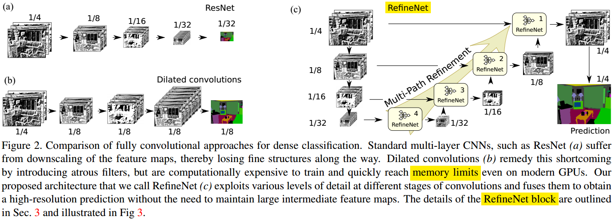
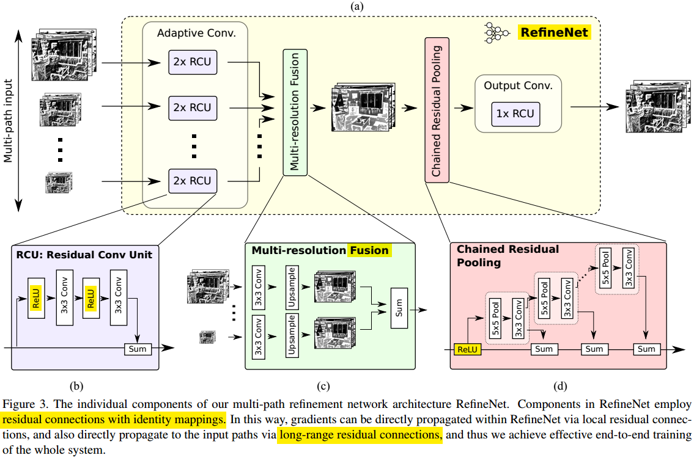
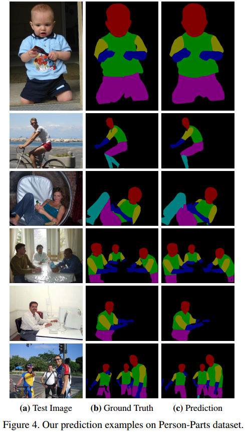
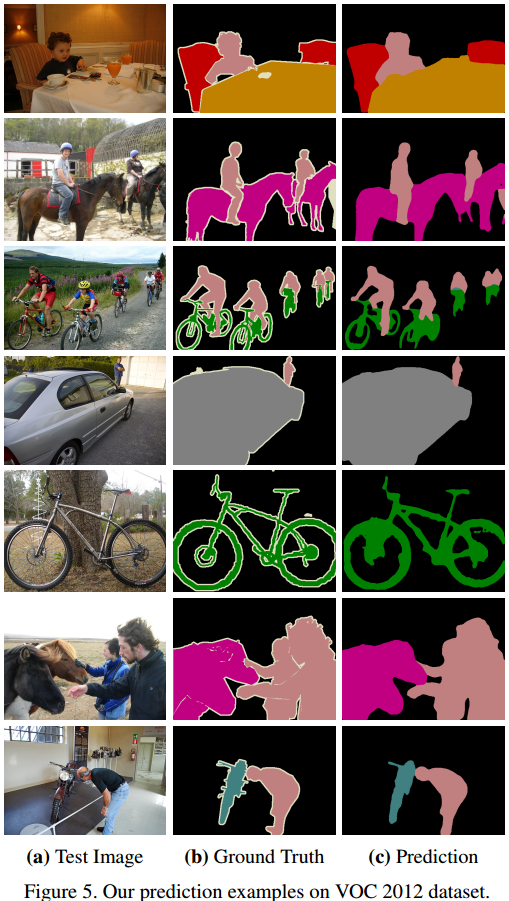
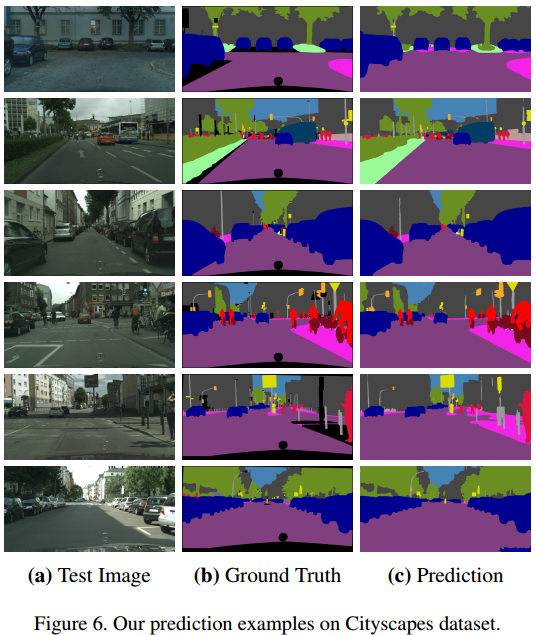

#                                 用RefineNet做分割

这里继续介绍第三篇著名的图像分割模型，RefineNet。论文发表于2017年的CVPR上。RefineNet提出了一种通用的多路级联精修结构的网络，与FCN相比，它更充分利用了主干网不同层次分辨率的特征图里面的信息，与Deeplab的Dilated Convolution方法相比，它要求更少的内存。最重要的是，它的效果很好，在七个benchmark上都做出了更好的效果，属于当年的SOTA。

**欢迎探讨，本文持续维护。**

## 实验平台

N/A

## RefineNet网络结构

上图基本上表示了RefineNet的思路起源和它比之前方法的优点。如左上角的a所示是一个基于ResNet的全卷积分割模型，但是它只是利用了最后一层的低分辨率的特征图，很多空间信息都在不断地卷积stride和pooling层中丢失了，很难恢复出高精度的Segmentation map；左下的b模型，是Deeplab利用Dilated Convolution的方法来做特征提取，Dilated Convolution优点在于可以在不增大计算量和参数量的情况下保持比较大的感受野，也可以保证网络中每层特征图的分辨率不至于太小，但是缺点也是很显然的，由于中间结果都是分辨率很大的特征图，那么训练和推理过程中都对内存/显存提出了很大的要求。

而右边表示的是RefineNet的示意图，**主干网络是ResNet**，但是在ResNet的4个不同分辨率阶段都会抽出来给一个RefineNet块做处理，而且也有identity mapping的连接，即丰富了不同分辨率的特征混合（和U-Net类似），也让大网络的训练更加容易。

另外值得注意的是，这个网络的**Cascade Multi-Path Refinement**。从ResNet出来的低分辨率特征，不断的结合上一个Stage的较高分辨率的特征，进行混合；而且这是一个级联(Cascade)的过程，从而不断不断地提升分割精度。

## RefineNet块结构

上图所示就是RefineNet网络中基础的RefineNet块的结构，RefineNet结构是输入一个或者多个不同分辨率的特征图，进行混合和提升，输出一个较大特征图的块。它由三个级联的子块组成，下面分别介绍。

### 残差卷积单元Residual Conv Unit

每个input path的后面都会接两个串联的RCU。这个RCU块的作用就是**fine-tune主干网ResNet的输出**使他更适应分割这个任务。

### 多分辨率融合Multi-resolution Fusion

在RCU输出的特征图每个path的空间分辨率是不一样的，这个多分辨率融合块的作用就是把输入的各种**不同分辨率的特征提升并对齐**到最大的输入path的分辨率，然后将它们通过Sum操作融合起来。

### 链式残差池化Chained Residual Pooling

这个层的作用是通过pooling操作让不同的特征图有不同的感受野以便于**提取不同尺度的背景上下文**的信息。用不同的残差连接一个作用是便于训练，第二个作用是混合复用不同分辨率的特征。每个pooling层后面添加的卷积层的作用相当于在sum操作前学习一个**自适应的权重**。

### 输出卷积层Output Conv

RefineNet块最后的输出层其实就是一个前面介绍的Residual Conv Unit（这样每个RefineNet有三个RCN，两个在最前面，一个在最后，RCU进，RCU出）。这一层的作用就是给前面层输出的特征**增加一些非线性**。

## RefineNet网络中的恒等映射Identity Mapping

受到ResNet的启发，在RefineNet的设计中，作者大量使用了Identity Maping这种结构。ResNet的shortcut连接形成一条干净的通道使信息的流通更加顺畅，而在主路上，添加了非线性来学习有效特征。这种结构使很深的网络也可以很好的训练出来。

在RefineNet中，有两种Identity Mapping，Long-term的和Short-term的。在RefineNet块的RCU和CRP里面的是Short-term的，在各个RefineNet和主干网ResNet各个Stage输出之间的是Long-term的Identity Mapping。

## 实验结果

RefineNet不但可以用在语义分割任务上，也可以用在Object Parsing的任务上，而且都取得了不错的效果。下面的三幅图分别是在Person-Part 数据集上做Object Parsing和在VOC2012，Cityspace数据集上做语义分割的效果。

## Cascade RefineNet网络的变种

RefineNet网络做很少的修改就可以变化到不同的结构（论文主要介绍的是4个Stage的RefineNet），比如如上图，把网络中的RefineNet块的个数修改一下就得到了变种a和b，把输入图片的个数和分辨率修改一下就可以得到变种c。

## 总结

RefineNet采用多路，多分辨率，Cascade Refine和广泛使用残差结构的网络做语义分割任务，取得了很好的效果。其提出的RefineNet块，也可以以一个基础块的方式嵌入到别的网络中去。另外，RefineNet这个网络还可以做很多不同的泛化和拓展。

## 参考资料

+ [《D#0025-CNN中使用卷积代替全连接》](https://github.com/Captain1986/CaptainBlackboard/blob/master/D%230025-CNN%E4%B8%AD%E4%BD%BF%E7%94%A8%E5%8D%B7%E7%A7%AF%E4%BB%A3%E6%9B%BF%E5%85%A8%E8%BF%9E%E6%8E%A5/D%230025.md)
+ [RefineNet: Multi-Path Refinement Networks for High-Resolution Semantic Segmentation](https://arxiv.org/abs/1611.06612)
