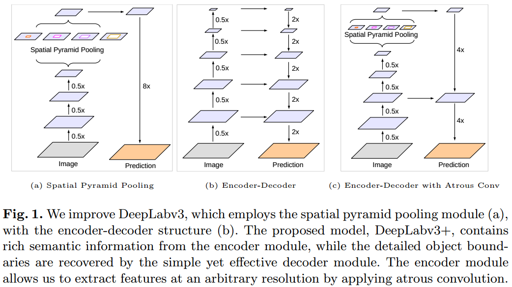
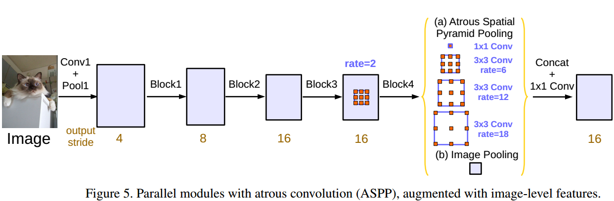
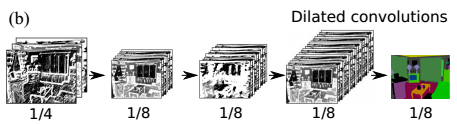
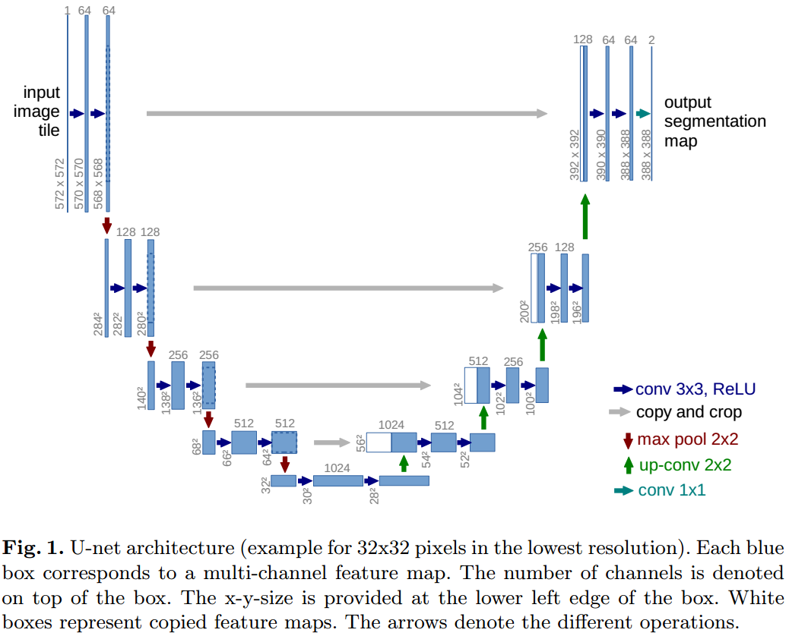
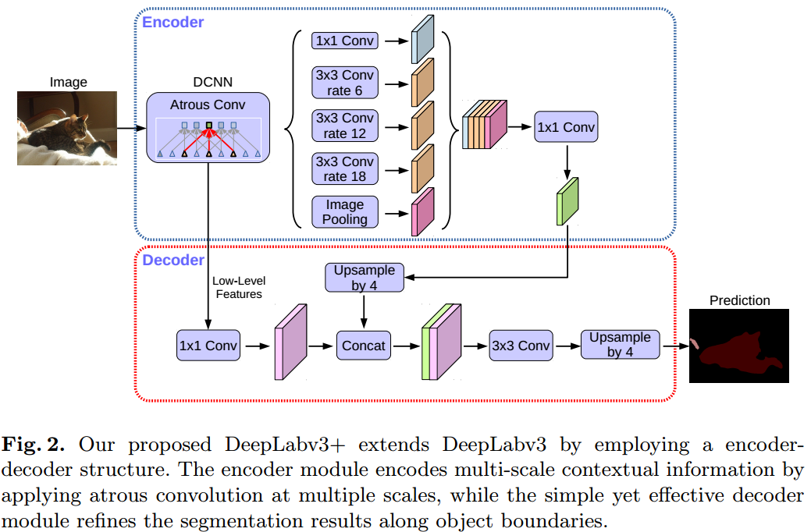

#                                 用DeepLabv3+的Encoder-Decoder做分割

这里继续介绍第四篇著名的图像分割模型，DeepLabv3+。论文发表于2018年的ECCV上。DeepLabv3+在DepLabv3的基础上加了一个精细的Decoder模块得到了一个**Encoder-Decoder**的分割模型，以快速的**Xception为主干网络**，还吸收了MobileNet的**深度可分离卷积**进一步加速，最终在PASCAL VOC 2012和Cityspace两个benchmark上分别得到了89.0%和82.1%的mIOU成绩。

**欢迎探讨，本文持续维护。**

## 实验平台

N/A

## 分割的常用特征提取思路

图像分割，其实就是在整图大小的分辨率上做每个像素的分类，实际上属于一个**稠密分类问题**，分类的是每一个像素。既然要做到每个像素这么精细的级别，那么就需要很精细的浅层特征，既然要做分类，那么就要有抽象的上层特征。所以，基本的分割方法都是在考虑**怎么样提取浅层和深层的特征**，和**怎么样把这两种特征联合利用**。

### 用SPP来提取特征

一般利用不同大小的卷积核或者Pooling在主干网的最后一层来得到不同分辨率的特征图，形成一个空间特征金字塔SPP，也就是如上图所示的a，然后再这个SPP上恢复出每个像素的label的预测值。但是这个思路有个明显的弊病，他是在主干网的最后一层来做SPP操作的，而**主干网最后一层虽然有很丰富的语义信息，但是由于一路上的卷积和Pooling操作，分辨率不断压缩，许多对分割细节至关重要的浅层细节信息还是流失了**。

本文介绍的DeepLabv3+前的DeepLabv3（也叫ASPP）就是这么一个思路，如上图所示，只不过在做SPP这一步的时候把普通卷积推广到了空洞卷积。

### 用空洞卷积来提取特征

尽管还可以用如上图所示的空洞卷积来做，这样就可以一路保持比较大的特征图的分辨率，保持丰富的细节信息，但是这么做，又太消耗GPU显存资源了，也不太好。

### 用Encoder的方式来提取特征，Decoder再来解码

还有第三种方式，就是本文第一幅图中的b，用一个Encoder模块抽取特征，网络的特征图是逐渐变小的，这样就节约了内存，而在网络的不同深度有不同抽象程度的特征，然后再用一个Decoder模块来利用这些不同层的特征去解码出一个全图大小的pixel-label map。以前介绍的[FCN]()和[U-Net]()基本上就是属于这么一个路子。

## DeepLabv3+的Encoder-Decoder网络结构

### 融合SPP，空洞卷积和Encoder-Decoder结构来得到DeepLabv3+

本文提出的DeepLabv3+，综合吸收了上面几种思路的有点，主体设计如第一幅图所示，细节设计如上图所示，它主体上是一个**Encoder-Decoder结构**：Encoder部分，用主干网DCNN（可以使Xception，也可以是VGG或者ResNet等）提取基本特征，再用**空洞卷积**提取不同感受野的特征图，最后用1x1的卷积混合它们。Decoder部分，抽取主干网前面的特征（**这里是细节信息**），然后对Encoder混合出来的小分辨率特征（**这里是抽象特征**）进行上采样，Concate的方式混合两者，再经过3x3的卷积和上采样之后回复出输入图分辨率的pixel-wise预测结果。

这么一路分析下来，思路就很明显了，**就是在DeepLabv3（ASPP结合了空洞卷积和SPP）的基础上连一个比较复杂的Decoder模块改造成一个Encoder-Decoder结构**，用主干网中间的细节信息，和更多的非线性来解码出来预测图。

## 总结

本文比较简介的介绍常用于分割网络设计的特征提取思路，包括，多分辨率特征，SPP，空洞卷积和Encoder-Decoder结构，基本上所有的分割网络、甚至目标检测和别的任务的网络，都大量的采用了这些设计思路。DeepLabv3+是结合了多种设计思路的模型，也取得了不错的结果，值得我们去学习和借鉴。

## 参考资料

+ [《D#0025-CNN中使用卷积代替全连接》](https://github.com/Captain1986/CaptainBlackboard/blob/master/D%230025-CNN%E4%B8%AD%E4%BD%BF%E7%94%A8%E5%8D%B7%E7%A7%AF%E4%BB%A3%E6%9B%BF%E5%85%A8%E8%BF%9E%E6%8E%A5/D%230025.md)
+ [RefineNet: Multi-Path Refinement Networks for High-Resolution Semantic Segmentation](https://arxiv.org/abs/1611.06612)
