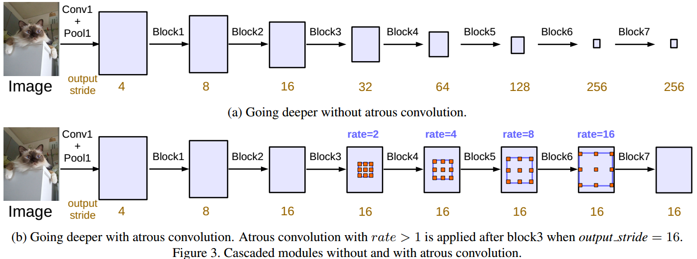
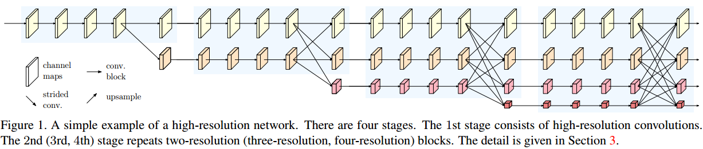
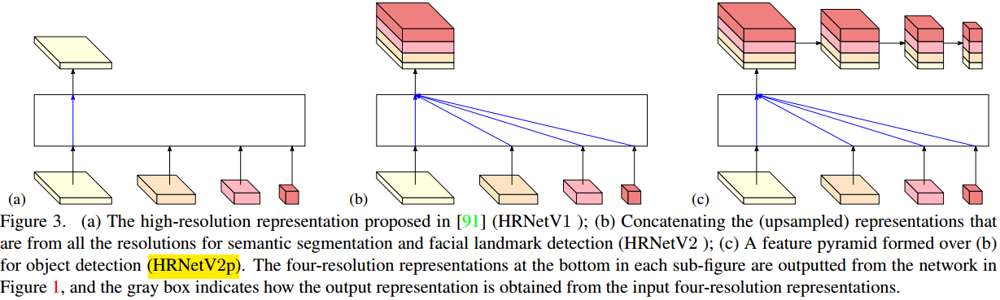
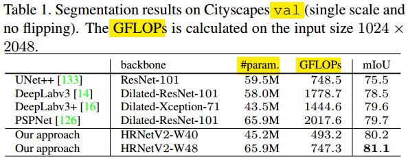

#                                 用HRNet做分割

这里继续介绍第五篇著名的图像分割模型，HRNet[v2]。最开始的HRNet的论文发表于2019年的CVPR上，是做Pose检测的，而HRNetv2是在原来HRNet的基础上把它稍作改造使其成为用于分割的网络。不过，由于HRNet提取的特征丰富，各种分辨率的都有，而且在网络一路都保持着高分辨率特征，所以也很容易类似于改造VGG，GoogLeNet和ResNet那样**根据需要将其改造别的任务**（比如图像识别，目标检测，人脸特征点检测，语义分割的等）的主干网络。本文仅以HRNetv2做分割为例，来介绍HRNet。

**欢迎探讨，本文持续维护。**

## 实验平台

N/A

## HRNet思路来源

做语义分割，现在主流的网络设计可以按照最终特征图的生成方式分为两大流派：

### 以FCN，U-Net的代表的特征图先缩小后恢复的方法

像以前介绍过的[FCN](https://github.com/Captain1986/CaptainBlackboard/blob/master/D%230039-%E7%94%A8FCN%E5%81%9A%E5%88%86%E5%89%B2/D%230039.md)和[U-Net](https://github.com/Captain1986/CaptainBlackboard/blob/master/D%230040-用U-Net做分割/D%230040.md)的网络，如上图所示，在网络的传播过程中，**逐步减小特征图的空间分辨率**，可以视为一个Encoder的过程，然后再加上一个尾巴Decoder把特征图编码了的信息解码出来，一次性或者**逐步地放大特征图分辨率**直到原始输入分辨率，得到Segmentation map。这其中可能也穿插着不同分辨率信息的融合。

### 以DeepLab为代表的一路保持较大分辨率特征图的方法

上面的FCN和U-Net那样的思路，会在特征图分辨率缩小的过程中有**信息的流失**，就算加上了跳跃连接和多分辨率融合也不一定能很好的补偿这种信息流失。所以就有另外一种思路，在**特征提取的过程中一路保持较大的分辨率**，如上图b，在最后的大分辨率特征图上预测Segmentation map。这种思路比较有代表性的就是DeepLab系列的空洞卷积了，[以前也有介绍](https://github.com/Captain1986/CaptainBlackboard/blob/master/D%230042-%E7%94%A8DeepLabv3%2B%E7%9A%84Encoder-Decoder%E5%81%9A%E5%88%86%E5%89%B2/D%230042.md)。

## HRNet网络结构

HRNet的设计思路延续了一路保持较大分辨率特征图的方法，在网络前进的过程中，都**保持较大的特征图**，但是在网路前进过程中，也会**平行地**做一些下采样缩小特征图，如此**迭代**下去。最后生成**多组有不同分辨率的特征图**，**再融合**这些特征图做Segmentation map的预测。

### 主干网络结构

上图是HRNet简单地示意图，生成多种不同分辨率的特征。这里需要注意的细节是，它在网络的前，中，后三段都做了特征融合，而不是仅仅在最后的特征图上做融合。别的好像也没什么了，结构和思路都比较简单，没有[前面的RefineNet](https://github.com/Captain1986/CaptainBlackboard/blob/master/D%230041-用RefineNet做分割/D%230041.md)那么复杂，就不多做介绍了。

### 多分辨率融合Multi-resolution Fusion

HRNet作为主干网络提取了特征，这些特征有不同的分辨率，需要根据不同的任务来选择融合的方式。

在HRNet的最初CVPR做人体姿态检测的版本中，用的是上图a的融合方式，也就是丢掉低分辨率的特征，只用最大分辨率的特征。

如果做语义分割或者人脸特征点定位，那么就是如上图b中所示，把不同分辨率的特征通过upsample操作后得到一致的大分辨率特征图，然后concate起来做融合。

如果做目标检测，那么如上图c所示，在b的基础上构造一个多分辨率的特征金字塔。

### 计算量

HRNet虽然有许多分辨率，而且一路都有保持大分辨率，但是根据论文的Table 1来看，貌似参数数量和计算量与前面的UNet和DeepLab相比并没有增加多少，特别是与DeepLab相比，计算量少了一大半。

## 总结

HRNet构造思路很简单，一路保持较大的分辨率，而且并行地下采样、融合，最终生成多个分辨率的特征图，可以根据不同任务的具体需要进行选择性地融合使用。HRNet能在图像分类，目标检测，语义分割，人脸特征点定位等应用上取得不错的效果，有望像VGG，GoogLeNet和ResNet那样，成为各个任务主干网络新的选择。

## 参考资料

+ [Deep High-Resolution Representation Learning for Human Pose Estimation](https://arxiv.org/abs/1902.09212)
+ [High-Resolution Representations for Labeling Pixels and Regions](https://arxiv.org/abs/1904.04514)
+ [D#0039-用FCN做分割](https://github.com/Captain1986/CaptainBlackboard/blob/master/D%230039-%E7%94%A8FCN%E5%81%9A%E5%88%86%E5%89%B2/D%230039.md)
+ [D#0040-用U-Net做分割](https://github.com/Captain1986/CaptainBlackboard/blob/master/D%230040-用U-Net做分割/D%230040.md)
+ [RefineNet: Multi-Path Refinement Networks for High-Resolution Semantic Segmentation](https://arxiv.org/abs/1611.06612)
