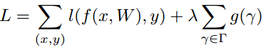
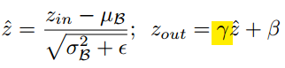
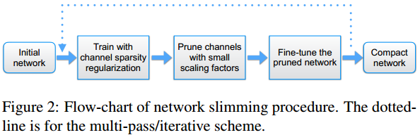
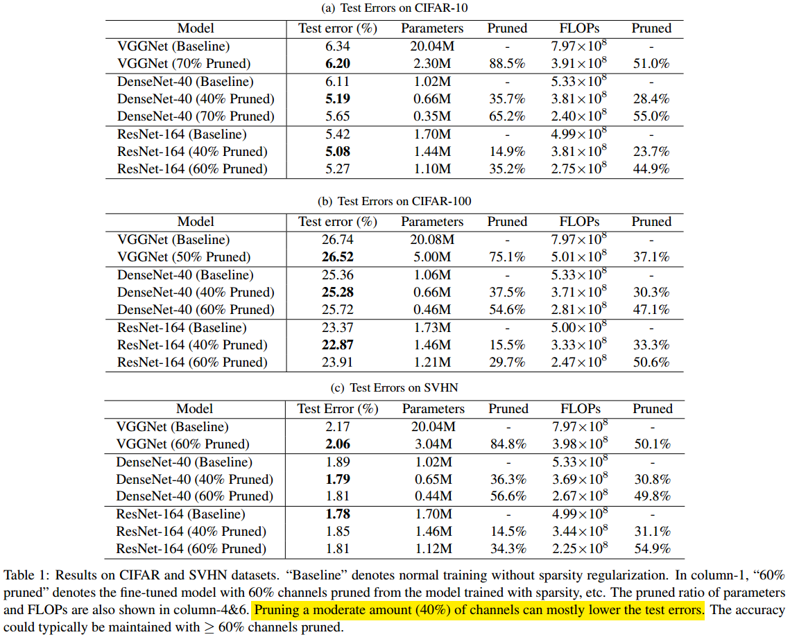
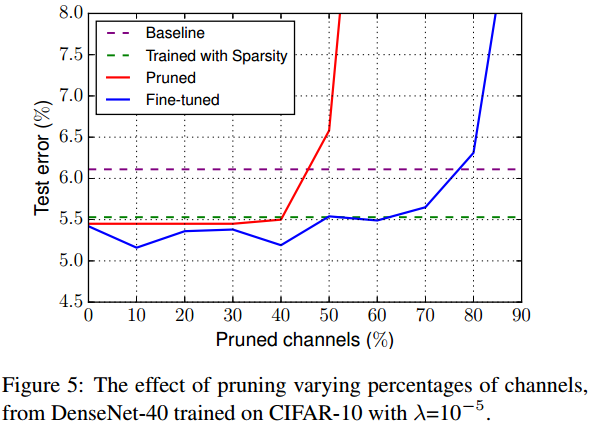
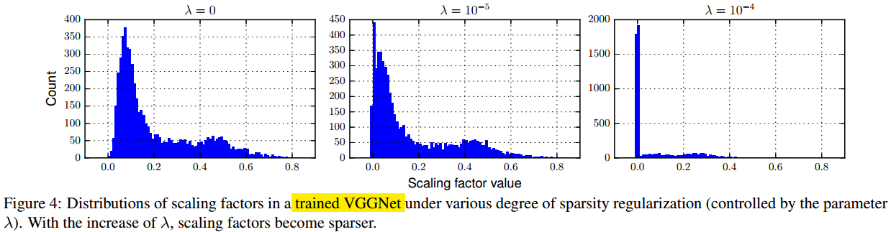
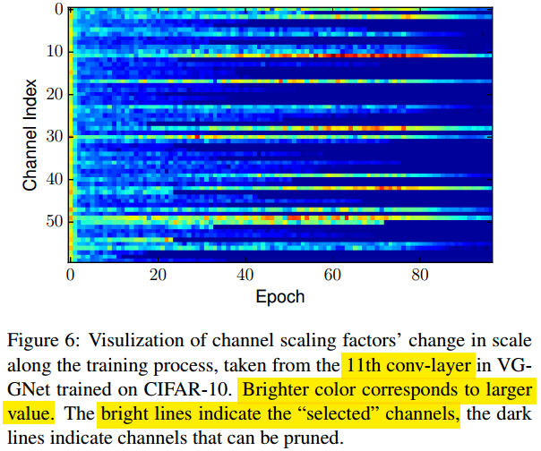

#                                 用Network Slimming做模型加速和压缩

对于做好一个产品来说，算法工程师输出的模型光性能达标是不够的，模型**文件的体积**，**运行时速度**和**资源占用大小**也是不可忽视的因素，特别是对于高吞吐的业务量和受限的边缘计算场景来说。对于这些方面的优化都可以称之为模型的加速和压缩。这里以2017年ICCV上的一篇[《Learning Efficient Convolutional Networks through **Network Slimming**》](https://arxiv.org/abs/1708.06519)为例，介绍一下做模型通道剪枝来加速和压缩CNN模型的方法。

**欢迎探讨，本文持续维护。**

## 实验平台

N/A

## 模型加速和压缩的几个大的思路

对于模型的前向推理速度，要么是**1. 加快运算速度**（例如上更好的CPU，GPU，DSP，更大内存，更快的主板这样的硬件升级），或者是**2. 进行针对部署平台的深度优化**（比如移动端arm上的neno优化，桌面CPU上的SIMD优化，或者GPU上的cuda优化等），要么是**3. 减少计算量**（模型的乘加次数）。硬件升级简单粗暴见效快，不过成本也高；针对平台的深度优化，开发周期长，可移植性差；减少模型计算量的优化，主要是思路和调参的事情，相对而言比较容易。而且，1，2和3的几个优化方法也不是矛盾的，可以根据项目的具体情况来组合实施。

### 加快运算速度

升级更好的更贵的硬件，更好的主频，更多的计算单元，更大的内存，来提升前向推理速度，这个手段只要有点计算机基础知识的人都知道。但是并不代表这个方法不可以用，更不代表这个方法很容易用。

首先，硬件升级**见效快**。现在AI领域很多To B的客户，定制化需求都很强，各种想法，各种细节，工程师和PM不可能在做研发的时候都能考虑到，但是限于要快速出demo或者提供POC的要求，慢工出细活地针对平台做优化或者对模型进行剪枝压缩都来不及，这时是可以考虑升级一下硬件的。

其次，硬件升级被很多人忽视，但是其实升级也不是真的简单粗暴地瞎升级的。要对现有模型的速度和资源瓶颈做分析后，得到分析数据后才能有针对性地去升级硬件。比如，模型写成Demo后跑一下看一看，是主要卡在CPU的主频低了，还是CPU的核心数少了，还是CPU和内存的cache命中率太低，或者是内存的大小，频率，还有主板的总线带宽太垃圾等，不一样的问题有不一样的解决方案，**要有数据的支撑后选择有针对性的硬件升级方案**可能更好。

### 前向框架加速

现在深度学习在不同的设备上都有落地开花，同一个模型可能部署在不同的硬件设备上。针对不同的设备，选择一些成熟的前向框架无疑是应该的。

#### ARM

小米的mace，腾讯的[ncnn](https://github.com/Tencent/ncnn)和阿里的[MNN](https://github.com/alibaba/MNN)这些大公司开源的框架，专注于前向优化，在基于arm的移动端上做了很深的优化，如果用这些计算框架大概率比用tensorflow，caffe或者pytorch这种做训练的框架要快。

#### GPU

在GPU上，NVIDIA也推出了TensorRT这样的前向框架，如果是用他家的GPU做服务器部署，可以考虑一下。

#### 其它

也有像[TVM](https://github.com/dmlc/tvm)这种，针对不同的硬件平台都做了tuning的，可以考虑一下。另外值得一提的是OpenCV在桌面CPU上跑的速度也不赖，可以作为备选方案。

当然，**最好的东西，构成一些商业壁垒的产品，都是不会开源的**，一些实力更强的大公司，例如华为，海康和vivo这些，都有自己的团队，针对自己的情况做更深度的前向框架加速和优化，这里不做太多介绍。

上面讲的都是从非模型本身角度来做加速和优化，下面介绍一下从模型本身角度做优化的常见方法。

### 低秩分解

全连接层的权重参数，就是一个巨大的二维矩阵，对这个巨大的二维矩阵做SVD这样的分解，提取特征向量来表达这个矩阵，可以达到**压缩模型体积**的作用，因为大多数的CNN模型参数都是全连接层贡献的。但是低秩分解**不能取得计算量的压缩**，因为CNN的计算量大都是前面的卷积层贡献的。

### 权值量化

在模型训练和存储，还有进行前向的过程中，权重一般的都是默认为fp32的浮点值存储。但是有研究表明，CNN模型是一类过参数化的模型，参数的具体值对于结果来说不是很重要。所以有些库就把模型默认的浮点值用离散的整型值来量化，这样起到了减小模型体积(例如FP16比FP32节约一半的模型体积)和加速的作用(很多平台上整数值的计算比浮点值快)。但是这种权值量化的方法，**会对模型的性能产生一定的伤害**，就要看能不能接收了。

### 权值剪枝和稀疏化

对模型训练后出现的绝对值较小的接近于0的权值和连接，把他们强制置零。这样整个模型的权重大多数都是0了，用稀疏矩阵的特殊存储方式存储，可以减小模型文件的体积，节约不少存储空间。然而，如果要获得运行时速度的加速，**需要配合专门针对稀疏矩阵运算做优化的库或者硬件**；而且，运行时内存的消耗主要不是在权重参数的存储上，而是在中间生成的特征图的存储上（这些特征图还是稠密的），所以**对运行时内存的压缩也不是很多**。

### 结构化剪枝和稀疏化

结构化剪枝指的是整个卷积filter，整个feature map的channel或者整个网络的layer整个去掉的加速压缩方法。一般都是按照某些猜想，在网络训练的时候改造目标函数，然后在训练的结果中按照一定的规则进行剪枝达到加速和压缩的目的。本文在后面要介绍的Network Slimming方法就是属于结构化剪枝的思路。

### 网络结构学习

现在主流的CNN模型设计思路还是用一些专门的假设和前提设计好网络的结构，然后用梯度下降方法去训练优化出这个结构的权值使经验损失最小化。在这个方法中，模型结构是固定的。如果模型结构放得松弛一些，在优化的目标中也加上对模型结构的优化（比如让模型参数尽量小，层数尽量少，特征图尽量窄等），让算法在一个很大的模型结构的假设空间内去**自动搜索学习一个最好的结构**，那么这种方法就是网络结构学习（Neural Architecture Learning）。这种方式由于模型结构的假设空间巨大，可能性太多，需要训练成百个的模型来验证，所以**对计算资源的要求是很高的**。

另外提一句，**Network Slimming也可以当成一种特殊的网络结构的自动学习方法，只不过它的学习只限于在优化特征图宽度的这个维度**。

## Network Slimming

上面的都是模型加速和压缩这一领域的背景和铺垫，下面内容主要是根据论文[《Learning Efficient Convolutional Networks through **Network Slimming**》](https://arxiv.org/abs/1708.06519)来介绍。

### 通道剪枝的优点

Network Slimming实在通道层面来进行剪枝的，但是剪枝的方式不仅仅在通道层面，也有人在权值层面，卷积核层面和层的层面来做剪枝。在权值层面做**细粒度**的剪枝，灵活性最大，不过需要配合专门的做稀疏矩阵运算的软件硬件才能达到效果；做整层整层的剪枝，方式最为**粗糙**，不需要专门软件硬件的配合，但是灵活性比较差，一剪枝就是一整层，而且，如果原来网络的层数不多，这个方法效果也不好。

Network Slimming做的是在通道层面的剪枝，也就是在NCHW的Channel维度做裁剪，粒度比层这个层面做裁剪要精细，而且也**不需要专门的软硬件的配合，在粗粒度和细粒度的剪枝优缺点上做了很好的平衡。而且它既适用于卷积层也可用于全连接层的剪枝。**

### 用[BN层](https://github.com/Captain1986/CaptainBlackboard/blob/master/D%230020-Batch-Normalization%E5%B1%82%E5%8E%9F%E7%90%86%E4%B8%8E%E5%88%86%E6%9E%90/D%230020.md)的缩放因子(Scale Factor)做剪枝

既然要在通道维度做剪枝，那么怎么样挑选出哪些通道可剪枝，哪些通道不可剪枝呢？

作者这里简洁地像给每个通道分配一个可训练的权重因子gamma，每个通道的输出**乘以**这个权重因子当做这个通道的最终输出。然后在训练的时候，对这些权重因子做L1惩罚（如上图式子所示），强迫学习到稀疏的gamma，最后认为这些gamma的绝对值大小就代表了相应通道是不是重要，做一个全局排序，按比例去一个阈值，把不重要的通道剪枝。

整体思路是这样的，那么这个gamma就真的是在卷积层后面加一个缩放层吗？不是的，因为卷积层和缩放层都是线性操作，两个是可以互补的，缩放层的大小并不能代表层的重要性；那么在卷积层的后面，BN层的前面加一个缩放层呢？也不行，这个缩放层的效果会被BN层的Normalization操作抵消掉；还有一种是把缩放层放在BN层的后面，下一层卷积层的前面，那样和第一种是一样的，连续两个线性变换有可能是相互互补的，并不能用缩放层系数的大小代表该层的重要性。

这里作者没有特别地加其它层来做，直接用**的BN层的gamma缩放系数来表示对应Channel的重要性**。

### 迭代剪枝策略

有时候剪枝一次还不能满足压缩和加速的要求，有时候剪枝后会带来性能的退化，这时候可以把上面介绍的剪枝过程迭代几次，直到满足压缩加速的要求或者性能退化到已经很难用fine-tune再拉回来的时候，示意图如上图所示。

## 实验结果

作者在ImageNet，MNIST，CIFAR-10/100和SVHN，用VGGNet，ResNet和DenseNet做了很全面的实验，这里简单挑选几个来展示Network Slimming的效果。

### 加速压缩效果

从上图可以看到，在剪枝40%~70%的情况下，都可以取得比原来模型更好的性能，在大多数情况下，剪枝40%可以获得最佳的性能。从Parameters和FLOPs两列也可以看出来，模型参数数量和计算量都有很大的压缩（具体压缩多少和模型结构有关的，不一定是前面剪枝的比例那个数值）。

另外，可以看到，对模型进行剪枝，不但没有使模型性能下降，反而让模型性能提升了一些，这应该是因为Network Slimming剪枝的方式，对于本来就是过参数化的模型，基本没有增加网络的容量，反而相当于对训练过程加了一个L1正则化的作用，还提升了模型的泛化能力。

### 关键参数分析

Network Slimming中有两个比较重要的参数，一个是剪枝的百分比，一个是正则化强度系数，这里说一下他们对最终剪枝效果的的影响。具体实施时也要根据具体情况来试。

#### 剪枝百分比

从上图可以看到，如果使用剪枝后再Fine-tune的策略，剪枝百分比在一定阈值（这里是80%）以下会是比较安全的（Fine-tune之后得到的性能和不做剪枝的性能差不多甚至更好），当超过这个阈值，Fine-tune弥补不了性能的下降。

另外，从上图也可以看到，用L1稀疏化惩罚做训练的绿色虚线结果会比Baseline的紫色虚线方法好，这也说明了前面说的Network Slimming方法有正则化的作用。

#### 正则化强度

从上面的图可以看出，正则化强度系数gamma越大，最后得到的缩放系数的结果越稀疏，越多的系数往0靠拢。

上图是说在gamma强度一定的情况下，随着训练轮次Epoch的增加，越来越多的缩放系数往0靠拢，最终只剩下少部分的缩放系数比较大，它们对应的通道就是要保留下来的。

## 总结

本文先介绍了模型加速的几个大的思路，然后根据ICCV2017的Network Slimming的论文介绍了一下通道剪枝压缩加速的方法。Network Slimming的方法实现简单，压缩加速效果好，不牺牲性能，通用性好，而且不需要专用的软硬件的支持，可以在计算资源有限或者实时性要求高的场合使用。

## 参考资料

+ [Learning Efficient Convolutional Networks through Network Slimming](https://arxiv.org/abs/1708.06519)
+ [ncnn GitHub](https://github.com/Tencent/ncnn)
+ [MNN GitHub](https://github.com/alibaba/MNN)
+ [tvm GitHub](https://github.com/dmlc/tvm)
+ [TensorRT](https://developer.nvidia.com/tensorrt)
+ [D#0020-Batch-Normalization层原理与分析](https://github.com/Captain1986/CaptainBlackboard/blob/master/D%230020-Batch-Normalization%E5%B1%82%E5%8E%9F%E7%90%86%E4%B8%8E%E5%88%86%E6%9E%90/D%230020.md)
