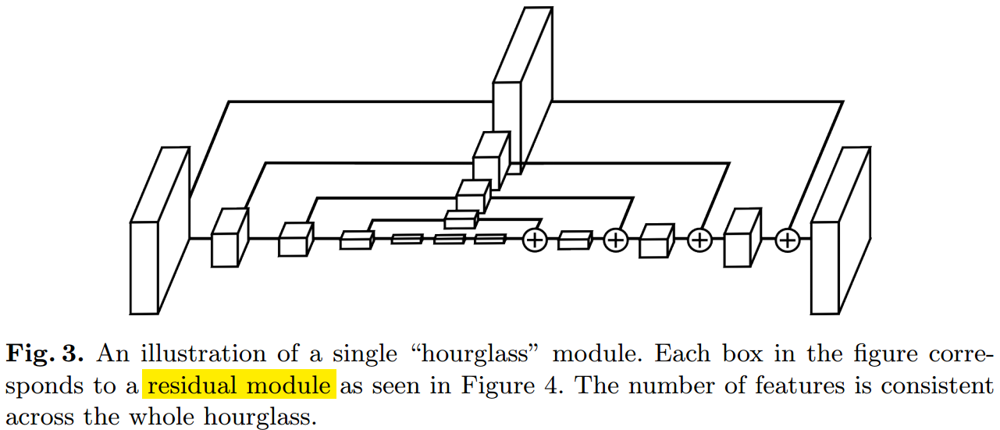
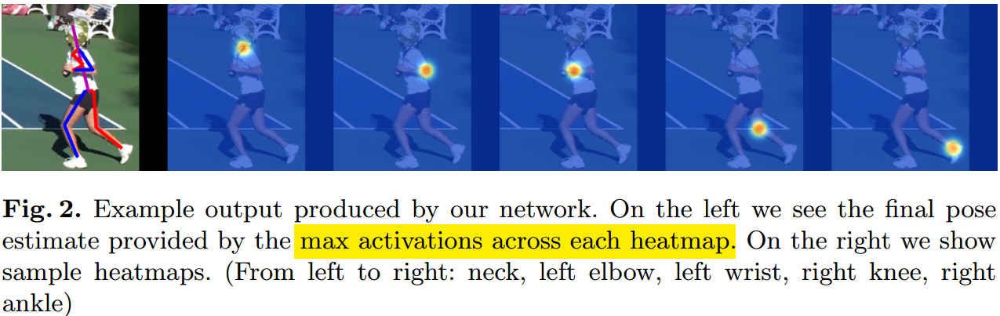
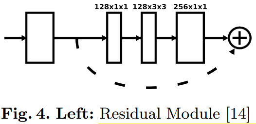
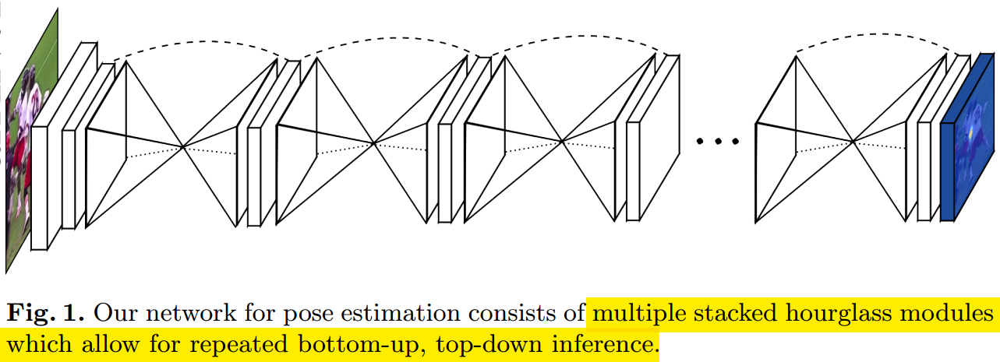
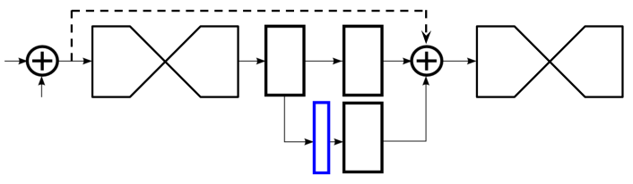
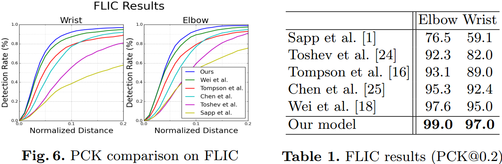
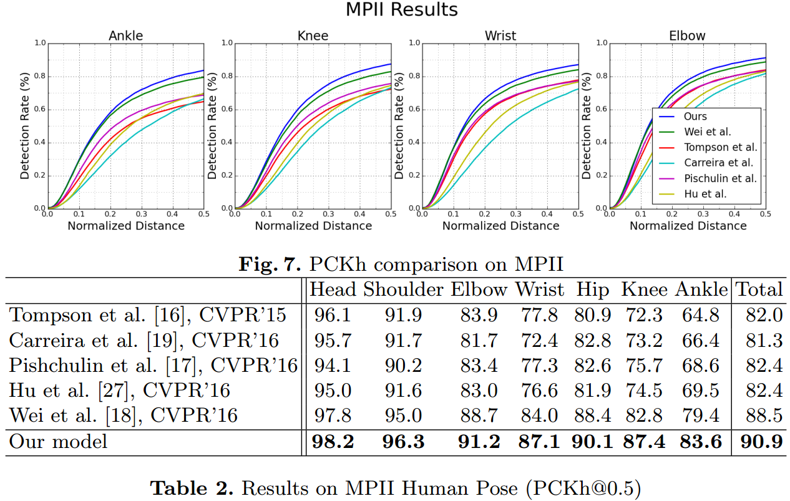
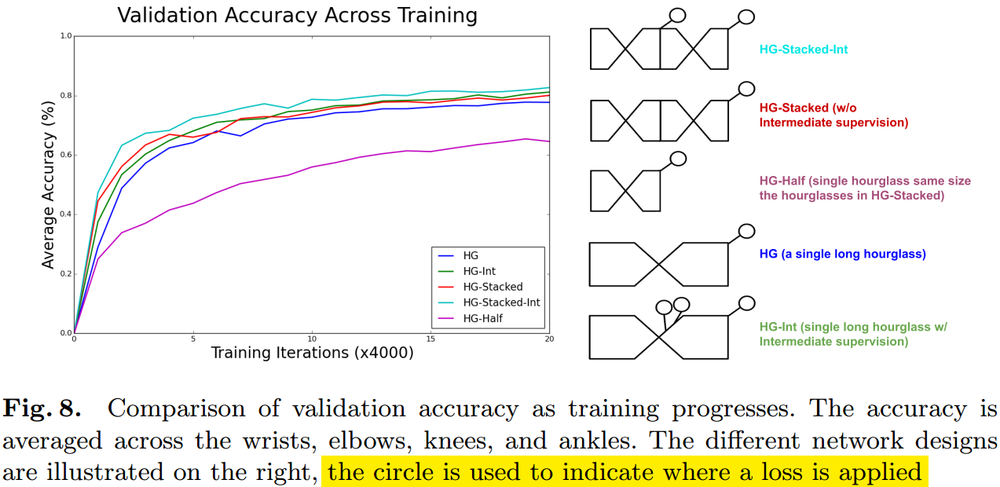

#                                 Stacked Hourglass Network for Human Pose Estimation

本文介绍一篇2016 ECCV上的老文章[《Stacked Hourglass Network for Human Pose Estimation》](https://arxiv.org/abs/1603.06937)，文章提出了一种用于做人体姿态估计的Hourglass网络，形状和前面介绍的用于分割的[U-Net](https://github.com/Captain1986/CaptainBlackboard/blob/master/D%230040-%E7%94%A8U-Net%E5%81%9A%E5%88%86%E5%89%B2/D%230040.md)很像，设计思路也很像，是人体姿态检测领域一篇比较重要的文章。而且，Hourglass的结构也作为Backbone网络应用于除人体姿态估计之外的领域中，比如今年大热的目标检测Anchor-Free的[CornetNet](https://arxiv.org/abs/1808.01244)中。

**欢迎探讨，本文持续维护。**

## 实验平台

N/A

## 网络结构

对于人体姿态估计这样的高级别的视觉任务来说，既需要模型能捕获低级别小尺度的信息（比如定位大概某个点是一个手腕），有需要模型能捕获高级别大尺度的信息（比如判断这个点是左手的手腕还是右手的手腕）。对不多尺度信息的捕获，有许多方法，比如简单的多分辨率预测，不同深度的层做特征融合，或者复杂一点的特征金字塔网络FPN，和前面介绍过的用于做语义分割的U-Net那样的。**这里说的Hourglass就属于和U-Net比较像的思路，先不断地缩小特征图空间分辨率，再不断提升和回复原来输入的分辨率，然后再在前后加一些Skip Layer，从而得到涵盖了不同尺度信息的输出特征图**。

### Hourglass模块

#### 大致结构

上图就是一个Hourglass模块，可以直观地看到分辨率是先降低再升高，两头大中间细，很像一个沙漏形状，所以取名Hourglass。

在Hourglass模块中，使用max pooling来降低特征图分辨率，在每次**max pooling**之后，牵出来一个Skip Layer来处理原来分辨率的信息（后面跟升起来分辨率的相对应的特征图做融合）。在模块达到最低分辨率的时候，后面又用**最近邻插值**的方法（不是unpooling或者deconv）进行上采样得到捕获全局信息的不同分辨率的特征图，和前面Skip Connection对应的特征图进行**Element-wise相加**做融合。上图中所有的max pooling操作都对应着一个最近邻插值操作，降低分辨率的过程和提升分辨率的过程是**完全对称**的结构。

在输出的时候，通过1x1的卷积调整得到一个heatmap，heatmap的通道个数等于人体Pose的关键点类别数。

#### Residual Module

上图是一个Hourglass模块中使用的残差模块的示意图（在图3中就是一个小方框），这个没什么说的。

### Stacked Hourglass网络

把多个（论文中是8个）Hourglass模块堆叠(Stacked)起来就组成了Stack Hourglass模型。需要注意的是，输入模型的图片分辨率是256x256，为了节约内存，一开始就用大卷积和一系列的max pooling操作把分辨率降到了64x64（这也是网络中Hourglass模块的输入和输出分辨率）。在网络中间各个Hourglass模块串联的时候，添加了一些卷积层。整个网络输出的时候，又通过1x1的卷积调整得到各个关节点的heatmap，heatmap通过最大值激活可以得到准确的关节点坐标，通道对应着关节点的种类。

## 训练方法

### Intermediate Supervision

由于Stacked Hourglass网络使用的是多个Hourglass模块堆叠而成，每个Hourglass模块都应该捕获了全局的和局部的信息，所以从这些信息中生成GT信息也应该是合理的。而且这个堆叠的过程，作者假设它是一个不断bottom-up，top-down的信息处理过程，在这个过程中输出的都是关于人体Pose的整体和局部信息，只不过后面的实在前面的基础上做further evaluate和reassess。基于这个假设，作者在每个Hourglass的输出上加了生成GT的模块，用GT进行监督训练来降低网络的训练难度。

### 训练细节

训练数据集采用FLIC和MPII，首先通过标注信息扣出人体，再resize到256x256的分辨率，做了一些旋转(正负30度)和缩放的数据增强(x0.75~x1.25)。优化方法使用rmsprop，初始学习率2.5e-4（后面每到达平台期就除以5），使用Titan X训练了3天。单次预测耗时75ms。在测试的时候，做两次预测，一次原图，一次翻转后的图，把两次的heatmap平均一下可以得到大约1%的性能提升。

损失函数用的是MSE，真值用2D正态分布做了软化处理。为了提升定位精度，在从heatmap坐标反推到原图坐标的时候，把heatmap坐标向第二高的激活值方向移动1/4个像素（其实就是heatmap的最大值和第二大值进行了一个调和）。

对于严重遮挡和扭曲的关节点，在把真值heatmap上都设置为0。

## 实验结果

### 数据集上测试结果

作者使用关键点正确分类的百分比(PCK)指标和一些在人体姿态估计上流行的方法做了比较，比较结果如下：

FLIC的结果

MPII的结果

### 剪枝实验

另外，作者为了证明Intermediate Supervision的效果确实对性能提升帮助很大，性能提升不是由于网络参数增多达到的，做了如下的剪枝实验。

## 总结

Hourglass网络在人体姿态领域算是比较早也比较经典的一个模型，其结构和U-Net类似，都是分辨率先下降再提升的过程。Hourglass不但应用于人体姿态检测，也作为Backbone被应用于目标检测模型CornerNet中。

## 参考资料

+ [D#0040-用U-Net做分割](https://github.com/Captain1986/CaptainBlackboard/blob/master/D%230040-%E7%94%A8U-Net%E5%81%9A%E5%88%86%E5%89%B2/D%230040.md)
+ [Stacked Hourglass Network for Human Pose Estimation](https://arxiv.org/abs/1603.06937)
+ [CornerNet: Detecting Objects as Paired Keypoints](https://arxiv.org/abs/1808.01244)
