#                                 Anchor Free第一篇CornerNet: Detecting Objects as Paired Keypoints

目标检测这个领域，在14年RCNN系列出现之前，一直是滑动窗口加上图像金字塔的方法主导；在RCNN,SSD和YOLO出现之后，是Proposal和Anchor based方法主导；在18年到现在，新出现了一系列方法，都是Anchor Free的，以**直接检测点**（矩形包围框的角点、中心点等）为思路来做目标检测。这里简单对一些典型的Anchor Free方法做一个系列性的介绍，本文介绍第一篇CornerNet。论文[《CornerNet: Detecting Objects as Paired Keypoints》](https://arxiv.org/abs/1808.01244)发表于2018年的ECCV上，应该算是以点检测来取代Anchor方法的第一篇，值得一读。

**欢迎探讨，本文持续维护。**

## 实验平台

N/A

## Anchor方法的缺点

像Faster RCNN，SSD，YOLO v2/v3这样的比较流行的目标检测框架，都是用到了锚点框的概念。通过在不同特征图上，配置不同的锚点框来通过学习锚点框相对于真值框的偏移和置信度来确定目标的位置。这种检测范式有以下两个缺点：

1. 正负样本不平衡：在基于Anchor的方法中，需要在不同的特征图上预设很多Anchor，这些Anchor根据和真值框的IoU大小来负责预测是有目标的还是背景图。为了增大召回率，需要很**密集地**布置很多很多的Anchor（这也导致了训练和预测的低效），然而，这么多的Anchor只有很少一部分可以达到和真值框足够的IoU来使其能作为正样本，**绝大多数的Anchor都是负样本**。这导致了训练时**正负样本的不平衡问题**。
2. 超参数难调：Anchor Box的**数量**、**大小**、**宽高比**，还有**哪个层**的特征图设置多少个Anchor Box，这些都是需要深度学习工程师在训练的时候根据项目的实际情况来设置的。比如，人脸检测中要加大小脸的召回，就在浅层的特征图上多设置一些宽高比为1:1的Anchor Box；在车牌检测中，就不能继续用1:1的Anchor Box了，需要根据车牌的比例（不同国家的车牌，比例还不一样），设置比如5:1，7:1的Anchor Box才合理。但是这些超参数，都是依赖经验的，如果能有方法去掉这些超参数，**全自动地**去从样本中学习目标检测需要的信息，那多好。

## CornerNet介绍

### 前人的启发

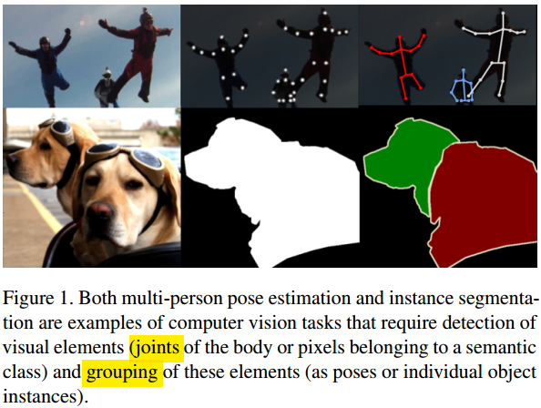

在2017年NIPS上出了一个论文[《Associative Embedding: End-to-End Learning for Joint Detection and Grouping》](https://arxiv.org/abs/1611.05424)，是做人体姿态估计的。文中提出了一个很有启发性的观点：像人体姿态估计和实例分割这种CV任务来说，底层的逻辑就是要**给点打标签**，然后**将这些点组合(Group)起来**形成上层的语义。受此启发，作者认为对于目标检测来说，我们要检测目标的包围框，其实也是等价于**检测包围框的左上角的点和右下角的点**，然后将它们组合起来。按此思路，作者18年提出了CornerNet这个模型，并发了这篇ECCV的论文。

### CornerNet思路

如上图所示，Cornet将检测目标的包围框这个任务转换成了检测包围框的左上角和右下角角点，然后将其组合起来这个任务，**完全抛弃了Anchor的概念**。首先用一个Backbone网络（文中用的[Hourglass](https://github.com/Captain1986/CaptainBlackboard/blob/master/D%230045-Stacked-Hourglass-Network-for-Human-Pose-Estimation/D%230045.md)，可能是因为作者的思路借鉴与人体姿态估计，而Hourglass也是做人体姿态估计的）提取特征，后面分出了两个单独的检测器分别得到左上角角点和右下角角点的Heatmaps和相应的Embeddings。**通过Heatmaps定位角点的位置集合，再通过Embeddings联系两个集合中的点组成框**。

### 网络结构和损失函数

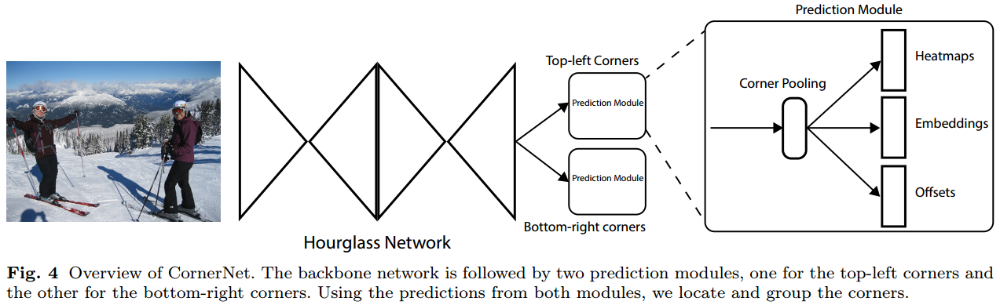

上面的图看的更清楚了，CornerNet先用一个Hourglass提取特征，后面接两个Predition Module分别负责左上角点和右下角点的定位。每一个Prediction Module内含先走一个Corner Pooling模块，再牵出三个分支分别预测Heatmaps，Embeddings和Offsets。Heatmaps和Offsets一起定位角点，Embeddings将一些零散的角点组合起来形成预测框。

**Backbone Hourglass**在[《D#0045-Stacked-Hourglass-Network-for-Human-Pose-Estimation》](https://github.com/Captain1986/CaptainBlackboard/blob/master/D%230045-Stacked-Hourglass-Network-for-Human-Pose-Estimation/D%230045.md)里面已经做了比较详细的介绍，这里不多说。下面来看Prediction Module：

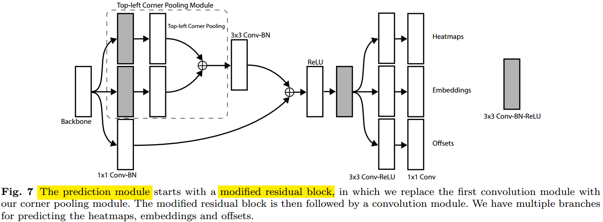

**Prediction Module**开始是一个残差块的变种，在残差块的主路径中，作者发明了一个**Corner Pooling**的块（Corner Pooling也是论文中的创新点之一）**利用一些先验知识抽取和Corner强相关的特征**，这些特征经过一次ReLU和一次3x3 Conv-BN-ReLU的操作后分别开三个分支，去做3x3 Conv-ReLU和1x1 Conv去得到负责的那类点（左上或者右下）的Heatmaps、Embeddings和Offsets信息。

**Heatmaps**的形状为CxHxW，C是通道数，等于需要检测的类别数量，这里**不需要负责背景的heatmap通道**（如果某个点是背景，那么所有的heatmap在那个位置都是0就行了）。

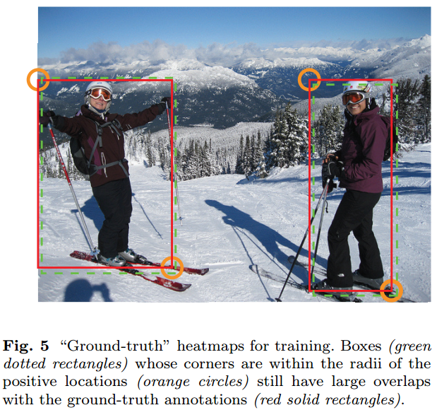

在训练的Prediction Module时候，会对真值做一些处理。如上图，红框是真值框，但是绿框也不是完全不对，他和红框的IoU依然很大。对此，作者对真值点的标签以真值点为中心，以一定的半径（这个半径和真值框的大小有关）做了一个Gaussian加权处理，这也是很合理的。最终Prediction Module部分的损失函数如下：

是一个修改了的Focal Loss。

由于网络中Pooling和Stride的存在，前面的Heatmap只能比较粗略地从HxW的图上反推出原图的坐标，实际误差是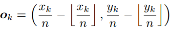，如果知道了这个误差值，就可以在反算时做一个弥补，使得到的坐标值更精确一些。**Offsets**模块就是干这个事情的，它使用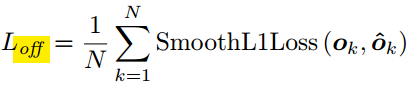学习误差值得到Offsets，利用Offset和Heatmaps的信息共同就精确定位了角点坐标。

只是得到了左上角的点的坐标集合和右下角点的坐标集合，还没办法将两个单独集合里面的点组合起来成为一个框。组合的信息就是通过**Embddings**来学习得到的。Embddings的思路很简单，也很巧妙。它为每个角点都设置一个值（这个值就叫Embdding值），训练的时候，设计目标函数，让同一个目标的两个角点的Embdding距离相近（将同一个目标的两个角点对应的Embdding**拉**到一起），而同时让不同目标的两个角点的Embdding的均值的距离很远（将不同目标的两个角点对应的Embdding的均值**推**开）。用公式表达如下：

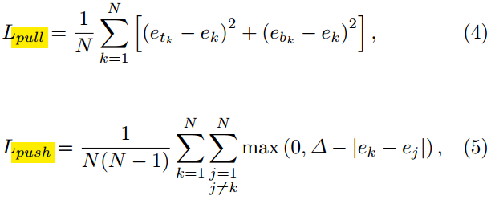

最终整个CornerNet网络的训练损失函数就是上面介绍的Heatmaps的损失，Offsets的损失和Embddings的损失的加权调和：

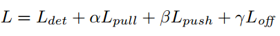

### Corner Pooling

Corner Pooling是论文中比较大的创新点，它是紧跟在Backbone模块后的第一步，对整个网络的性能影响也很大，这里值得单独细讲一下：

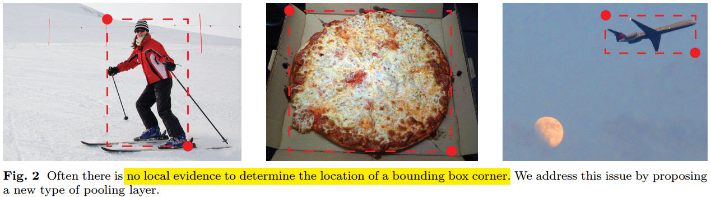

我们可以想象一下，如上图所示，以定位某个目标包围框的左上角关键点为例。**人眼在定位左上角关键点的时候，需要分别像右和向下扫描，找到目标的最顶和最左的边缘**。Corner Pooling就是**显示地将这个假设体现在网络中**，特意去编码那些对向右和向下寻找边缘这个任务有利的信息，来帮助定位角点。

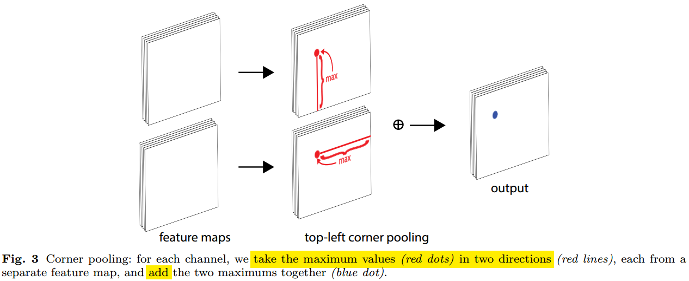

Corner Pooling是怎么编码目标的最顶上和最左边的边缘的信息呢？其实很简单，如上图所示，Corner Pooling模块输入两张特征图，分别扫描特征图上每个像素，替换成这个点及其右边所有点和这个点及其下面所有点的集合的最大值，然后相加起来得到输出的特征图。

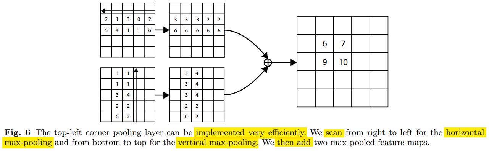

Corner Pooling的实现也特别简单，并不需要自己再在现有的训练框架上加特别的层写一些前向和反向的代码，只需要利用常见的Max Pooling层就行的（有点像快速计算积分图）。

## 总结

本文介绍了今年流行的以点检测代替Anchor做目标检测的论文CornerNet，点检测的方法借鉴了人体姿态估计和实例分割里面的思想，避免了Anchor方法中正负样本不均衡和需要手动调的那些超参数那些弊端。CornerNet出来后，CenterNet，FCOS，ExtremeNet等等方法都沿着这个Anchor Free的思路继续深入下去，先挖个坑，以后有机会再讲。

## 参考资料

+ [Associative embedding: End-to-end learning for joint detection and grouping](https://arxiv.org/abs/1611.05424)
+ [CornerNet: Detecting Objects as Paired Keypoints](https://arxiv.org/abs/1808.01244)
+ [Stacked Hourglass Network for Human Pose Estimation](https://arxiv.org/abs/1603.06937)
+ [《D#0045-Stacked-Hourglass-Network-for-Human-Pose-Estimation》](https://github.com/Captain1986/CaptainBlackboard/blob/master/D%230045-Stacked-Hourglass-Network-for-Human-Pose-Estimation/D%230045.md)
