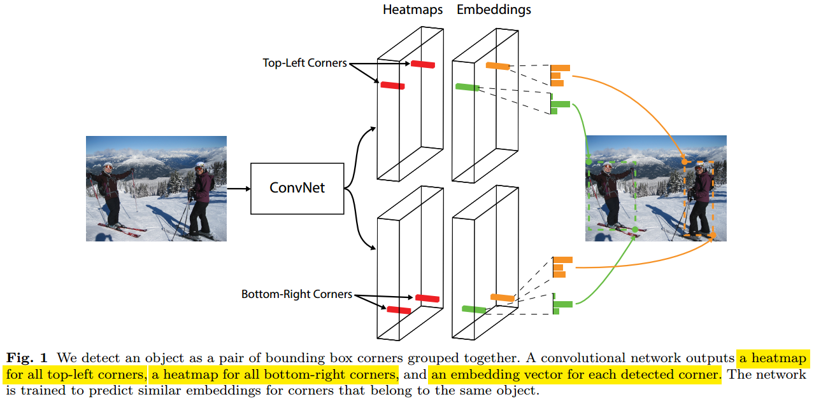
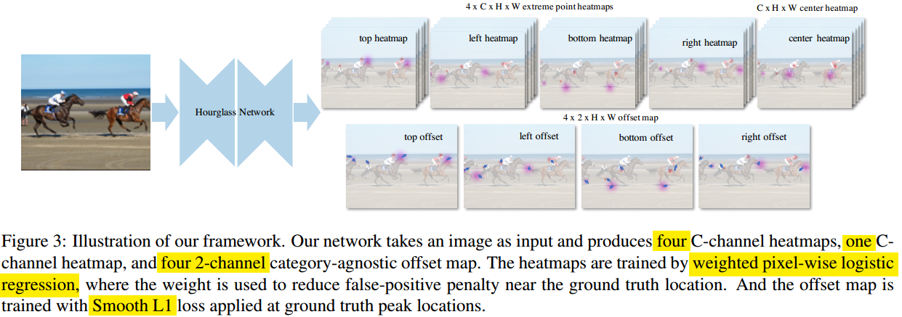
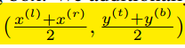
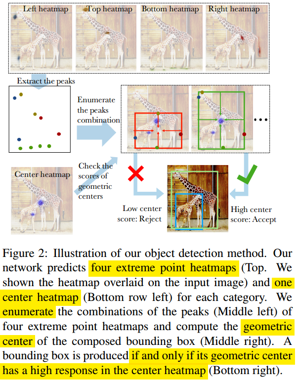
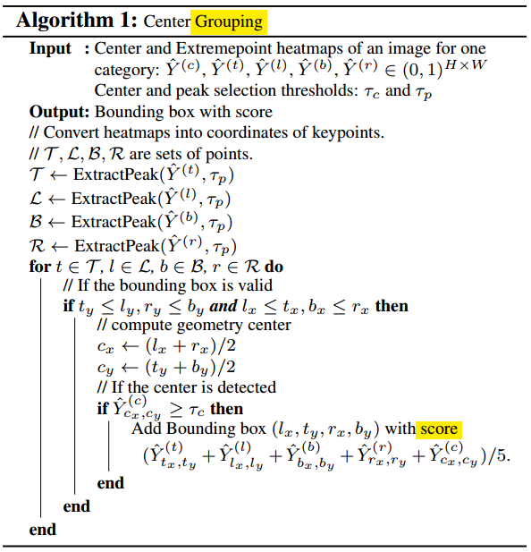
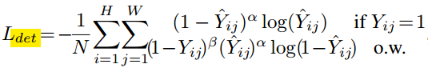
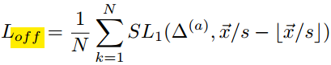

#                                 Anchor-Free第二篇CornerNet的变种ExtremeNet

上文介绍的[CornerNet](<https://github.com/Captain1986/CaptainBlackboard/blob/master/D%230046-Anchor-Free%E7%AC%AC%E4%B8%80%E7%AF%87CornerNet-Detecting-Objects-as-Paired-Keypoints/D%230046.md>)首次提出将目标检测问题从回归Anchor Box的Top-Down思路转化为检测KeyPoints的Bottom-Up思路，后面就有一些新的基于关键点检测的模型出来，例如ExtremeNet、CenterNet、FCOS等。这里我们先介绍ExtremeNet，它和CornerNet最接近（Backbone都是一样的，Prediction module小改）。ExtremeNet衍生于CornerNet，主要不同点在于(1) **关键点选取不同**：ExtremeNet的关键点选取为Object的最顶点，最底点，最左点和最右点，而不是包围框的左上角点和右下角的点；(2) **Grouping方法不同**：ExtremeNet不需要学习Embddings，直接把所有的候选点集合做暴力穷举，再结合几何规则和中心点Heatmap找出包围框（也可以是多边形）；(3) **ExtremeNet得到的信息更丰富**：ExtremeNet可以得到目标不多边形包围框，比一般的矩形包围框可以提供更多的关于目标的信息。

**欢迎探讨，本文持续维护。**

## 实验平台

N/A

## ExtremeNet比CornerNet好在哪

1. ExtremeNet的**关键点选择更科学**：如上面两张图片所示，第一张是CornerNet选择的关键点，目标包围框的左上角和右下角两个点，下图是ExtremeNet选择的四个关键点，目标顶点，底点，最左点和最右点。可以看的出来，目标的Cornner点一般离目标很远很少落在目标本身上面，而Extreme点一般都是在目标的边缘上。**离目标本身越远，越难学到很好的和目标位置强相关的特征**，虽然CornerNet提出了Corner Pooling来显示地编码进去一些关于目标边缘的特征，但是肯定还是不如关键点本身就在目标边缘效果好的（**标注四个Extreme点所携带的信息本身也比标注两个Corner点所携带的信息多**）。奥卡姆剃刀告诉我们**如无必要，勿增实体**。
2. ExtremeNet**不需要学习Embddings**：得到特征点之后，特征点怎么组合起来形成一个框，在CornerNet中单独引出了一个预测分支去学习一组关于点对关系的Embddings特征（同一个目标的点对，Embddings近，不同目标的点对，Embddings远），但是ExtremeNet把Embddings分支去掉了，添加了一些Center Points的Heatmap，再结合几何关系的规则来做Grouping，作者声称效果比Embddings好。
3. ExtremeNet的**数据标注成本小**：作者引用文献中的结论，认为标注目标的Extreme点比标注目标的Bounding Box要快4倍。鉴于实际项目中，数据标注的成本可能很大，这里也作为一个优势提出来。

## ExtremeNet介绍

### CornerNet的启发

简单地说，CornerNet的提出给了ExtremeNet很大启发。既然Corner利用两个在目标外的角点可以做定位，那么利用在目标边上的点，应该可以做的更好才是（省去了Corner Pooling，而且四个Extreme点提供了更多的信息）。具体介绍，请见上一节和[《Anchor Free第一篇CornerNet: Detecting Objects as Paired Keypoints》](<https://github.com/Captain1986/CaptainBlackboard/blob/master/D%230046-Anchor-Free%E7%AC%AC%E4%B8%80%E7%AF%87CornerNet-Detecting-Objects-as-Paired-Keypoints/D%230046.md>)关于Corner的介绍。

### ExtremeNet思路

如上图所示是ExtremeNet大致的流程图。ExtremeNet的网络结构和前面[《Anchor Free第一篇CornerNet: Detecting Objects as Paired Keypoints》](<https://github.com/Captain1986/CaptainBlackboard/blob/master/D%230046-Anchor-Free%E7%AC%AC%E4%B8%80%E7%AF%87CornerNet-Detecting-Objects-as-Paired-Keypoints/D%230046.md>)已经介绍过的CornerNet结构类似，这里不再单独介绍了。来看输出：ExtremeNet对每类目标，生成**5张**Heatmap，其中4张是表示Extreme点在哪里的Confidence，一张是表示Center点(4个Extreme点的均值)的Confidence。另外还有**4x2张**类别无关的offset map特征图，用来微调Extreme点反算到输入图的坐标。

得到了5张Heatmap后，先用四张Heatmap找出所有的Extreme点可能出现的位置，再**穷举**这些位置的四元组合，结合Center heatmap和几何规则排除掉False Positive。过滤后剩下的组合就是检测到的目标了。目标的Score就是五个点(4个Extreme点和一个Center点)在五张特征图对应的**Score的平均**。

关于怎么做Grouping的方法，更清晰的可以见下图：

### 网络结构和损失函数

ExtremeNet源于CornerNet，网络结构和CornerNet很像，损失函数和CornerNet一样。

#### 网络结构

和CornerNet一样，ExtremeNet也是用的关键点检测常用的104-layer **HourglassNet**作为特征提取Backbone网络，但是去掉了Corner Pooling模块，其余做了很小的相应修改。

#### 损失函数

基本上和CornerNet一样，关键点定位用的是**改造的Focal Loss**，Offset回归用的是**Smooth L1 Loss**。Grouping用的是几何方法，没有用到Embddings，就**没有推拉Loss**。

## 总结

本文是以点做目标检测的第二篇论文ExtremeNet，和CornerNet关键点选取目标包围框的左上角点和右下角点不同，ExtremeNet的关键点选择为目标边缘最高、最低、最左、最右这四个点，在目标检测领域取得了不错的成绩，而且**提供的定位信息更多更准确**，也可以作为第一步应用在**两阶段分割任务**中。

## 参考资料

+ [CornerNet: Detecting Objects as Paired Keypoints](https://arxiv.org/abs/1808.01244)
+ [Bottom-up Object Detection by Grouping Extreme and Center Points](https://arxiv.org/abs/1901.08043)
+ [Stacked Hourglass Network for Human Pose Estimation](https://arxiv.org/abs/1603.06937)
+ [《D#0045-Stacked-Hourglass-Network-for-Human-Pose-Estimation》](https://github.com/Captain1986/CaptainBlackboard/blob/master/D%230045-Stacked-Hourglass-Network-for-Human-Pose-Estimation/D%230045.md)
+ [《D#0046-Anchor-Free第一篇CornerNet-Detecting-Objects-as-Paired-Keypoints》](<https://github.com/Captain1986/CaptainBlackboard/blob/master/D%230046-Anchor-Free%E7%AC%AC%E4%B8%80%E7%AF%87CornerNet-Detecting-Objects-as-Paired-Keypoints/D%230046.md>)
