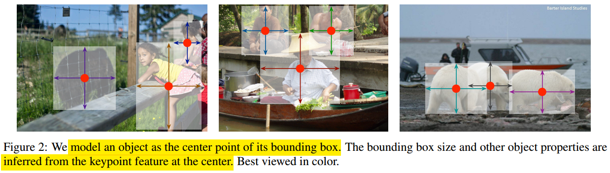
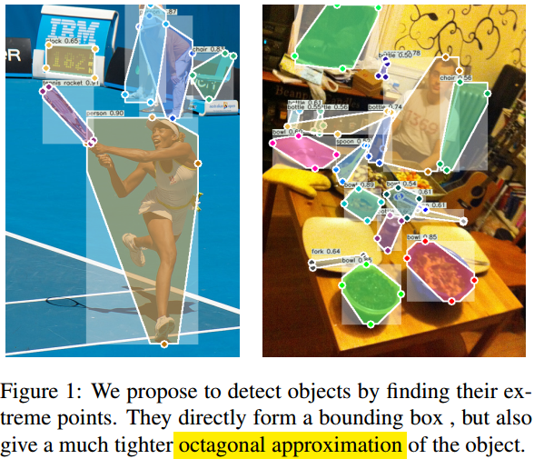
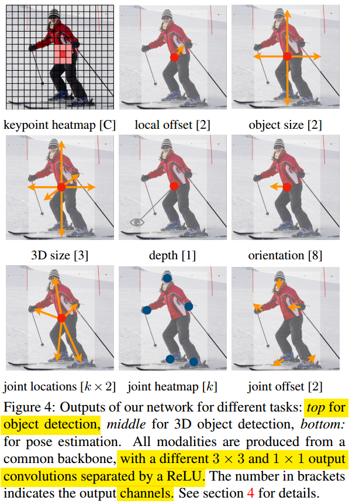
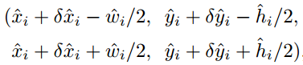
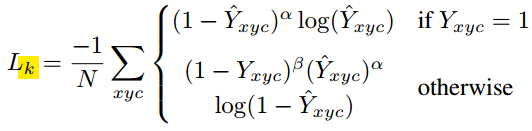
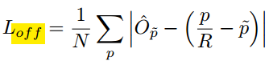
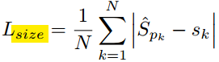
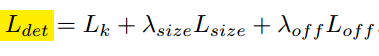

#                                 Anchor-Free第三篇Objects as Points

本文是Anchor Free系列的第三篇，CenterNet（19年出了两篇CenterNet，一个是本文UT Austin的；还有一个是中科院、清华和华为诺亚舟实验室的），**继续在CornerNet和ExtremeNet的基础之上做了改进**。最大的特点就是把关键点的个数从物体的外围、边缘改成了目标的中心点，然后再从中心点做微调，回归出目标自身的Bounding Box。

**欢迎探讨，本文持续维护。**

## 实验平台

N/A

## CenterNet的特点

CenterNet和ExtremeNet，CornerNet和Anchor-based方法相比，有如下几个特点：

1. CenterNet的**关键点选择更少也更科学**：如上面两张图片所示，CenterNet也是用关键点检测的Buttom-Up思路去做目标检测，但是只选择了一个中心关键点，比前面CornerNet的两个对角关键点和ExtermeNet的四个极点关键点更少。而且，中心关键点一般都是落在了目标内部，**所提取到的信息直接和目标本身相关性更大**，不像CornerNet那样大部分落在目标外部，ExtermeNet那样落在目标边缘。基本上把基于点做目标检测这个路子的关键点的数量降到了最少了，**如无必要，勿增实体**。
2. ExtremeNet**不需要NMS，不需要学习Embddings，也不需要几何规则做Grouping**：。像很多Anchor-based检测器，为了提高召回，在同一个目标身上会得出很多有Overlap的框，然后再在后处理时候利用NMS去掉置信度低的框；在CornerNet中，得到的Corner点，需要再后处理中用Embddings组合起来；ExtermeNet也需要在得到Exterme点之后，利用几何规则做后处理将这些零散的Exterme点组合起来形成包围框。CenterNet对**每个目标只会生成一个中心点的预测和回归框，不需要做别的后处理**，一切都追求最简化。

## CenterNet介绍

### CornerNet和ExtremeNet的启发

如上面两张图所示，CornerNet把关键点选择在了目标包围框的左上角和右下角，ExtermeNet想着左上角和右下角其实和目标本身相关性不大，就把关键点选择在目标的最顶、最底、最左和最右四个位置，CenterNet觉得Exterme选择的四个点在目标边边上，如果**选择在目标本身中心点，是不是应该和目标本身更相关效果更好**。其次，CornerNet和ExtremeNet得到了一些类别相关的点之后，还需要后处理将这些点Grouping起来，毕竟，一个单独的角点或者边缘点并不能得到一个框，他要和其他点组合起来才行；但是中心点不一样，**一个目标只有中心点，不需要什么关键点的组合步骤了**，只需要和宽高组合起来，就能得到Bounding Box了。

### ExtremeNet思路

如上图所示（目标检测看第一行三张图）是ExtremeNet大致的思路。CenterNet的网络结构和前面[《Anchor Free第一篇CornerNet: Detecting Objects as Paired Keypoints》](<https://github.com/Captain1986/CaptainBlackboard/blob/master/D%230046-Anchor-Free%E7%AC%AC%E4%B8%80%E7%AF%87CornerNet-Detecting-Objects-as-Paired-Keypoints/D%230046.md>)已经介绍过的CornerNet结构类似，这里不再单独介绍了。来看输出：CenterNet对每类目标，生成**1张**表示中心点在哪的Heatmap。另外还有**1x2张**类别无关的offset map特征图，用来微调Center点反算到输入图的坐标。第三个输出是**1x2**张类别无关的宽高预测（以裸像素为单位），一副输入图像，**总共C+4通道特征图**。

结合中心点预测，Offset预测和宽高预测，由上式就可以得到目标的包围框了。

### 网络结构和损失函数

CenterNet源于CornerNet，网络结构和CornerNet很像，损失函数和CornerNet大致一样。

#### 网络结构

和CornerNet一样，CenterNet也是用的关键点检测常用的104-layer **HourglassNet**作为特征提取Backbone网络，但是去掉了Corner Pooling模块，加上了宽高预测模块，其余做了很小的相应修改。

#### 损失函数

基本上和CornerNet一样，关键点定位用的是**改造的Focal Loss**，Offset回归用的是**L1 Loss**，宽高预测分支用的是**L1 Loss**。

总的损失函数是以上三者的加权和。

## 总结

本文是以点做目标检测的第三篇论文CenterNet，和CornerNet关键点选取目标包围框的左上角点和右下角点不同，ExtremeNet的关键点选择为目标边缘最高、最低、最左、最右这四个点，CenterNet干脆直接**选择了中心点**这一个点作为关键点。在目标检测领域取得了不错的成绩，而且**去掉了Embddings和几何规则做Grouping这一步**，CenterNet也可以在小改之后应用到人体姿态，3D估计等领域。

## 参考资料

+ [CornerNet: Detecting Objects as Paired Keypoints](https://arxiv.org/abs/1808.01244)
+ [Bottom-up Object Detection by Grouping Extreme and Center Points](https://arxiv.org/abs/1901.08043)
+ [Objects as Points](https://arxiv.org/abs/1904.07850)
+ [Stacked Hourglass Network for Human Pose Estimation](https://arxiv.org/abs/1603.06937)
+ [《D#0045-Stacked-Hourglass-Network-for-Human-Pose-Estimation》](https://github.com/Captain1986/CaptainBlackboard/blob/master/D%230045-Stacked-Hourglass-Network-for-Human-Pose-Estimation/D%230045.md)
+ [《D#0046-Anchor-Free第一篇CornerNet-Detecting-Objects-as-Paired-Keypoints》](<https://github.com/Captain1986/CaptainBlackboard/blob/master/D%230046-Anchor-Free%E7%AC%AC%E4%B8%80%E7%AF%87CornerNet-Detecting-Objects-as-Paired-Keypoints/D%230046.md>)
+ [D#0046-Anchor-Free第一篇CornerNet-Detecting-Objects-as-Paired-Keypoints](https://github.com/Captain1986/CaptainBlackboard/blob/master/D%230046-Anchor-Free%E7%AC%AC%E4%B8%80%E7%AF%87CornerNet-Detecting-Objects-as-Paired-Keypoints/D%230046.md)
