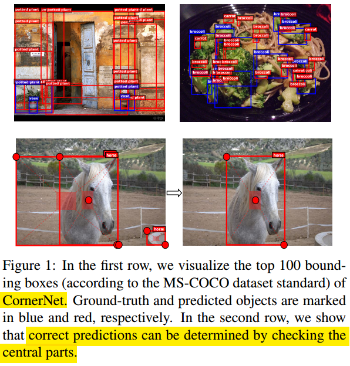
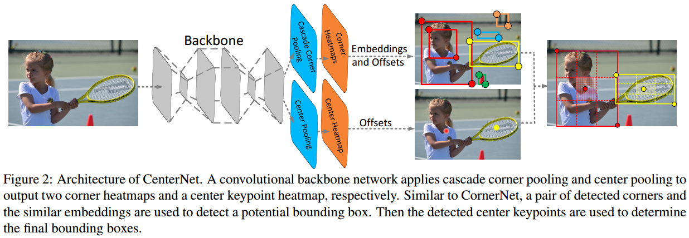
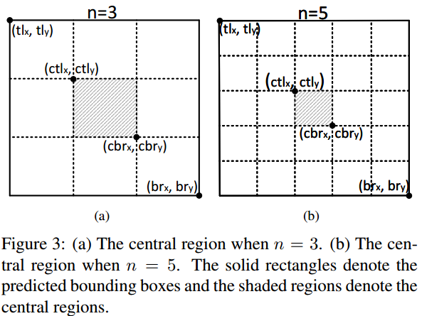
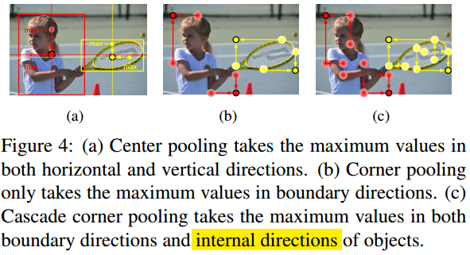
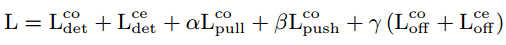

#                                 Anchor Free第四篇CenterNet: Keypoint Triplets for Object Detection

本文是Anchor Free系列的第四篇，CenterNet（19年出了两篇CenterNet，一个是UT Austin的；还有一个是本文中科院、清华和华为诺亚舟实验室的），性能直接在MS COCO上刷到了47%，应该是现在One-Stage的SOTA了。CenterNet**直接分析并针对CornerNet的不足有针对性地添加了修改**。最大的特点就是在CornerNet的两个Corner关键点的基础上，**添加了一个Center关键点**，并为此提出了**Center Pooling**结构和**Cascade Corner Pooling**结构。

**欢迎探讨，本文持续维护。**

## 实验平台

N/A

## CenterNet介绍

### CornerNet的不足之处

如上面表所示，作者在把CornerNet的误检测做过分析后发现，CornerNet的性能，受到错误框的影响很大。平均上CornerNet每生成100个预测框，有37.8个是错的离谱的(和真值的IoU<**0.05**)，这个问题太大了，必须改。

怎么改呢？作者认为，光靠左上角和右下角这两个Corner点能得到的信息还不够，**对于和真值IoU很小很小的误检测来说，预测到的目标的中心点一般不在目标身上（如上图所示），如果在训练的时候，加上一个对目标身上中心点的预测，得到中心点的信息辅助判断，对于滤出这些False Discovery的预测框应该会有帮助**。所以作者就在CornerNet的两个Corner点的基础上加上了目标Center点来组合成一个三元组来预测目标框的位置。

另外，针对CornerNet中Corner Pooling获取到的信息是边缘信息更多一些这个短板，为了加入一些关于物体内部的信息，作者也提出了修改的方案，就是在边缘点先做一次Corner Pooling得到关于目标内部的信息，再串联原来的Corner Pooling得到Cascade Corner Pooling方法。

### CenterNet做法

CenterNet的主要部分还是和前面有介绍的CornerNet是一致的：先依靠点检测能力很好的Hourglass主干网络提取特征，然后预测Corner Points，Offsets和Embddings，得到一些Bounding box。不同的是，在**得到Bounding box之后，找出中心区域，看Center点Heatmap对应的中心区域有没有同类的Center点**。如果没有，那就是一个False Discovery，需要丢掉；如果有，那就保留这个Bounding box，且用三个点的Score的均值更新Bounding box的Score。

### Bounding box的中心区域怎么找

CornerNet的方法得到Bounding box之后，会按照Bounding box的大小，选择一片Center Area。

这很合理，大的目标，中心区域选择大一点，小尺寸的目标，中心区域选择小一点，然后再去Center Point的Heatmap里面去看看对应区域有没有Score足够大的同类别Center点来判断CornerNet的Bounding box是不是False Discovery。

### Center Pooling和Cascade Corner Pooling

对于中心点特征的提取，作者类比与CornerNet的Corner Pooling显示地加了一个**Center Pooling**模块，如上上图(a)和上图(a)所示：对于每一个输出特征图中的点，分别做两个横向和竖向**全范围**的Corner Pooling，然后把Pooling的结果相加起来输出。

对于两个Corner点特征的提取，原来CornerNet的作者没有考虑到物体内部信息，这里CenterNet的作者加了一步做成了**Cascade Corner Pooling**，**对于Corner点也考虑到了物体内部信息**：如上上图(c)和上图(b)所示，对输入的特征图，先做一次竖直（水平）方向的Corner Pooling，再做一次水平（竖直）方向的Corner Pooling。

### 网络结构

和CornerNet一样，CenterNet也是用的关键点检测常用的104-layer **HourglassNet**作为特征提取Backbone网络，但是加上了Center点的预测，加强了Corner Pooling的模块形成了Center Pooling和Cascade Corner Pooling，其余做了很小的相应修改。

### 损失函数

基本上和CornerNet一样，关键点定位用的是**改造的Focal Loss**，**Push和Pull Loss**来学习Embddings，再加上Offset用的是**L1 Loss**。

## 总结

本文是针对**CornerNet的False Discovery做了有针对性的修改**，添加了Center点和原来的Corner点组成三元组做预测，滤掉了很多False Discovery。另外，针对**加强物体中间部分信息的采集**，改造Corner Pooling得到了Center Pooling和Cascade Corner Pooling也是CenterNet的贡献之一。

**八卦**一下，本文介绍的CenterNet和上篇[《D#0048-Anchor-Free第三篇Objects-as-Points》](https://github.com/Captain1986/CaptainBlackboard/blob/master/D%230048-Anchor-Free%E7%AC%AC%E4%B8%89%E7%AF%87Objects-as-Points/D%230048.md)介绍的CenterNet都叫CenterNet，而且两者发表时间十分相近，也没有互相引用。窃以为，虽然本文的性能更好，但是Objects as Points的思路更配得上CenterNet这个称呼。深度学习这块发展实在很快，发论文要趁早。

本CenterNet没有提到**ExtremeNet**([这里](https://github.com/Captain1986/CaptainBlackboard/blob/master/D%230047-Anchor-Free%E7%AC%AC%E4%BA%8C%E7%AF%87CornerNet%E7%9A%84%E5%8F%98%E7%A7%8DExtremeNet/D%230047.md)有介绍)，感觉和ExtremeNet的关键点选择如果借鉴过来融合一下，效果应该不差。

## 参考资料

+ [CornerNet: Detecting Objects as Paired Keypoints](https://arxiv.org/abs/1808.01244)
+ [Bottom-up Object Detection by Grouping Extreme and Center Points](https://arxiv.org/abs/1901.08043)
+ [Objects as Points](https://arxiv.org/abs/1904.07850)
+ [Stacked Hourglass Network for Human Pose Estimation](https://arxiv.org/abs/1603.06937)
+ [《D#0045-Stacked-Hourglass-Network-for-Human-Pose-Estimation》](https://github.com/Captain1986/CaptainBlackboard/blob/master/D%230045-Stacked-Hourglass-Network-for-Human-Pose-Estimation/D%230045.md)
+ [《D#0046-Anchor-Free第一篇CornerNet-Detecting-Objects-as-Paired-Keypoints》](<https://github.com/Captain1986/CaptainBlackboard/blob/master/D%230046-Anchor-Free%E7%AC%AC%E4%B8%80%E7%AF%87CornerNet-Detecting-Objects-as-Paired-Keypoints/D%230046.md>)
+ [《D#0047-Anchor-Free第二篇CornerNet的变种ExtremeNet》](https://github.com/Captain1986/CaptainBlackboard/blob/master/D%230047-Anchor-Free%E7%AC%AC%E4%BA%8C%E7%AF%87CornerNet%E7%9A%84%E5%8F%98%E7%A7%8DExtremeNet/D%230047.md)
+ [《D#0048-Anchor-Free第三篇Objects-as-Points》](https://github.com/Captain1986/CaptainBlackboard/blob/master/D%230048-Anchor-Free%E7%AC%AC%E4%B8%89%E7%AF%87Objects-as-Points/D%230048.md)
